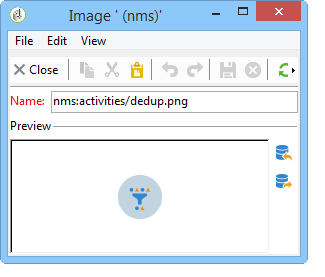

# 管理活動影像{#managing-activity-images}

可以更改各種工作流的圖表中使用的影像。 但是，它們必須符合某些限制。 以下是實施階段：

* 若要變更背景影像，請選取所需的定位工作流程，然後按一下&#x200B;**[!UICONTROL Properties]**&#x200B;標籤。

   

   若要選取要使用的影像，請按一下&#x200B;**[!UICONTROL Background image]**&#x200B;欄位右側的&#x200B;**[!UICONTROL Select link]**&#x200B;圖示。

   >[!NOTE]
   >
   >背景影像的寬度（像素）必須是4的倍數。

   

   **[!UICONTROL Edit link]**&#x200B;圖示可讓您檢視選取的影像。

* 若要變更與活動相關聯的影像，請連按兩下物件，然後按一下&#x200B;**[!UICONTROL Advanced]**&#x200B;標籤。

   若要選取要使用的影像，請按一下&#x200B;**[!UICONTROL Image]**&#x200B;欄位右側的&#x200B;**[!UICONTROL Select link]**&#x200B;圖示。

   

   **[!UICONTROL Edit link]**&#x200B;圖示可讓您檢視選取的影像。

   

>[!NOTE]
>
>儲存在樹的&#x200B;**[!UICONTROL Administration > Configuration > Images]**&#x200B;節點中的影像可供選擇。
>  
>影像必須為PNG格式，有48x48像素、1600萬色和透明背景。
