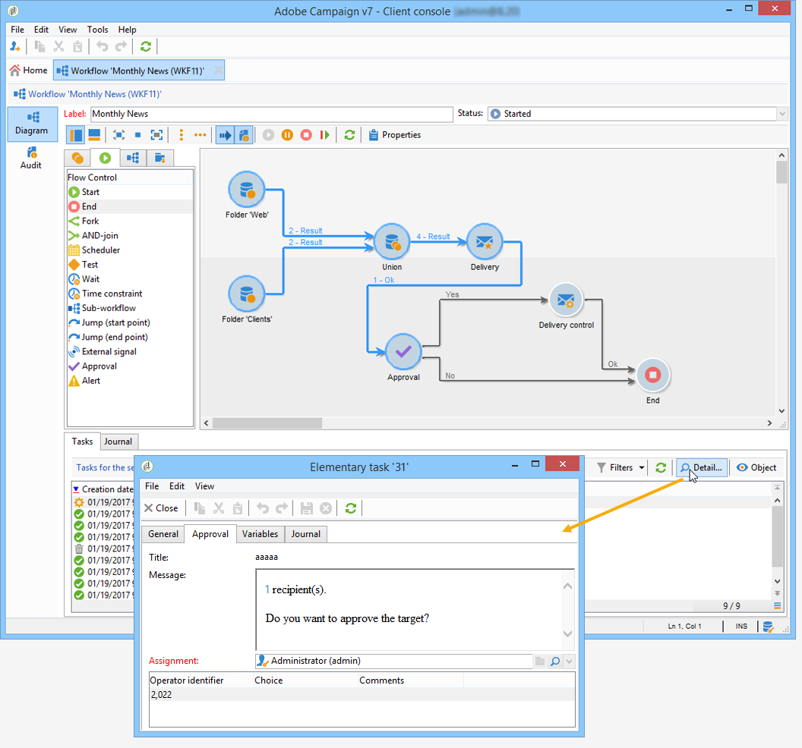
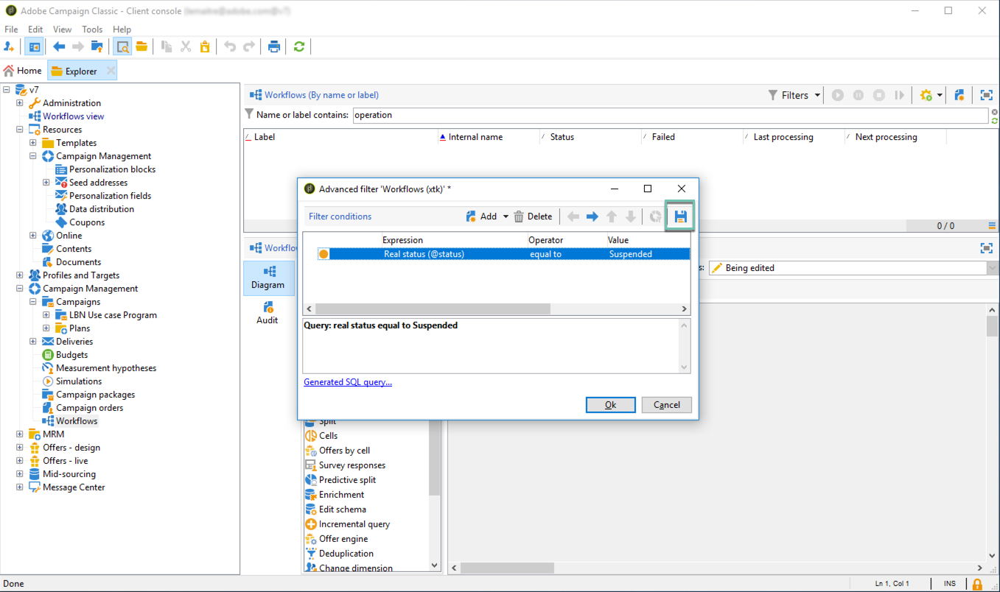

# 監控工作流程執行 {#monitoring-workflow-execution}

本節介紹如何監控工作流執行的資訊。

[本節](../../workflow/using/supervising-workflows.md#supervising-workflows)也提供如何建立工作流程的使用案例，讓您監控一組「暫停」、「停止」或「有錯誤」的工作流程的狀態。

此外，實例的管理員可以使用&#x200B;**稽核記錄**&#x200B;來檢查工作流程的活動和最後修改，即工作流程的狀態。 有關詳細資訊，請參閱[專用部分](../../production/using/audit-trail.md)。

監控不同促銷活動程式的其他方式，請參閱本頁[。](../../production/using/monitoring-guidelines.md)

## 顯示進度{#displaying-progress}

您可以使用工具列上的適當圖示來顯示進度，以監控執行。

**[!UICONTROL Display progress information]**&#x200B;圖示可讓您顯示狀態，以及導致執行畫面的活動。


選取此選項時，已執行的活動會以藍色顯示，待定活動會閃爍，警告會以橙色顯示，錯誤會以紅色顯示。 此選項還顯示活動在其出站轉移時的結果，後面是活動屬性中定義的結果標籤，如果超過一秒，則顯示作業的持續時間


## 顯示日誌{#displaying-logs}

記錄檔包含工作流程的歷史記錄或稽核記錄。 它註冊所有用戶操作、所有執行的操作和遇到的錯誤。 您可以：

* 在詳細資訊中選擇&#x200B;**[!UICONTROL Tracking]**&#x200B;頁籤。 此清單包含所有工作流消息。

   

* 按活動篩選日誌消息。 要執行此操作，請按一下圖上方工具欄上的&#x200B;**[!UICONTROL Display the tasks and the log]** ，以便在圖下顯示&#x200B;**[!UICONTROL Log]**&#x200B;和&#x200B;**[!UICONTROL Tasks]**&#x200B;頁籤。 選擇活動以查看所有相關消息。 此清單包含未選擇任何活動時的所有消息。

   

   >[!NOTE]
   >
   >按一下圖的背景以取消選擇所有元素。

* 僅查看連結到給定任務的消息。 要執行此操作，請選擇&#x200B;**[!UICONTROL Tasks]**&#x200B;頁籤，然後在圖中選擇活動以限制清單。 連按兩下工作即可顯示資訊；窗口中的最後一個頁籤包含日誌。

   

   **[!UICONTROL Details...]**&#x200B;按鈕可讓您顯示有關活動執行的所有其他資訊。 例如，您可以檢視驗證運算子，以及在適用時，在核准期間輸入的註解，如下列範例所示：

   

>[!NOTE]
>
>重新啟動工作流時，不會清除日誌。 保留所有留言。 如果要放棄先前執行中的消息，則必須清除歷史記錄。

日誌顯示與定位工作流活動相關的執行消息的時間清單。

* 定位促銷活動的記錄

   執行定位促銷活動後，按一下&#x200B;**[!UICONTROL Tracking]**&#x200B;標籤以檢視執行追蹤。

   

   所有促銷活動訊息皆顯示：促銷活動以及警告或錯誤。

* 活動記錄

   您也可以檢視執行記錄檔和每個活動的詳細資訊。 有兩種方法可以做到：

   1. 選擇目標活動，然後按一下&#x200B;**[!UICONTROL Display the tasks and the log]**&#x200B;表徵圖。

      

      圖的下部分顯示兩個頁籤：日誌和任務。

      在圖中選擇的活動用作日誌和任務清單上的篩選器。

      

   1. 按一下右鍵目標活動，然後選擇&#x200B;**[!UICONTROL Display logs]**。

      

      記錄檔會顯示在個別視窗中。

## 清除日誌{#purging-the-logs}

工作流歷史記錄不會自動清除：預設情況下會保留所有消息。 您可以透過&#x200B;**[!UICONTROL File > Actions]**&#x200B;功能表或按一下清單上方工具列中的&#x200B;**[!UICONTROL Actions]**&#x200B;按鈕來清除歷史記錄。 選取 **[!UICONTROL Purge history]**。**[!UICONTROL Actions]**&#x200B;菜單中可用的選項在[操作工具欄](../../workflow/using/starting-a-workflow.md)部分中有詳細說明。


## 工作表和工作流架構{#worktables-and-workflow-schema}

工作流程會傳達可透過特定活動處理的工作表。 Adobe Campaign允許您通過資料管理活動修改、更名和豐富工作流工作表的列，例如，根據客戶的需要將它們與術語對齊，以收集關於合同共同受益人的附加資訊等。

還可以建立各種工作維之間的連結並定義維更改。 例如，對於資料庫中記錄的每個合同，請定址主持人，並在附加資訊中使用共同持有人資料。

當工作流被鈍化時，工作流的工作表將被自動刪除。 如果希望保留工作表，請通過&#x200B;**[!UICONTROL List update]**&#x200B;活動將其保存在清單中（請參閱[清單更新](../../workflow/using/list-update.md)）。

## 管理錯誤{#managing-errors}

發生錯誤時，工作流程暫停，當發生錯誤時執行的活動閃爍紅色。 在工作流程概述（**[!UICONTROL Monitoring]**&#x200B;宇宙> **[!UICONTROL Workflows]**&#x200B;連結）中，您只能顯示有錯誤的工作流程，如下所示。


在「Adobe Campaign檔案總管」中，工作流程清單預設會顯示&#x200B;**[!UICONTROL Failed]**&#x200B;欄。


當工作流出錯時，只要其電子郵件地址列在其配置檔案中，即會以電子郵件通知屬於工作流監督組的操作員。 此組在工作流屬性的&#x200B;**[!UICONTROL Supervisor(s)]**&#x200B;欄位中被選中。


通知內容是在&#x200B;**[!UICONTROL Workflow manager notification]**&#x200B;預設範本中設定：此模板在工作流屬性的&#x200B;**[!UICONTROL Execution]**&#x200B;頁籤中選擇。 通知會顯示錯誤工作流程的名稱及相關任務。

通知範例：


此連結可讓您以Web模式存取Adobe Campaign主控台，並在您登入後處理錯誤工作流程。


您可以設定工作流程，以免發生錯誤時暫停並繼續執行。 若要這麼做，請編輯工作流程&#x200B;**[!UICONTROL Properties]**，並在&#x200B;**[!UICONTROL Error management]**&#x200B;區段中，選取&#x200B;**[!UICONTROL In case of error]**&#x200B;欄位中的&#x200B;**[!UICONTROL Ignore]**&#x200B;選項。 然後，您可以指定在暫停程式之前可忽略的連續錯誤數。

在這種情況下，錯誤任務將中止。 此模式特別適用於設計為稍後重新嘗試促銷活動（定期動作）的工作流程。


>[!NOTE]
>
>您可以針對每個活動分別套用此設定。 要執行此操作，請編輯活動屬性，並在&#x200B;**[!UICONTROL Advanced]**&#x200B;頁籤中選擇錯誤管理模式。

有關工作流執行故障排除的詳細資訊，請參閱[專用部分](../../production/using/workflow-execution.md)。

## 處理錯誤{#processing-errors}

關於活動，**[!UICONTROL Process errors]**&#x200B;選項顯示特定轉場，當產生錯誤時，此選項將啟用。 在這種情況下，工作流不會進入錯誤模式並繼續執行。

考慮到的錯誤是檔案系統錯誤（無法移動檔案、無法訪問目錄等）。

此選項不處理與活動配置相關的錯誤，即無效值。 與故障配置相關的錯誤將不會啟用此轉換（目錄不存在等）。

如果暫停了工作流（手動或在出現錯誤後自動）,**[!UICONTROL Start]**&#x200B;按鈕會在工作流停止的位置重新啟動該工作流執行。 錯誤活動（或暫停的活動）將會重新執行。 不會重新執行先前的活動。

要重新執行所有工作流活動，請使用&#x200B;**[!UICONTROL Restart]**&#x200B;按鈕。

如果修改已執行的活動，則在重新啟動工作流執行時不會考慮這些更改。

如果修改未執行的活動，則在重新啟動工作流執行時會考慮這些活動。

如果您修改暫停的活動，則在重新啟動工作流程時無法正確考慮這些變更。

如果可能，建議在進行修改後完全重新啟動工作流。

## 實例監督{#instance-supervision}

**[!UICONTROL Instance supervision]**&#x200B;頁面可讓您檢視Adobe Campaign伺服器活動，並顯示有錯誤的工作流程和傳送清單。

若要存取本頁，請前往&#x200B;**[!UICONTROL Monitoring]**&#x200B;宇宙，然後按一下&#x200B;**[!UICONTROL General view]**&#x200B;連結。


若要顯示所有工作流程，請按一下&#x200B;**[!UICONTROL Workflows]**&#x200B;連結。 使用下拉式清單，根據工作流程的狀態來顯示平台中的工作流程。


按一下含有錯誤的工作流程上的連結，以開啟並檢視其記錄檔。


## 防止同時執行多個執行{#preventing-simultaneous-multiple-executions}

單一工作流程可同時執行數個執行。 在某些情況下，您應該防止這種情況發生。

例如，您可以讓排程器每小時觸發工作流程執行，但有時整個工作流程的執行需要超過一小時。 如果工作流已運行，則可能希望跳過執行。

如果您在工作流程開始時有訊號活動，則在工作流程執行時，可能會想略過訊號。

一般原則是：


解決方案是使用例項變數。 執行個體變數會由工作流程的所有平行執行共用。

以下是簡單的測試工作流程：


**[!UICONTROL Scheduler]**&#x200B;每分鐘觸發一個事件。 以下&#x200B;**[!UICONTROL Test]**&#x200B;活動將測試&#x200B;**isRunning**&#x200B;實例變數，以決定是否繼續執行：


>[!NOTE]
>
>**isRunning** 是此範例中選取的變數名稱。這不是內建變數。

緊接在&#x200B;**yes**&#x200B;分支中&#x200B;**[!UICONTROL Test]**&#x200B;後面的活動必須在其&#x200B;**Initialization Script**&#x200B;中設定實例變數：

```
instance.vars.isRunning = true
```

**yes**&#x200B;分支中最後一個活動必須將&#x200B;**初始化指令碼**&#x200B;中的變數還原為false:

```
instance.vars.isRunning = false
```

請注意：

* 您可以透過工作流程&#x200B;**Properties**&#x200B;中的&#x200B;**Variables**&#x200B;標籤，檢查例項變數的目前值。
* 當您重新啟動工作流程時，會重設例項變數。
* 在JavaScript中，測試中未定義的值為false，允許在初始化執行個體變數之前先測試它。
* 通過向&quot;no&quot;結束的初始化指令碼添加日誌記錄指令，可以監視因此機制而未處理的活動。

   ```
   logInfo("Workflow already running, parallel execution not allowed.");
   ```

本節將介紹一個使用案例：[協調資料更新](../../workflow/using/coordinating-data-updates.md)。

## 資料庫維護 {#database-maintenance}

工作流程使用大量工作表，這些工作表會佔用空間，最終導致整個平台的速度變慢（如果不加以維護）。 有關資料庫維護的詳細資訊，請參閱此[部分](../../production/using/tables-to-maintain.md)。

通過&#x200B;**管理>生產>技術工作流**&#x200B;節點可訪問&#x200B;**資料庫清理**&#x200B;工作流，可以刪除過時的資料以避免資料庫的指數級增長。 工作流程會自動觸發，使用者不需干預。 請參閱此[節](../../production/using/database-cleanup-workflow.md)。

您也可以建立特定的技術工作流程，以清除不必要的資料佔用空間。 請參閱此[節](../../production/using/application-objects.md)和此[頁](#purging-the-logs)。

## 處理暫停的工作流程{#handling-of-paused-workflows}

預設情況下，如果某個工作流暫停，則不會清除其工作表。 從build 8880開始，暫停狀態太久的工作流程會自動停止，並清除其工作表。 觸發此行為的方式如下：

* 自7天以來暫停的工作流程會在監控控制面板（和監控API）中顯示為警告，並傳送通知給主管群組。
* 每週觸發&#x200B;**[!UICONTROL cleanupPausedWorkflows]**&#x200B;技術工作流程時都會發生相同的情況。 有關工作流的詳細資訊，請參閱[本節](../../workflow/using/delivery.md)。
* 在4個通知後（亦即預設為一個月處於暫停狀態），工作流程會無條件停止。 日誌停止後，該日誌將出現在工作流中。 在下次執行&#x200B;**[!UICONTROL cleanup]**&#x200B;工作流時將清除這些表

這些句點可以通過NmsServer_PausedWorkflowPeriod選項進行配置。

工作流程主管會收到通知。 同時也會通知建立者和修改工作流程的最後使用者。 管理員不會收到通知。

## 根據工作流的狀態{#filtering-workflows-status}篩選工作流

Campaign Classic介面允許您使用預定義的&#x200B;**views**&#x200B;監視實例上所有工作流的執行狀態。 要訪問這些視圖，請開啟&#x200B;**[!UICONTROL Administration]** / **[!UICONTROL Audit]** / **[!UICONTROL Workflows Status]**&#x200B;節點。

可使用下列檢視：

* **[!UICONTROL Running]**：列出所有執行中的工作流程。
* **[!UICONTROL Paused]**：列出所有暫停的工作流程。
* **[!UICONTROL Failed]**：列出所有失敗的工作流程。
* **[!UICONTROL Start Pending]**：列出等待operationMagt進程啟動的所有工作流。此檢視僅適用於&#x200B;**Marketing campaigns**&#x200B;套件（請參閱[安裝Campaign標準套件](../../installation/using/installing-campaign-standard-packages.md)）。


預設情況下，這些視圖可在&#x200B;**[!UICONTROL Audit]**&#x200B;資料夾中訪問。 但是，您可以在資料夾樹中選擇的位置重新建立它們。 如此，就可讓不具管理權限的標準使用者使用。

要執行此操作：

1. 按一下右鍵要添加視圖的資料夾。
1. 在&#x200B;**[!UICONTROL Add new folder]** / **[!UICONTROL Administration]**&#x200B;中，選擇要添加的視圖。
1. 將資料夾添加到樹中後，請確保將其配置為視圖，以便顯示所有工作流，無論其源資料夾是什麼。有關如何配置視圖的詳細資訊，請參閱[此部分](../../platform/using/access-management-folders.md)。

除了這些檢視外，您還可以設定篩選資料夾，讓您根據工作流程的執行狀態來篩選工作流程清單。 操作步驟：

1. 訪問工作流類型資料夾，然後選擇&#x200B;**[!UICONTROL Filters]** / **[!UICONTROL Advanced filter]**&#x200B;菜單。
1. 設定篩選，讓工作流程的&#x200B;**[!UICONTROL @status]**&#x200B;欄位等於您選擇的狀態。
1. 儲存並命名篩選。 然後，篩選器清單中就會直接提供它。



如需詳細資訊，請參閱下列章節：

* [建立進階篩選](../../platform/using/creating-filters.md#creating-an-advanced-filter)
* [儲存篩選](../../platform/using/creating-filters.md#saving-a-filter)
