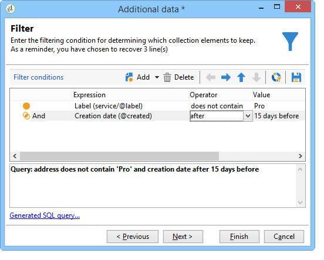

# 查詢{#query}

## 建立查詢 {#creating-a-query}

查詢可讓您根據條件選取目標。 您可以將區段代碼與查詢結果建立關聯，並插入其他資料。
有關查詢示例的詳細資訊，請參閱此[此部分](querying-recipient-table.md)。

>[!NOTE]
>
>使用Oracle時，查詢活動與CLOB欄位不相容。

有關使用和管理其他資料的詳細資訊，請參閱[Adding data](#adding-data)。

**[!UICONTROL Edit query...]**&#x200B;連結可讓您以下列方式定義母體的定位類型、限制和選取標準：

1. 選取目標和篩選維度。 預設情況下，從收件者中選取目標。 限制篩選器清單與用於傳送鎖定目標的清單相同。

   目標維度與我們將要處理的元素類型一致，例如操作所定位的母體。

   篩選維度可讓收集這些元素，例如與目標人員相關的資訊（合約、完全和最終結算等）。

   如需詳細資訊，請參閱[定位和篩選維度](building-a-workflow.md#targeting-and-filtering-dimensions)。

   

   如有需要，在選擇定位和篩選維度時選取&#x200B;**[!UICONTROL Temporary schema]**，即可根據入站轉變的資料查詢。

   

1. 使用精靈定義母體。 要輸入的欄位可能因目標類型而異。 您可以使用&#x200B;**[!UICONTROL Preview]**&#x200B;標籤，以您目前的條件預覽目標母體。

   有關建立和使用篩選器或查詢的詳細資訊，請參閱此[節](../../platform/using/filtering-options.md)。

   

1. 如果您在步驟1選擇了&#x200B;**[!UICONTROL Filtering conditions]**&#x200B;或使用&#x200B;**[!UICONTROL Filters]** > **[!UICONTROL Advanced filter...]**&#x200B;選項，則以後必須手動添加篩選條件。

   您也可以核取對應方塊，以新增資料分組條件。 若要這麼做，篩選維度必須與查詢的目標維度不同。 有關分組的詳細資訊，請參閱此[節](querying-using-grouping-management.md)。

   您也可以使用運算式產生器來新增更多條件，並將其與邏輯選項AND、OR和EXCEPT結合。 然後，您可以預覽條件組合的&#x200B;**[!UICONTROL Corresponding SQL query...]**。 如需詳細資訊，請參閱此[區段](../../platform/using/defining-filter-conditions.md#building-expressions)。

   如果您稍後想重新使用篩選器，請儲存篩選器。

   

## 新增資料 {#adding-data}

其他欄可讓您收集目標母體的其他資訊，例如合約編號、電子報訂閱或來源。 此資料可儲存在Adobe Campaign資料庫或外部資料庫中。

**[!UICONTROL Add data...]**&#x200B;連結可讓您選取要收集的其他資料。

首先，選取要新增的資料類型：

* 選擇&#x200B;**[!UICONTROL Data linked to the filtering dimension]**&#x200B;以選擇Adobe Campaign資料庫中的資料。
* 選擇&#x200B;**[!UICONTROL External data]**&#x200B;以從外部資料庫添加資料。 只有在您已購買&#x200B;**同盟資料存取**&#x200B;選項時，才可使用此選項。 有關詳細資訊，請參閱[存取外部資料庫(FDA)](accessing-an-external-database--fda-.md)。
* 選取&#x200B;**[!UICONTROL An offer proposition]**&#x200B;選項，以新增一組欄，讓您儲存優惠方案引擎產生的最佳主張。 只有在您已購買&#x200B;**Interaction**&#x200B;模組時，才可使用此選項。

如果平台上未安裝可選模組，則不顯示此階段。 你會被帶到下一個階段。

從Adobe Campaign資料庫新增資料：

1. 選取要新增的資料類型。 這可以是屬於篩選維度的資料，或儲存在連結表格中的資料。

   

1. 如果資料屬於查詢的篩選維度，只需在可用欄位清單中選取該維度，即可在輸出欄中顯示。

   

   您可以新增：

   * 根據從目標母體取得的資料或匯總（上個月的待定購買數、收據的平均金額等）計算的欄位。 例如，前往[選取資料](targeting-data.md#selecting-data)。
   * 使用輸出列清單右側的&#x200B;**[!UICONTROL Add]**&#x200B;按鈕建立的新欄位。

      您也可以新增資訊集合，例如合約清單、最近5個傳送等。 集合與欄位一致，這些欄位可以有相同設定檔的多個值（1-N關係）。 有關詳細資訊，請參閱[編輯其他資料](targeting-data.md#editing-additional-data)。

若要新增連結至目標人口的資訊集合：

1. 在嚮導的第一步，選擇&#x200B;**[!UICONTROL Data linked to the filtering dimension]**&#x200B;選項：
1. 選擇包含要收集的資訊的表，然後按一下&#x200B;**[!UICONTROL Next]**。

   

1. 如有必要，請在&#x200B;**[!UICONTROL Data collected]**&#x200B;欄位中選取其中一個值，以指定您要保留的集合元素數目。 依預設，會復原集合的所有行，然後根據下列步驟所指定的條件進行篩選。

   * 如果集合的單一元素與此集合的篩選條件一致，請在&#x200B;**[!UICONTROL Data collected]**&#x200B;欄位中選取&#x200B;**[!UICONTROL Single row]**。

      >[!IMPORTANT]
      >
      >由於集合元素上的直接接合，此模式會最佳化產生的SQL查詢。
      >
      >如果初始條件未得到遵守，結果可能有缺陷（缺少線或重疊線）。

   * 如果選擇恢復多行(**[!UICONTROL Limit the line count]**)，則可以指定要收集的行數。
   * 如果收集的欄包含匯總，例如宣告失敗次數、網站平均支出等。 您可以使用&#x200B;**[!UICONTROL Aggregates]**&#x200B;值。

   

1. 指定集合的子選取項目。 例如：僅限過去15天內購買。

   

1. 如果您已選取&#x200B;**[!UICONTROL Limit the line count]**&#x200B;選項，請定義要篩選收集資料的順序。 一旦收集的行數超過指定要保留的行數，篩選順序就允許您指定要保留的行。

## 範例：對簡單收件者屬性進行定位 {#example--targeting-on-simple-recipient-attributes}

在以下範例中，查詢旨在識別居住在法國的18至30歲男性。 此查詢將用於工作流程中，例如，旨在讓這些查詢成為專屬選件。

>[!NOTE]
>
>其他查詢示例顯示在[此部分](querying-recipient-table.md)中。

1. 為查詢命名，然後選取&#x200B;**[!UICONTROL Edit query...]**&#x200B;連結。
1. 在可用篩選器類型清單中選擇&#x200B;**[!UICONTROL Filtering conditions]**。
1. 輸入建議目標的不同標準。 以下是使用AND選項結合的條件。 要納入選擇，收件者必須滿足以下四個條件：

   * 標題為「Mr」的收件者（也可使用&#x200B;**Gender**&#x200B;欄位找到，並選取&#x200B;**Male**&#x200B;作為值）。
   * 30歲以下的收件者。
   * 18歲以上的收件者。
   * 住在法國的收件者。

   

   您可以檢視符合條件組合的SQL:

   

1. 您可以在相關索引標籤中預覽符合查詢的收件者，以檢查條件是否正確：

   

1. 儲存您的篩選器，以便在稍後日期再按一下「**[!UICONTROL Finish]** > **[!UICONTROL OK]**」來使用。
1. 新增其他活動以繼續編輯工作流程。 一旦啟動後，上一個查詢步驟就會顯示找到的收件者數目。 您可以使用滑鼠快顯功能表（以滑鼠右鍵按一下轉變> **[!UICONTROL Display the target...]**）顯示更多詳細資訊。

   

## 輸出參數 {#output-parameters}

* tableName
* 綱要
* recCount

這組三個值標識查詢所定位的母體。 **[!UICONTROL tableName]** 是記錄目標標識符的表的名稱， **[!UICONTROL schema]** 是母體（通常為nms:recipient）的模式， **[!UICONTROL recCount]** 是表中的元素數。

此值是工作表的架構。 此參數對於具有&#x200B;**[!UICONTROL tableName]**&#x200B;和&#x200B;**[!UICONTROL schema]**&#x200B;的所有轉變都有效。

## 最佳化查詢 {#optimizing-queries}

以下章節提供最佳實務，以最佳化在Adobe Campaign上執行的查詢，以限制資料庫的工作負載並改善使用者體驗。

### 聯接和索引 {#joins-and-indexes}

* 有效的查詢依賴於索引。
* 對所有聯接使用索引。
* 在架構上定義連結將決定連接條件。 連結的表在主鍵上應具有唯一索引，連接應在此欄位上。
* 通過在數字欄位（而非字串欄位）上定義鍵來執行聯接。
* 避免執行外連接。 盡可能使用零ID記錄來實現外連接功能。
* 對聯接使用正確的資料類型。

   確保`where`子句的類型與欄位相同。

   一個常見的錯誤是：`iBlacklist='3'`其中`iBlacklist`是數字欄位，而`3`表示文本值。

   請確定您知道查詢的執行計畫。 避免執行完整表掃描，特別是對於每分鐘運行的即時查詢或幾乎即時查詢。

   如需詳細資訊，請視您的Campaign版本而定，參閱下列區段：

   [  Campaign v7 文件](../../configuration/using/database-mapping.md)

   [  Campaign v8 文件](https://experienceleague.adobe.com/docs/campaign/campaign-v8/architecture/shemas-forms/database-mapping.html)

### 函式 {#functions}

* 請注意`Lower(...)`之類的函式。 使用Lower函式時，不使用索引。
* 使用「like」指令或「upper」或「lower」指令仔細檢查查詢。 在用戶輸入上應用「Upper」，而不是在資料庫欄位上。

   有關函式的詳細資訊，請參閱[此部分](../../platform/using/defining-filter-conditions.md#list-of-functions)。

### 篩選維度 {#filtering-dimensions}

使用查詢的篩選維度，而非使用「exists sach」運算子。

在查詢中，篩選器中的「存在（例如」）條件無法有效。 它們等同於SQL中的子查詢：

`select iRecipientId from nmsRecipient where iRecipientId IN (select iRecipientId from nmsBroadLog where (...))`

最佳實務是改用查詢的篩選維度：

SQL中的篩選維等效於內部連接：

`select iRecipientId from nmsRecipient INNER JOIN nmsBroadLog ON (...)`

有關篩選維度的詳細資訊，請參閱[此區段](building-a-workflow.md#targeting-and-filtering-dimensions)。

### 架構 {#architecture}

* 建立與生產平台類似的卷、參數和架構的開發平台。
* 對開發和生產環境使用相同的值。 請盡可能使用相同的：

   * 作業系統,
   * 版本，
   * 資料，
   * 應用程式、
   * 卷。

   >[!NOTE]
   >
   >在開發環境中運作的功能可能無法用於資料可能不同的生產環境。 嘗試識別主要差異，以預測風險並準備解決方案。

* 進行與目標卷匹配的配置。 大卷需要特定配置。 100,000個收件者適用的設定，可能無法供10,000,000個收件者使用。

   考慮系統上線時的規模。 僅僅因為某種東西在小範圍內起作用，並不意味著它適合於更大的體積。 應使用與生產中的卷類似的捲進行測試。 您還應評估在峰值時間、峰值天數以及整個項目生命週期中卷（呼叫數、資料庫大小）更改的影響。
