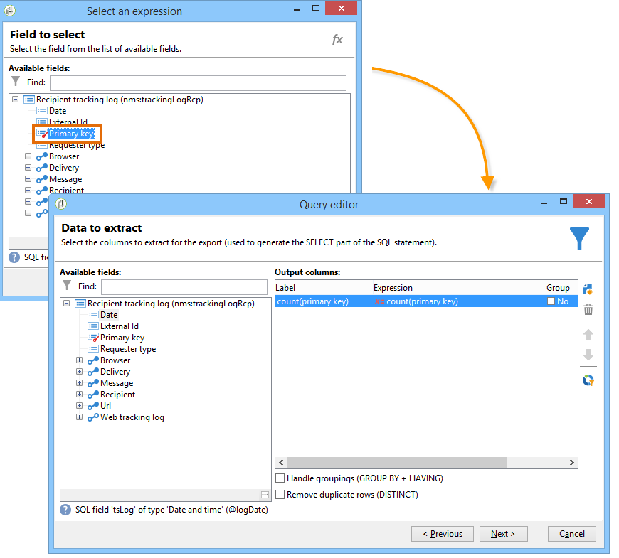
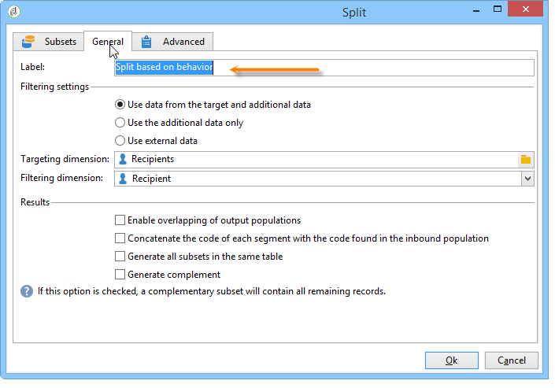
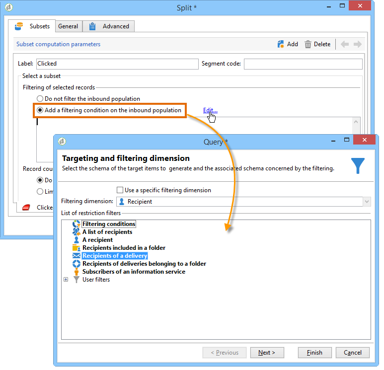
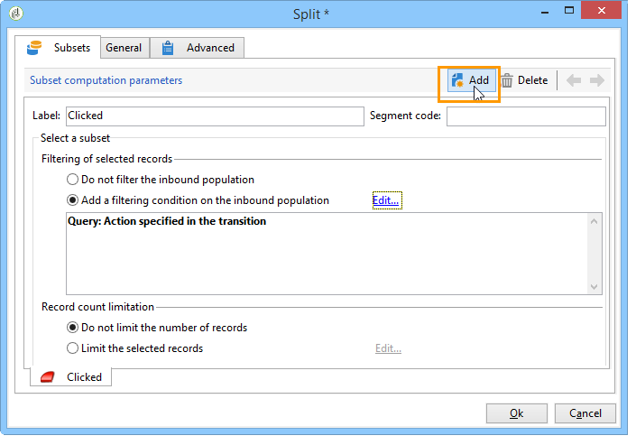
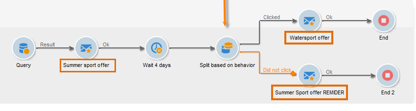

# 查詢傳遞資訊 {#querying-delivery-information}

## 特定傳送的點按次數 {#number-of-clicks-for-a-specific-delivery}

在此範例中，我們希望復原特定傳送的點按次數。 由於收件者追蹤記錄在指定時段內，因此會記錄這些點按。 收件者是透過其電子郵件地址識別。 此查詢使用&#x200B;**[!UICONTROL Recipient tracking logs]**&#x200B;表。

* 需要選取哪個表格？

   收件者記錄追蹤表(**[!UICONTROL nms:trackingLogRcp]**)

* 要為輸出列選擇的欄位？

   主鍵（含計數）和電子郵件

* 會根據哪些條件篩選資訊？

   傳送標籤的特定期間和元素

若要執行此範例，請套用下列步驟：

1. 開啟&#x200B;**[!UICONTROL Generic query editor]**&#x200B;並選取&#x200B;**[!UICONTROL Recipient tracking logs]**&#x200B;架構。

   

1. 在&#x200B;**[!UICONTROL Data to extract]**&#x200B;視窗中，我們要建立匯總以收集資訊。 要執行此操作，請新增主鍵（位於主&#x200B;**[!UICONTROL Recipient tracking logs]**&#x200B;元素上方）:會在此&#x200B;**[!UICONTROL Primary key]**&#x200B;欄位上執行追蹤記錄計數。 編輯的運算式為&#x200B;**[!UICONTROL x=count(primary key)]**。 它會將各種追蹤記錄的總和連結至單一電子郵件地址。

   操作步驟：

   * 按一下&#x200B;**[!UICONTROL Output columns]**&#x200B;欄位右側的&#x200B;**[!UICONTROL Add]**&#x200B;圖示。 在&#x200B;**[!UICONTROL Formula type]**&#x200B;窗口中，選擇&#x200B;**[!UICONTROL Edit the formula using an expression]**&#x200B;選項，然後按一下&#x200B;**[!UICONTROL Next]**。 在&#x200B;**[!UICONTROL Field to select]**&#x200B;窗口中，按一下&#x200B;**[!UICONTROL Advanced selection]**。

      

   * 在&#x200B;**[!UICONTROL Formula type]**&#x200B;窗口中，對聚合函式運行進程。 此程式將是主要金鑰計數。

      在&#x200B;**[!UICONTROL Aggregate]**&#x200B;部分中選擇&#x200B;**[!UICONTROL Process on an aggregate function]**，然後按一下&#x200B;**[!UICONTROL Count]**。

      

      按一下&#x200B;**[!UICONTROL Next]**。

   * 選擇&#x200B;**[!UICONTROL Primary key (@id)]**&#x200B;欄位。 已配置&#x200B;**[!UICONTROL count (primary key)]**&#x200B;輸出列。

      

1. 選取要在輸出欄中顯示的其他欄位。 在&#x200B;**[!UICONTROL Available fields]**&#x200B;列中，開啟&#x200B;**[!UICONTROL Recipient]**&#x200B;節點，然後選擇&#x200B;**[!UICONTROL Email]**。 勾選&#x200B;**[!UICONTROL Group]**&#x200B;方塊至&#x200B;**[!UICONTROL Yes]**，依電子郵件地址將追蹤記錄分組：此群組會將每個記錄檔連結至其收件者。

   

1. 設定欄排序，讓最活躍的收件者（具有最多的追蹤記錄檔）先顯示。 檢查&#x200B;**[!UICONTROL Descending sort]**&#x200B;欄中的&#x200B;**[!UICONTROL Yes]**。

   

1. 然後，您必須篩選您感興趣的日誌，即那些2週以內且與銷售相關的傳送相關的日誌。

   操作步驟：

   * 設定資料篩選。 要執行此操作，請選擇&#x200B;**[!UICONTROL Filter conditions]**，然後按一下&#x200B;**[!UICONTROL Next]**。

      

   * 針對特定傳送在指定期間復原追蹤記錄。 需要三個篩選條件：兩個日期條件，用以設定目前日期之前2週與目前日期之前一天之間的搜尋期間；和另一個條件，限制搜尋至特定傳送。

      在&#x200B;**[!UICONTROL Target element]**&#x200B;視窗中，設定要考慮追蹤記錄的開始日期。 按一下 **[!UICONTROL Add]**。條件行隨即顯示。 按一下&#x200B;**[!UICONTROL Edit expression]**&#x200B;函式以編輯&#x200B;**[!UICONTROL Expression]**&#x200B;欄。 在&#x200B;**[!UICONTROL Field to select]**&#x200B;窗口中，選擇&#x200B;**[!UICONTROL Date (@logDate)]**。

      

      選擇&#x200B;**[!UICONTROL greater than]**&#x200B;運算子。 在&#x200B;**[!UICONTROL Value]**&#x200B;列中，按一下&#x200B;**[!UICONTROL Edit expression]**，然後在&#x200B;**[!UICONTROL Formula type]**&#x200B;窗口中，選擇&#x200B;**[!UICONTROL Process on dates]**。 最後，在&#x200B;**[!UICONTROL Current date minus n days]**&#x200B;中輸入&quot;15&quot;。

      按一下&#x200B;**[!UICONTROL Finish]**。

      

   * 若要選取追蹤記錄搜尋結束日期，請按一下&#x200B;**[!UICONTROL Add]**&#x200B;建立第二個條件。 在&#x200B;**[!UICONTROL Expression]**&#x200B;欄中，再次選擇&#x200B;**[!UICONTROL Date (@logDate)]**。

      選擇&#x200B;**[!UICONTROL less than]**&#x200B;運算子。 在&#x200B;**[!UICONTROL Value]**&#x200B;欄中，按一下&#x200B;**[!UICONTROL Edit expression]**。 對於日期處理，請轉至&#x200B;**[!UICONTROL Formula type]**&#x200B;窗口，在&#x200B;**[!UICONTROL Current date minus n days]**&#x200B;中輸入&quot;1&quot;。

      按一下&#x200B;**[!UICONTROL Finish]**。

      

      現在，我們想設定第三個篩選條件，即查詢所關注的傳送標籤。

   * 按一下&#x200B;**[!UICONTROL Add]**&#x200B;函式以建立其他篩選條件。 在&#x200B;**[!UICONTROL Expression]**&#x200B;欄中，按一下&#x200B;**[!UICONTROL Edit expression]**。 在&#x200B;**[!UICONTROL Field to select]**&#x200B;窗口中，選擇&#x200B;**[!UICONTROL Delivery]**&#x200B;節點中的&#x200B;**[!UICONTROL Label]**。

      按一下&#x200B;**[!UICONTROL Finish]**。

      

      尋找包含&quot;sales&quot;字的傳送。 由於您不記得其確切標籤，因此可以選擇&#x200B;**[!UICONTROL contains]**&#x200B;運算子，並在&#x200B;**[!UICONTROL Value]**&#x200B;欄中輸入&quot;sales&quot;。

      

1. 按一下&#x200B;**[!UICONTROL Next]**&#x200B;直到到達&#x200B;**[!UICONTROL Data preview]**&#x200B;窗口：此處不需要格式設定。
1. 在&#x200B;**[!UICONTROL Data preview]**&#x200B;視窗中，按一下&#x200B;**[!UICONTROL Start the preview of the data]**&#x200B;以查看每個傳送收件者的追蹤記錄數。

   結果會以降序顯示。

   

   此傳送的使用者最多記錄數為6。 5個不同的使用者開啟傳送電子郵件，或按一下電子郵件中的其中一個連結。

## 未開啟任何傳遞的收件者 {#recipients-who-did-not-open-any-delivery}

在此範例中，我們要篩選過去7天內未開啟電子郵件的收件者。

若要建立此範例，請套用下列步驟：

1. 在工作流程中拖放&#x200B;**[!UICONTROL Query]**&#x200B;活動並開啟活動。
1. 按一下&#x200B;**[!UICONTROL Edit query]**，將目標和篩選維度設為&#x200B;**[!UICONTROL Recipients]**。

   

1. 選擇&#x200B;**[!UICONTROL Filtering conditions]**，然後按一下&#x200B;**[!UICONTROL Next]**。
1. 按一下&#x200B;**[!UICONTROL Add]**&#x200B;按鈕並選擇&#x200B;**[!UICONTROL Tracking logs]**。
1. 將&#x200B;**[!UICONTROL Tracking logs]**&#x200B;運算式的&#x200B;**[!UICONTROL Operator]**&#x200B;設定為&#x200B;**[!UICONTROL Do not exist such as]**。

   

1. 新增其他運算式。 在&#x200B;**[!UICONTROL URL]**&#x200B;類別中選擇&#x200B;**[!UICONTROL Type]**。
1. 然後，將其&#x200B;**[!UICONTROL Operator]**&#x200B;設為&#x200B;**[!UICONTROL equal to]**，將其&#x200B;**[!UICONTROL Value]**&#x200B;設為&#x200B;**[!UICONTROL Open]**。

   

1. 添加其他表達式並選擇&#x200B;**[!UICONTROL Date]**。 **[!UICONTROL Operator]** 應設為 **[!UICONTROL on or after]**。

   

1. 若要設定最近7天的值，請按一下&#x200B;**[!UICONTROL Value]**&#x200B;欄位中的&#x200B;**[!UICONTROL Edit expression]**&#x200B;按鈕。
1. 在&#x200B;**[!UICONTROL Function]**&#x200B;類別中，選取&#x200B;**[!UICONTROL Current date minus n days]**&#x200B;並新增您要定位的天數。 在這裡，我們想鎖定過去7天。

   

您的出站轉變將包含過去7天內未開啟電子郵件的收件者。

相反地，如果您要篩選至少開啟一封電子郵件的收件者，您的查詢應如下所示。 請注意，在此情況下，**[!UICONTROL Filtering dimension]**&#x200B;應設為&#x200B;**[!UICONTROL Tracking logs (Recipients)]**。

## 已開啟傳遞的收件者 {#recipients-who-have-opened-a-delivery}

下列範例說明如何定位在過去2週內開啟傳送的設定檔：

1. 若要定位已開啟傳送的設定檔，您需要使用追蹤記錄。 它們儲存在連結的表中：首先，在&#x200B;**[!UICONTROL Filtering dimension]**&#x200B;欄位的下拉式清單中選取此表格，如下所示：

   

1. 關於篩選條件，請按一下追蹤記錄子樹結構中所顯示條件的&#x200B;**[!UICONTROL Edit expression]**&#x200B;圖示。 選擇&#x200B;**[!UICONTROL Date]**&#x200B;欄位。

   

   按一下&#x200B;**[!UICONTROL Finish]**&#x200B;以確認選擇。

   若要僅復原不到兩週前的追蹤記錄，請選取&#x200B;**[!UICONTROL Greater than]**&#x200B;運算子。

   

   然後按一下&#x200B;**[!UICONTROL Value]**&#x200B;欄中的&#x200B;**[!UICONTROL Edit expression]**&#x200B;圖示，以定義要套用的計算公式。 選擇&#x200B;**[!UICONTROL Current date minus n days]**&#x200B;公式，並在相關欄位中輸入15。

   

   按一下公式窗口的&#x200B;**[!UICONTROL Finish]**&#x200B;按鈕。 在篩選視窗中，按一下&#x200B;**[!UICONTROL Preview]**&#x200B;標籤以檢查目標准則。

   

## 傳遞後篩選收件者的行為 {#filtering-recipients--behavior-folllowing-a-delivery}

在工作流程中， **[!UICONTROL Query]**&#x200B;和&#x200B;**[!UICONTROL Split]**&#x200B;方塊可讓您選取先前傳送後的行為。 此選取是透過&#x200B;**[!UICONTROL Delivery recipient]**&#x200B;篩選器執行。

* 範例目的

   在傳送工作流程中，有數種方式可追蹤第一封電子郵件通訊。 此類操作涉及使用&#x200B;**[!UICONTROL Split]**&#x200B;框。

* 內容

   系統會傳送「夏季運動優惠方案」。 傳送後4天，會傳送另外2個傳送。 其中一個是「水上運動優惠」，另一個是首次「夏季運動優惠」交付的後續活動。

   「水上運動選件」傳送會傳送給在第一次傳送時按下「水上運動」連結的收件者。 這些點按會顯示收件者對主題感興趣。 將他們引導至類似的報價是明智的。 不過，未點按「夏季運動優惠方案」的收件者將會再次收到相同內容。

下列步驟顯示如何透過整合兩種不同行為來設定&#x200B;**[!UICONTROL Split]**&#x200B;方塊：

1. 將&#x200B;**[!UICONTROL Split]**&#x200B;方塊插入工作流程。 此方塊會將第一個傳送的收件者細分為下一個兩個傳送。 劃分會根據第一次傳送期間連結至收件者行為的篩選條件進行。

   

1. 開啟&#x200B;**[!UICONTROL Split]**&#x200B;方塊。 在&#x200B;**[!UICONTROL General]**&#x200B;標籤中，輸入標籤：**例如，根據行為**&#x200B;進行分割。

   

1. 在&#x200B;**[!UICONTROL Subsets]**&#x200B;標籤中，定義第一個拆分分支。 例如，輸入此分支的&#x200B;**Clicked**&#x200B;標籤。
1. 選擇&#x200B;**[!UICONTROL Add a filtering condition on the incoming population]**&#x200B;選項。 按一下&#x200B;**[!UICONTROL Edit]**。
1. 在&#x200B;**[!UICONTROL Targeting and filtering dimension]**&#x200B;視窗中，按兩下&#x200B;**[!UICONTROL Recipients of a delivery]**&#x200B;篩選器。

   

1. 在&#x200B;**[!UICONTROL Target element]**&#x200B;窗口中，選擇要應用到此分支的行：**[!UICONTROL Recipients having clicked (email)]**。

   在下面，選擇&#x200B;**[!UICONTROL Delivery specified by the transition]**&#x200B;選項。 此功能會自動復原第一次傳送期間鎖定的目標人員。

   這是「水上運動優惠方案」的傳遞。

   

1. 定義第二個分支。 此分支會包含後續電子郵件，其內容與第一次傳送的內容相同。 前往&#x200B;**[!UICONTROL Subsets]**&#x200B;標籤，然後按一下&#x200B;**[!UICONTROL Add]**&#x200B;加以建立。

   

1. 畫面上會顯示另一個子標籤。 將其命名為「**Did not click**」。
1. 按一下 **[!UICONTROL Add a filtering condition for the incoming population]**。然後按一下 **[!UICONTROL Edit...]**。

   

1. 在&#x200B;**[!UICONTROL Targeting and filtering dimension]**&#x200B;視窗中按一下&#x200B;**[!UICONTROL Delivery recipients]**。
1. 在&#x200B;**[!UICONTROL Target element]**&#x200B;視窗中，選取&#x200B;**[!UICONTROL Recipients who did not click (email)]**&#x200B;行為。 選擇&#x200B;**[!UICONTROL Delivery specified by the transition]**&#x200B;選項，如最後一個分支所示。

   **[!UICONTROL Split]**&#x200B;方塊現已完全設定。

   

以下是預設設定的各種元件清單：

* **[!UICONTROL All recipients]**
* **[!UICONTROL Recipients of successfully sent messages,]**
* **[!UICONTROL Recipients who opened or clicked (email),]**
* **[!UICONTROL Recipients who clicked (email),]**
* **[!UICONTROL Recipients of a failed message,]**
* **[!UICONTROL Recipients who didn't open or click (email),]**
* **[!UICONTROL Recipients who didn't click (email).]**

   
