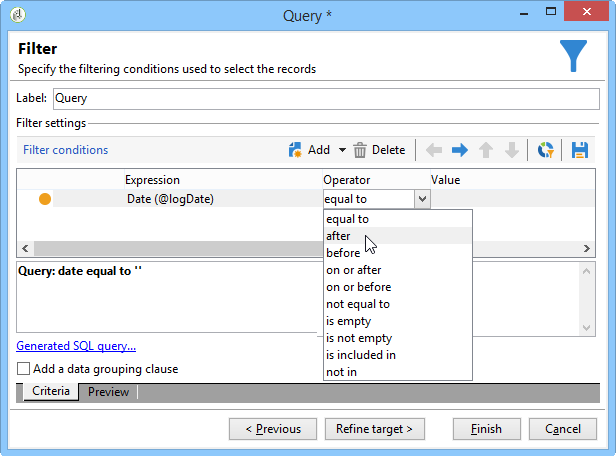

# 查詢傳遞資訊 {#querying-delivery-information}

## 特定傳送的點按次數{#number-of-clicks-for-a-specific-delivery}

在此範例中，我們希望恢復特定傳送的點按次數。 由於收件者追蹤記錄在指定的時段內，因此會記錄這些點按。 收件者是透過其電子郵件地址識別。 此查詢使用&#x200B;**[!UICONTROL Recipient tracking logs]**&#x200B;表。

* 需要選擇哪個表？

   收件者記錄追蹤表(**[!UICONTROL nms:trackingLogRcp]**)

* 要為輸出列選擇的欄位？

   主鍵（含計數）和電子郵件

* 將根據哪些標準篩選資訊？

   傳送標籤的特定期間和元素

要執行此示例，請應用以下步驟：

1. 開啟&#x200B;**[!UICONTROL Generic query editor]**&#x200B;並選擇&#x200B;**[!UICONTROL Recipient tracking logs]**&#x200B;方案。

   

1. 在&#x200B;**[!UICONTROL Data to extract]**&#x200B;視窗中，我們要建立匯整以收集資訊。 若要這麼做，請新增主鍵（位於主&#x200B;**[!UICONTROL Recipient tracking logs]**&#x200B;元素上方）:追蹤記錄計數會在此&#x200B;**[!UICONTROL Primary key]**&#x200B;欄位上執行。 編輯的運算式為&#x200B;**[!UICONTROL x=count(primary key)]**。 它會將各種追蹤記錄的總和連結至單一電子郵件地址。

   操作步驟：

   * 按一下&#x200B;**[!UICONTROL Output columns]**&#x200B;欄位右側的&#x200B;**[!UICONTROL Add]**&#x200B;表徵圖。 在&#x200B;**[!UICONTROL Formula type]**&#x200B;窗口中，選擇&#x200B;**[!UICONTROL Edit the formula using an expression]**&#x200B;選項並按一下&#x200B;**[!UICONTROL Next]**。 在&#x200B;**[!UICONTROL Field to select]**&#x200B;窗口中，按一下&#x200B;**[!UICONTROL Advanced selection]**。

      

   * 在&#x200B;**[!UICONTROL Formula type]**&#x200B;窗口中，對聚合函式運行進程。 此程式將是主鍵計數。

      在&#x200B;**[!UICONTROL Aggregate]**&#x200B;區段中選擇&#x200B;**[!UICONTROL Process on an aggregate function]** ，然後按一下&#x200B;**[!UICONTROL Count]**。

      

      按一下 **[!UICONTROL Next]**。

   * 選擇&#x200B;**[!UICONTROL Primary key (@id)]**&#x200B;欄位。 已配置&#x200B;**[!UICONTROL count (primary key)]**&#x200B;輸出列。

      

1. 選擇要在輸出列中顯示的其它欄位。 在&#x200B;**[!UICONTROL Available fields]**&#x200B;列中，開啟&#x200B;**[!UICONTROL Recipient]**&#x200B;節點，然後選擇&#x200B;**[!UICONTROL Email]**。 選中&#x200B;**[!UICONTROL Group]**&#x200B;方塊至&#x200B;**[!UICONTROL Yes]**，以依電子郵件位址將追蹤記錄分組：此群組會將每個記錄連結至其收件者。

   

1. 設定欄排序，讓最活躍的收件者（具有最多的追蹤記錄）會先顯示。 檢查&#x200B;**[!UICONTROL Descending sort]**&#x200B;欄中的&#x200B;**[!UICONTROL Yes]**。

   

1. 然後，您必須篩選您感興趣的記錄檔，即2週以下且與銷售相關的交貨記錄檔。

   操作步驟：

   * 設定資料篩選。 要執行此操作，請選擇&#x200B;**[!UICONTROL Filter conditions]** ，然後按一下&#x200B;**[!UICONTROL Next]**。

      

   * 在特定傳送的指定期間內恢復追蹤記錄檔。 需要三種篩選條件：兩個日期條件，將搜索期間設定在當前日期前2週和當前日期前2週之間；以及另一個條件，以限制搜尋至特定的傳送。

      在&#x200B;**[!UICONTROL Target element]**&#x200B;視窗中，設定將追蹤記錄納入其中的開始日期。 按一下 **[!UICONTROL Add]**。顯示條件行。 按一下&#x200B;**[!UICONTROL Edit expression]**&#x200B;函式，編輯&#x200B;**[!UICONTROL Expression]**&#x200B;列。 在&#x200B;**[!UICONTROL Field to select]**&#x200B;窗口中，選擇&#x200B;**[!UICONTROL Date (@logDate)]**。

      

      選擇&#x200B;**[!UICONTROL greater than]**&#x200B;運算子。 在&#x200B;**[!UICONTROL Value]**&#x200B;欄中，按一下&#x200B;**[!UICONTROL Edit expression]**，然後在&#x200B;**[!UICONTROL Formula type]**&#x200B;視窗中，選取&#x200B;**[!UICONTROL Process on dates]**。 最後，在&#x200B;**[!UICONTROL Current date minus n days]**&#x200B;中輸入&quot;15&quot;。

      按一下 **[!UICONTROL Finish]**。

      

   * 若要選取追蹤記錄搜尋結束日期，請按一下&#x200B;**[!UICONTROL Add]**&#x200B;建立第二個條件。 在&#x200B;**[!UICONTROL Expression]**&#x200B;欄中，再次選擇&#x200B;**[!UICONTROL Date (@logDate)]**。

      選擇&#x200B;**[!UICONTROL less than]**&#x200B;運算子。 在&#x200B;**[!UICONTROL Value]**&#x200B;欄中，按一下&#x200B;**[!UICONTROL Edit expression]**。 對於日期處理，請轉至&#x200B;**[!UICONTROL Formula type]**&#x200B;窗口，在&#x200B;**[!UICONTROL Current date minus n days]**&#x200B;中輸入&quot;1&quot;。

      按一下 **[!UICONTROL Finish]**。

      

      現在，我們要設定第三個篩選條件，即我們查詢所關注的傳送標籤。

   * 按一下&#x200B;**[!UICONTROL Add]**&#x200B;函式以建立另一個篩選條件。 在&#x200B;**[!UICONTROL Expression]**&#x200B;欄中，按一下&#x200B;**[!UICONTROL Edit expression]**。 在&#x200B;**[!UICONTROL Field to select]**&#x200B;窗口中，選擇&#x200B;**[!UICONTROL Delivery]**&#x200B;節點中的&#x200B;**[!UICONTROL Label]**。

      按一下 **[!UICONTROL Finish]**。

      

      尋找包含&quot;sales&quot;字詞的傳送。 由於您不記得其確切標籤，因此可以選擇&#x200B;**[!UICONTROL contains]**&#x200B;運算子，並在&#x200B;**[!UICONTROL Value]**&#x200B;欄中輸入&quot;sales&quot;。

      

1. 按一下&#x200B;**[!UICONTROL Next]**，直到您進入&#x200B;**[!UICONTROL Data preview]**&#x200B;視窗：這裡不需要格式設定。
1. 在&#x200B;**[!UICONTROL Data preview]**&#x200B;視窗中，按一下&#x200B;**[!UICONTROL Start the preview of the data]**&#x200B;以查看每個傳送收件者的追蹤記錄檔數。

   結果會以遞減順序顯示。

   

   此傳送的使用者記錄檔數目上限為6。 5位不同的使用者開啟傳送電子郵件，或按一下電子郵件中的其中一個連結。

## 未開啟任何傳送{#recipients-who-did-not-open-any-delivery}的收件者

在此範例中，我們想篩選過去7天內未開啟電子郵件的收件者。

若要建立此範例，請套用下列步驟：

1. 在工作流程中拖放&#x200B;**[!UICONTROL Query]**&#x200B;活動並開啟活動。
1. 按一下&#x200B;**[!UICONTROL Edit query]**，將目標和篩選維度設為&#x200B;**[!UICONTROL Recipients]**。

   

1. 選擇&#x200B;**[!UICONTROL Filtering conditions]** ，然後按一下&#x200B;**[!UICONTROL Next]**。
1. 按一下&#x200B;**[!UICONTROL Add]**&#x200B;按鈕並選擇&#x200B;**[!UICONTROL Tracking logs]**。
1. 將&#x200B;**[!UICONTROL Tracking logs]**&#x200B;運算式的&#x200B;**[!UICONTROL Operator]**&#x200B;設為&#x200B;**[!UICONTROL Do not exist such as]**。

   

1. 新增另一個運算式。 在&#x200B;**[!UICONTROL URL]**&#x200B;類別中選擇&#x200B;**[!UICONTROL Type]**。
1. 然後，將其&#x200B;**[!UICONTROL Operator]**&#x200B;設為&#x200B;**[!UICONTROL equal to]**，其&#x200B;**[!UICONTROL Value]**&#x200B;設為&#x200B;**[!UICONTROL Open]**。

   

1. 添加另一個表達式並選擇&#x200B;**[!UICONTROL Date]**。 **[!UICONTROL Operator]** 應設為 **[!UICONTROL on or after]**。

   

1. 要設定該值最近7天，請按一下&#x200B;**[!UICONTROL Value]**&#x200B;欄位中的&#x200B;**[!UICONTROL Edit expression]**&#x200B;按鈕。
1. 在&#x200B;**[!UICONTROL Function]**&#x200B;類別中，選擇&#x200B;**[!UICONTROL Current date minus n days]**&#x200B;並添加要定位的天數。 這裡，我們想鎖定過去7天。

   

您的對外轉換將包含過去7天內未開啟電子郵件的收件者。

相反地，如果您想要篩選至少開啟一封電子郵件的收件者，您的查詢應如下所示。 請注意，在本例中，**[!UICONTROL Filtering dimension]**&#x200B;應設為&#x200B;**[!UICONTROL Tracking logs (Recipients)]**。

## 已開啟傳送{#recipients-who-have-opened-a-delivery}的收件者

下列範例說明如何定位在過去2週內開啟傳送的描述檔：

1. 若要定位已開啟傳送的描述檔，您必須使用追蹤記錄檔。 它們儲存在連結表中：首先，在&#x200B;**[!UICONTROL Filtering dimension]**&#x200B;欄位的下拉式清單中選取此表格，如下所示：

   

1. 關於篩選條件，請按一下追蹤記錄子樹結構中所示准則的&#x200B;**[!UICONTROL Edit expression]**&#x200B;圖示。 選擇&#x200B;**[!UICONTROL Date]**&#x200B;欄位。

   

   按一下&#x200B;**[!UICONTROL Finish]**&#x200B;確認選擇。

   若要僅恢復不到兩週的追蹤記錄，請選取&#x200B;**[!UICONTROL Greater than]**&#x200B;運算子。

   

   然後按一下&#x200B;**[!UICONTROL Value]**&#x200B;列中的&#x200B;**[!UICONTROL Edit expression]**&#x200B;表徵圖以定義要應用的計算公式。 選擇&#x200B;**[!UICONTROL Current date minus n days]**&#x200B;公式，並在相關欄位中輸入15。

   

   按一下公式窗口的&#x200B;**[!UICONTROL Finish]**&#x200B;按鈕。 在篩選視窗中，按一下&#x200B;**[!UICONTROL Preview]**&#x200B;標籤以檢查定位條件。

   

## 在傳送{#filtering-recipients--behavior-folllowing-a-delivery}後篩選收件者的行為

在工作流程中，**[!UICONTROL Query]**&#x200B;和&#x200B;**[!UICONTROL Split]**&#x200B;方塊可讓您選取先前傳送後的行為。 此選擇是透過&#x200B;**[!UICONTROL Delivery recipient]**&#x200B;篩選器進行。

* 範例目標

   在傳送工作流程中，有數種方式可追蹤第一次電子郵件通訊。 此類型的操作涉及使用&#x200B;**[!UICONTROL Split]**&#x200B;框。

* 內容

   酒店會寄送「夏季運動優惠」。 交貨四天後，另外兩件交貨送出。 其中一項是「水上運動優惠」，另一項是首次「夏季運動優惠」的後續活動。

   「Watersports選件」傳送給在第一次傳送時按一下「watersports」連結的收件者。 這些點按顯示收件者對主題感興趣。 將它們引向類似的報價是明智的。 不過，未點選「夏季運動優惠」的收件者將會再次收到相同的內容。

下列步驟將示範如何透過整合兩種不同的行為來設定&#x200B;**[!UICONTROL Split]**&#x200B;方塊：

1. 將&#x200B;**[!UICONTROL Split]**&#x200B;方塊插入工作流程。 此方塊會將第一個交貨的收件者劃分為下一個兩個交貨。 劃分會根據第一個傳送期間連結至收件者行為的篩選條件進行。

   

1. 開啟&#x200B;**[!UICONTROL Split]**&#x200B;框。 在&#x200B;**[!UICONTROL General]**&#x200B;標籤中，輸入標籤：例如，**根據行為**&#x200B;進行分割。

   

1. 在&#x200B;**[!UICONTROL Subsets]**&#x200B;標籤中，定義第一個拆分分支。 例如，輸入此分支的&#x200B;**Clicked**&#x200B;標籤。
1. 選擇&#x200B;**[!UICONTROL Add a filtering condition on the incoming population]**&#x200B;選項。 按一下 **[!UICONTROL Edit]**。
1. 在&#x200B;**[!UICONTROL Targeting and filtering dimension]**&#x200B;窗口中，按兩下&#x200B;**[!UICONTROL Recipients of a delivery]**&#x200B;過濾器。

   

1. 在&#x200B;**[!UICONTROL Target element]**&#x200B;窗口中，選擇要應用於此分支的行為：**[!UICONTROL Recipients having clicked (email)]**。

   在下面，選擇&#x200B;**[!UICONTROL Delivery specified by the transition]**&#x200B;選項。 這項功能會自動復原第一次傳送期間鎖定的人員。

   這是「水上運動優惠」。

   

1. 定義第二個分支。 此分支會包含後續電子郵件，其內容與第一次傳送的內容相同。 前往&#x200B;**[!UICONTROL Subsets]**&#x200B;標籤，然後按一下&#x200B;**[!UICONTROL Add]**&#x200B;以建立它。

   

1. 將顯示另一個子頁籤。 將其命名為&quot;**Did not click**&quot;。
1. 按一下 **[!UICONTROL Add a filtering condition for the incoming population]**。然後按一下 **[!UICONTROL Edit...]**。

   

1. 按一下&#x200B;**[!UICONTROL Targeting and filtering dimension]**&#x200B;窗口中的&#x200B;**[!UICONTROL Delivery recipients]**。
1. 在&#x200B;**[!UICONTROL Target element]**&#x200B;窗口中，選擇&#x200B;**[!UICONTROL Recipients who did not click (email)]**&#x200B;行為。 選擇&#x200B;**[!UICONTROL Delivery specified by the transition]**&#x200B;選項，如最後一個分支所示。

   **[!UICONTROL Split]**&#x200B;方塊現在已完全設定。

   

以下是依預設設定的各種元件清單：

* **[!UICONTROL All recipients]**
* **[!UICONTROL Recipients of successfully sent messages,]**
* **[!UICONTROL Recipients who opened or clicked (email),]**
* **[!UICONTROL Recipients who clicked (email),]**
* **[!UICONTROL Recipients of a failed message,]**
* **[!UICONTROL Recipients who didn't open or click (email),]**
* **[!UICONTROL Recipients who didn't click (email).]**

   
