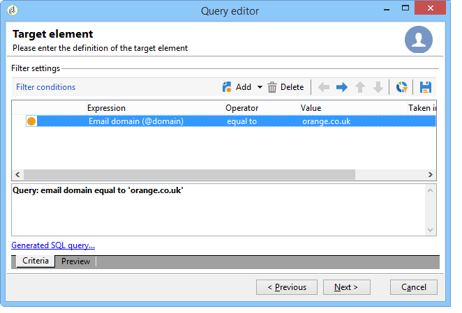

# 查詢收件人資料表 {#querying-recipient-table}

在此範例中，我們想要復原電子郵件網域為「orange.co.uk」且未居住在倫敦的收件者的姓名和電子郵件。

* 我們應選取哪個表格？

   收件者表格(nms:recipient)

* 要選作輸出列的欄位

   電子郵件、姓名、城市和帳號

* 收件者的篩選條件為何？

   城市和電子郵件網域

* 類型是否已設定？

   是，根據&#x200B;**[!UICONTROL Account number]**&#x200B;和&#x200B;**[!UICONTROL Last name]**

若要建立此範例，請套用下列步驟：

1. 按一下&#x200B;**[!UICONTROL Tools > Generic query editor...]**&#x200B;並選擇&#x200B;**收件者**(**nms:recipient**)表。 然後按一下 **[!UICONTROL Next]**。
1. 選擇：**[!UICONTROL Last name]**、**[!UICONTROL First name]**、**[!UICONTROL Email]**、**[!UICONTROL City]**&#x200B;和&#x200B;**[!UICONTROL Account number]**。 這些欄位會新增至&#x200B;**[!UICONTROL Output columns]**。 然後按一下 **[!UICONTROL Next]**。

   

1. 排序欄，以正確順序顯示。 在此，我們想依遞減順序排序帳戶號碼，並依字母順序排序名稱。 然後按一下 **[!UICONTROL Next]**。

   

1. 在&#x200B;**[!UICONTROL Data filtering]**&#x200B;視窗中，調整搜尋：選擇&#x200B;**[!UICONTROL Filtering conditions]** ，然後按一下&#x200B;**[!UICONTROL Next]**。
1. **[!UICONTROL Target element]**&#x200B;視窗可讓您輸入篩選設定。

   定義下列篩選條件：電子郵件網域等於「orange.co.uk」的收件者。 要執行此操作，請在&#x200B;**[!UICONTROL Expression]**&#x200B;列中選擇&#x200B;**電子郵件域(@email)**，在&#x200B;**[!UICONTROL Operator]**&#x200B;列中選擇&#x200B;**等於**，並在&#x200B;**[!UICONTROL Value]**&#x200B;列中輸入&quot;orange.co.uk&quot;。

   

1. 如有需要，按一下&#x200B;**[!UICONTROL Distribution of values]**&#x200B;按鈕，以根據潛在客戶的電子郵件網域檢視分送。 資料庫中每個電子郵件網域都有一個百分比。 在套用篩選器之前，會顯示「orange.co.uk」以外的網域。

   查詢的摘要會顯示在視窗底部：**電子郵件網域等於&#39;orange.co.uk&#39;**。

1. 按一下&#x200B;**[!UICONTROL Preview]**&#x200B;以取得查詢結果的概念：只會顯示「orange.co.uk」電子郵件網域。

   

1. 我們現在將更改查詢，以查找不住在倫敦的聯繫人。

   選擇&#x200B;**[!UICONTROL Expression]**&#x200B;列中的&#x200B;**[!UICONTROL City (location/@city)]**&#x200B;作為運算子，在&#x200B;**[!UICONTROL Value]**&#x200B;列中輸入&#x200B;**[!UICONTROL London]**。**[!UICONTROL different from]**

   

1. 這會帶您前往&#x200B;**[!UICONTROL Data formatting]**&#x200B;視窗。 檢查列順序。 將「帳號」欄下方的「城市」欄向上移動。

   取消勾選「名字」欄，將其從清單中移除。

   

1. 在&#x200B;**[!UICONTROL Data preview]**&#x200B;窗口中，按一下&#x200B;**[!UICONTROL Start the preview of the data]**。 此函式會計算查詢的結果。

   **[!UICONTROL Column results]**&#x200B;標籤會以欄顯示查詢結果。

   結果會顯示所有收件者，其電子郵件網域為「orange.co.uk」，且不住在倫敦。 不會顯示「名字」欄，因為在上一個階段中未勾選該欄。 帳號會以遞減順序排序。

   

   **[!UICONTROL XML result]**&#x200B;標籤以XML格式顯示結果。

   

   **[!UICONTROL Generated QSL queries]**&#x200B;頁簽以SQL格式顯示查詢結果。

   
