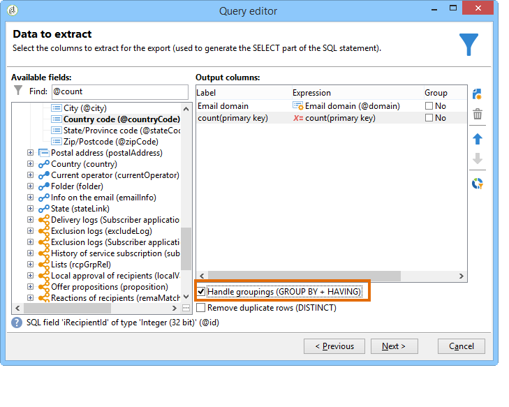

# 使用分組管理進行查詢 {#querying-using-grouping-management}

在此範例中，我們想執行查詢，以尋找在先前傳送期間鎖定超過30次的所有電子郵件網域。

* 需要選擇哪個表？

   收件者表(nms:recipient)

* 要在輸出欄中選擇的欄位？

   電子郵件網域和主要金鑰（含計數）

* 資料分組？

   根據主鍵數超過30的電子郵件網域。 此操作是使用選項執 **[!UICONTROL Group by + Having]** 行的。 **[!UICONTROL Group by + Having]** 可讓您將資料分組（「分組依據」），並選取已分組的項目（「有」）。

若要建立此範例，請套用下列步驟：

1. 開啟 **[!UICONTROL Generic query editor]** 並選擇「收件者」表(**nms:recipient**)。

   

1. 在窗口 **[!UICONTROL Data to extract]** 中，選擇和 **[!UICONTROL Email domain]** 字 **[!UICONTROL Primary key]** 段。 對欄位執行計 **[!UICONTROL Primary key]** 數。

   有關主鍵計數的詳細資訊，請參 [閱本節](../../platform/using/defining-filter-conditions.md#building-expressions)。

1. 選中該 **[!UICONTROL Handle groupings (GROUP BY + HAVING)]** 框。

   

1. 在視窗中 **[!UICONTROL Sorting]** ，以遞減順序排序電子郵件網域。 要執行此操作，請 **[!UICONTROL Yes]** 檢入列 **[!UICONTROL Descending sort]** 。 按一下 **[!UICONTROL Next]**.

   

1. 在中 **[!UICONTROL Data filtering]**，選擇 **[!UICONTROL Filtering conditions]**。 轉到窗口 **[!UICONTROL Target elements]** 並按一下 **[!UICONTROL Next]**。
1. 在窗口 **[!UICONTROL Data grouping]** 中，按一下 **[!UICONTROL Email domain]** 選擇 **[!UICONTROL Add]**。

   此資料分組窗口僅在選中該 **[!UICONTROL Handle groupings (GROUP BY + HAVING]**)框時顯示。

   

1. 在視窗 **[!UICONTROL Grouping condition]** 中，指出主要金鑰計數大於30，因為我們只希望傳回超過30次的電子郵件網域作為結果。

   選中該框時，將 **[!UICONTROL Manage groupings (GROUP BY + HAVING)]** 顯示此窗口：這是篩選分組結果(HAVING)的地方。

   

1. 在視窗中 **[!UICONTROL Data formatting]** ，按一下 **[!UICONTROL Next]**:這裡不需要格式設定。
1. 在資料預覽視窗中，按一下 **[!UICONTROL Launch data preview]**:在此，會傳回3個以上30次為目標的不同電子郵件網域。

   
