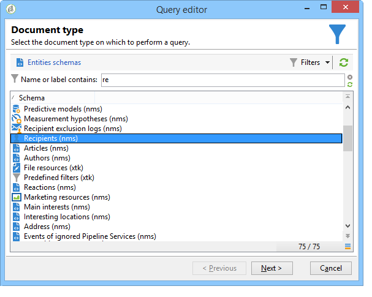

# 使用分組管理進行查詢 {#querying-using-grouping-management}

在此範例中，我們想執行查詢，以尋找先前傳送中鎖定超過30次的所有電子郵件網域。

* 需要選取哪個表格？

   收件者表格(nms:recipient)

* 要在輸出列中選擇的欄位？

   電子郵件網域和主索引鍵（含計數）

* 資料分組？

   根據主鍵計數超過30的電子郵件網域。 此操作是使用 **[!UICONTROL Group by + Having]** 選項。 **[!UICONTROL Group by + Having]** 可讓您將資料分組（「分組依據」），並選取分組的項目（「有」）。

若要建立此範例，請套用下列步驟：

1. 開啟 **[!UICONTROL Generic query editor]** 並選擇「收件者」表格(**nms:recipient**)。

   

1. 在 **[!UICONTROL Data to extract]** ，選擇 **[!UICONTROL Email domain]** 和 **[!UICONTROL Primary key]** 欄位。 計算 **[!UICONTROL Primary key]** 欄位。

   有關主鍵計數的詳細資訊，請參閱 [本節](../../platform/using/defining-filter-conditions.md#building-expressions).

1. 檢查 **[!UICONTROL Handle groupings (GROUP BY + HAVING)]** 框。

   

1. 在 **[!UICONTROL Sorting]** 視窗中，依遞減順序排序電子郵件網域。 要執行此操作，請檢查 **[!UICONTROL Yes]** 在 **[!UICONTROL Descending sort]** 欄。 按一下&#x200B;**[!UICONTROL Next]**。

   

1. 在 **[!UICONTROL Data filtering]** 中選取 **[!UICONTROL Filtering conditions]**。前往 **[!UICONTROL Target elements]** 按一下 **[!UICONTROL Next]**.
1. 在 **[!UICONTROL Data grouping]** ，選擇 **[!UICONTROL Email domain]** 按一下 **[!UICONTROL Add]**.

   只有在 **[!UICONTROL Handle groupings (GROUP BY + HAVING]**)方塊。

   

1. 在 **[!UICONTROL Grouping condition]** 視窗中，指出主要金鑰計數大於30，因為我們只希望傳回超過30次以上的電子郵件網域作為結果。

   當 **[!UICONTROL Manage groupings (GROUP BY + HAVING)]** 框已選中：這是篩選分組結果(HAVING)的位置。

   

1. 在 **[!UICONTROL Data formatting]** 按一下 **[!UICONTROL Next]**:此處不需要格式設定。
1. 在資料預覽視窗中，按一下 **[!UICONTROL Launch data preview]**:在此處，會傳回三個目標超過30次的不同電子郵件網域。

   
