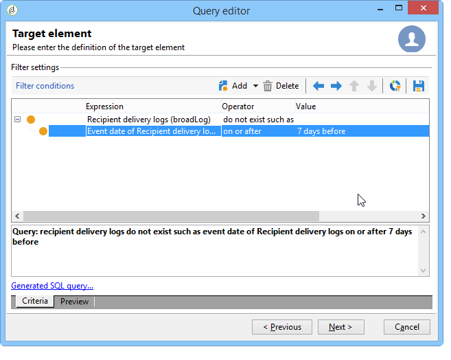

# 使用多對多關係查詢{#querying-using-a-many-to-many-relationship}

在此範例中，我們想要復原過去7天內未連絡的收件者。 此查詢涉及所有交貨。

此範例也說明如何設定與系列元素（或橘色節點）選擇相關的篩選。 **[!UICONTROL Field to select]**&#x200B;視窗中提供系列元素。

* 需要選擇哪個表？

   收件者表(**nms:recipient**)

* 要為輸出列選擇的欄位

   主鍵、姓氏、名字和電子郵件

* 根據篩選的資訊是哪個標準

   根據收件者在今天前7天的傳送記錄

應用以下步驟：

1. 開啟「一般查詢編輯器」並選擇「收件人」表&#x200B;**[!UICONTROL (nms:recipient)]**。
1. 在&#x200B;**[!UICONTROL Data to extract]**&#x200B;窗口中，選擇&#x200B;**[!UICONTROL Primary key]**、**[!UICONTROL First name]**、**[!UICONTROL Last name]**&#x200B;和&#x200B;**[!UICONTROL Email]**。

   

1. 在排序窗口中，按字母順序對名稱排序。

   

1. 在&#x200B;**[!UICONTROL Data filtering]**&#x200B;窗口中，選擇&#x200B;**[!UICONTROL Filtering conditions]**。
1. 在&#x200B;**[!UICONTROL Target element]**&#x200B;視窗中，擷取過去7天沒有追蹤記錄的描述檔的篩選條件包含兩個步驟。 您需要選取的元素是多對多連結。

   * 首先，為第一個&#x200B;**[!UICONTROL Value]**&#x200B;列選擇&#x200B;**[!UICONTROL Recipient delivery logs (broadlog)]**&#x200B;收集元素（橘色節點）。

      

      選擇&#x200B;**[!UICONTROL do not exist as]**&#x200B;運算子。 無需在此行中選擇第二個值。

   * 第二過濾條件的內容取決於第一過濾條件。 在此處，**[!UICONTROL Event date]**&#x200B;欄位直接在&#x200B;**[!UICONTROL Recipient delivery logs]**&#x200B;表中提供，因為有到此表的連結。

      

      使用&#x200B;**[!UICONTROL greater than or equal to]**&#x200B;運算子選擇&#x200B;**[!UICONTROL Event date]**。 選擇&#x200B;**[!UICONTROL DaysAgo (7)]**&#x200B;值。 若要這麼做，請按一下&#x200B;**[!UICONTROL Value]**&#x200B;欄位中的&#x200B;**[!UICONTROL Edit expression]**。 在&#x200B;**[!UICONTROL Formula type]**&#x200B;窗口中，選擇&#x200B;**[!UICONTROL Process on dates]**&#x200B;和&#x200B;**[!UICONTROL Current date minus n days]** ，將&quot;7&quot;作為值。

      

      篩選條件已設定。

      

1. 在&#x200B;**[!UICONTROL Data formatting]**&#x200B;窗口中，將姓氏切換為大寫。 按一下&#x200B;**[!UICONTROL Transformation]**&#x200B;列中的&#x200B;**[!UICONTROL Last name]**&#x200B;行，然後在下拉菜單中選擇&#x200B;**[!UICONTROL Switch to upper case]**。

   

1. 使用&#x200B;**[!UICONTROL Add a calculated field]**&#x200B;函式將列插入資料預覽窗口。

   在此範例中，在單一欄中新增包含收件者名字和姓氏的計算欄位。 按一下&#x200B;**[!UICONTROL Add a calculated field]**&#x200B;函式。 在&#x200B;**[!UICONTROL Export calculated field definition]**&#x200B;窗口中，輸入標籤和內部名稱，然後選擇&#x200B;**[!UICONTROL JavaScript Expression]**&#x200B;類型。 然後輸入以下表達式：

   ```
   var rep = source._firstName+" - "+source._lastName
   return rep
   ```

   

   按一下 **[!UICONTROL OK]**。已配置&#x200B;**[!UICONTROL Data formatting]**&#x200B;窗口。

   如需有關新增計算欄位的詳細資訊，請參閱本節。

1. 結果顯示在&#x200B;**[!UICONTROL Data preview]**&#x200B;窗口中。 過去7天內未連絡的收件者會以字母順序顯示。 名稱以大寫顯示，且已建立具有名字和姓氏的列。

   
