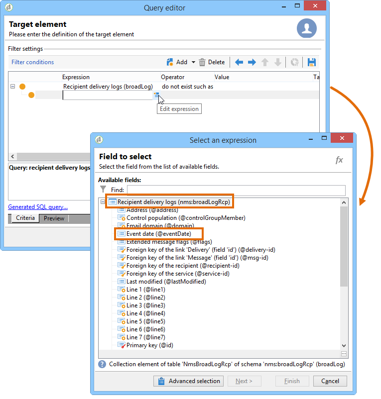
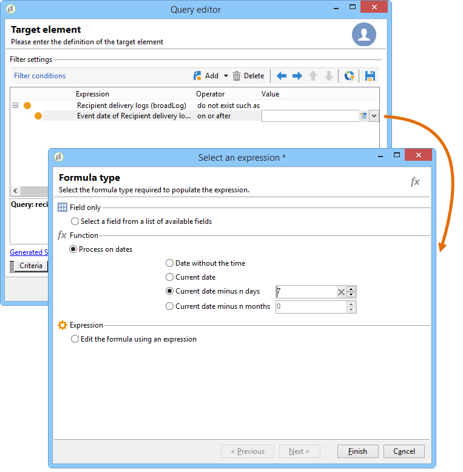
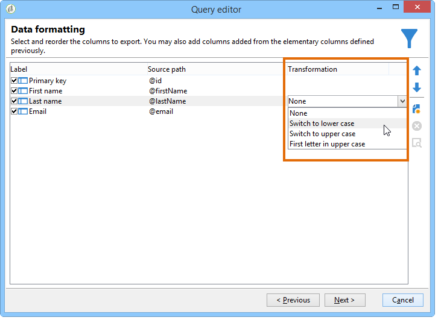
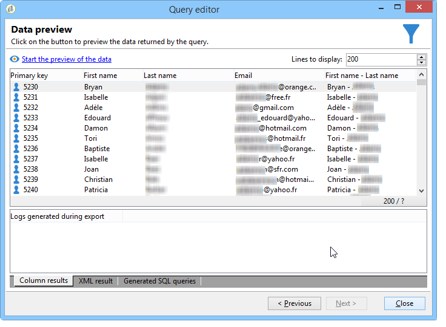

# 使用多對多關係進行查詢 {#querying-using-a-many-to-many-relationship}


在此範例中，我們想要復原過去7天未聯絡的收件者。 此查詢涉及所有傳送。

此範例也說明如何設定與選擇集合元素（或橘色節點）相關的篩選器。 集合元素可在&#x200B;**[!UICONTROL Field to select]**&#x200B;視窗中使用。

* 需要選取哪個表格？

   收件者表格(**nms:recipient**)

* 要為輸出列選擇的欄位

   主鍵、姓氏、名字和電子郵件

* 根據篩選的資訊是哪個標準

   根據收件者的傳送記錄，今天之前7天

應用以下步驟：

1. 開啟「一般查詢」編輯器，然後選取「收件者」表&#x200B;**[!UICONTROL (nms:recipient)]**。
1. 在&#x200B;**[!UICONTROL Data to extract]**&#x200B;窗口中，選擇&#x200B;**[!UICONTROL Primary key]**、**[!UICONTROL First name]**、**[!UICONTROL Last name]**&#x200B;和&#x200B;**[!UICONTROL Email]**。

   

1. 在排序視窗中，依字母排序名稱。

   

1. 在&#x200B;**[!UICONTROL Data filtering]**&#x200B;窗口中，選擇&#x200B;**[!UICONTROL Filtering conditions]**。
1. 在&#x200B;**[!UICONTROL Target element]**&#x200B;視窗中，擷取過去7天內沒有追蹤記錄之設定檔的篩選條件涉及兩個步驟。 您需要選取的元素是多對多連結。

   * 首先，為第一個&#x200B;**[!UICONTROL Value]**&#x200B;欄選取&#x200B;**[!UICONTROL Recipient delivery logs (broadlog)]**&#x200B;集合元素（橘色節點）。

      

      選擇&#x200B;**[!UICONTROL do not exist as]**&#x200B;運算子。 不需要在此行中選取第二個值。

   * 第二篩選條件的內容取決於第一個。 在此，**[!UICONTROL Event date]**&#x200B;欄位直接提供在&#x200B;**[!UICONTROL Recipient delivery logs]**&#x200B;表中，因為有此表的連結。

      

      使用&#x200B;**[!UICONTROL greater than or equal to]**&#x200B;運算子選擇&#x200B;**[!UICONTROL Event date]**。 選取&#x200B;**[!UICONTROL DaysAgo (7)]**&#x200B;值。 要執行此操作，請按一下&#x200B;**[!UICONTROL Value]**&#x200B;欄位中的&#x200B;**[!UICONTROL Edit expression]**。 在&#x200B;**[!UICONTROL Formula type]**&#x200B;窗口中，選擇&#x200B;**[!UICONTROL Process on dates]**&#x200B;和&#x200B;**[!UICONTROL Current date minus n days]**，將&quot;7&quot;作為值。

      

      篩選條件已設定。

      

1. 在&#x200B;**[!UICONTROL Data formatting]**&#x200B;窗口中，將姓氏切換為大寫。 按一下&#x200B;**[!UICONTROL Transformation]**&#x200B;欄中的&#x200B;**[!UICONTROL Last name]**&#x200B;行，然後在下拉式功能表中選取&#x200B;**[!UICONTROL Switch to upper case]**。

   

1. 使用&#x200B;**[!UICONTROL Add a calculated field]**&#x200B;函式將列插入資料預覽窗口。

   在此範例中，在單一欄中新增包含收件者名字和姓氏的計算欄位。 按一下&#x200B;**[!UICONTROL Add a calculated field]**&#x200B;函式。 在&#x200B;**[!UICONTROL Export calculated field definition]**&#x200B;窗口中，輸入標籤和內部名稱，然後選擇&#x200B;**[!UICONTROL JavaScript Expression]**&#x200B;類型。 然後輸入下列運算式：

   ```
   var rep = source._firstName+" - "+source._lastName
   return rep
   ```

   

   按一下 **[!UICONTROL OK]**。已配置&#x200B;**[!UICONTROL Data formatting]**&#x200B;窗口。

   如需新增計算欄位的詳細資訊，請參閱本區段。

1. 結果顯示在&#x200B;**[!UICONTROL Data preview]**&#x200B;窗口中。 過去7天內未與收件者聯絡的收件者會以字母順序顯示。 名稱會以大寫顯示，且已建立包含名字和姓氏的欄。

   
