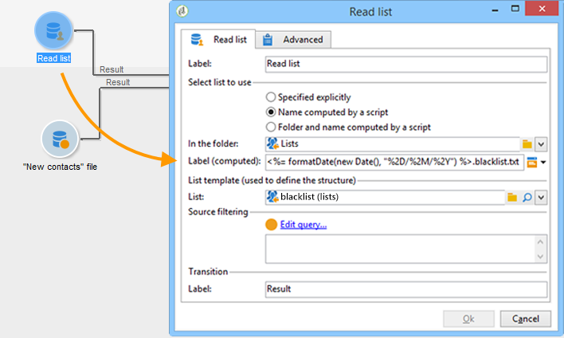

# 讀取清單{#read-list}

在工作流程中處理的資料可來自清單，其中資料已事先準備或結構化（在先前的分段或檔案上傳後）。

此活 **[!UICONTROL Read list]** 動可讓您從工作流程工作表的清單複製資料，例如查詢中的資料。 然後可在整個工作流程中存取。

要處理的清單可以根據選定的選項和活動中定義的參數顯式指定，由指令碼計算或動態本地 **[!UICONTROL Read list]** 化。

如果未明確指定清單，則必須提供要用作模板的清單以查找其結構。

在設定清單選取範圍後，您就可以使用選項新增篩選， **[!UICONTROL Edit query]** 以保留下一個工作流程的一部分人口。

>[!CAUTION]
>
>若要能夠在讀取清單活動中建立篩選，相關清單必須是「檔案」類型。

清單可直接在Adobe Campaign中透過首頁 **[!UICONTROL Profiles and Targets > Lists]** 的連結建立。 您也可以在使用活動的工作流程中建立 **[!UICONTROL List update]** 它們。

**範例：排除傳送位址清單**

下列範例可讓您使用電子郵件地址清單，從電子郵件傳送目標中排除。

「新建聯繫人」檔案 **夾中包含的配置檔案** ，必須由傳送操作定位。 要從目標中排除的電子郵件地址會儲存在外部清單中。 在我們的範例中，排除時只需要電子郵件位址的資訊。

1. 「新 **建聯繫人** 」資料夾選擇查詢必須允許您載入選定配置檔案的電子郵件地址，以便能夠與清單中的資訊對齊。

   

1. 在此，清單將儲存在「清單」 **資料夾** ，並計算其標籤。

   

1. 為了從主目標中排除外部清單的電子郵件地址，您必須配置排除活動並指定「 **New Contacts** 」資料夾包含要保留的資料。 此集合與來自排除活動的任何其他入站集合之間的聯合資料將從目標中刪除。

   

   排除規則是在編輯工具的中央區段中設定。 按一 **[!UICONTROL Add]** 下按鈕以定義要套用的排除類型。

   您可以根據活動的傳入轉場數來定義數個排除。

1. 在欄位 **[!UICONTROL Exclusion set]** 中，選取活 **[!UICONTROL Read list]** 動：此活動中的資料將從主集中排除。

   在我們的例子中，我們在連接上有一個排除：清單中包含的資料將與包含電子郵件地址的欄位中主集的資料協調。 要配置聯接，請在字 **[!UICONTROL Joins]** 段中選 **[!UICONTROL Change dimension]** 擇。

   

1. 然後，選擇與兩組電子郵件地址（「來源」和「目標」）對應的欄位。 然後，這些欄將會連結，而其電子郵件位址在匯入位址清單中的收件者，將會從目標中排除。

