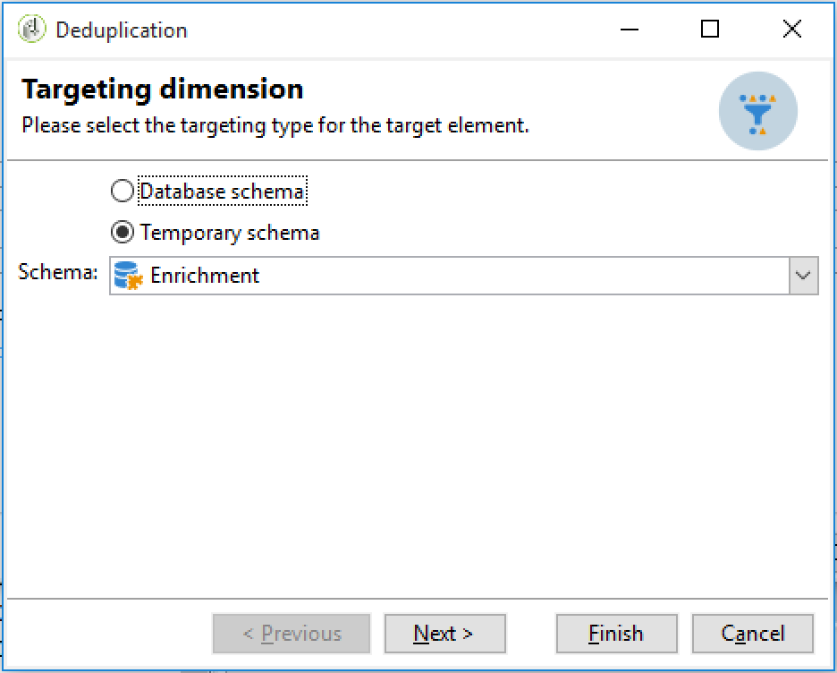

# 設定循環匯入工作流程 {#setting-up-a-recurring-import}

如果您需要定期匯入具有相同結構的檔案，則使用工作流程範本是最佳作法。

此範例說明如何預先設定可重複用於匯入來自Adobe Campaign資料庫中CRM之設定檔的工作流程。 有關每個活動的所有可能設定的詳細資訊，請參閱此[節](../../workflow/using/about-activities.md)。

1. 從&#x200B;**[!UICONTROL Resources > Templates > Workflow templates]**&#x200B;建立新的工作流模板。
1. 新增下列活動：

   * **[!UICONTROL Data loading (file)]**:定義包含要匯入之資料的檔案的預期結構。
   * **[!UICONTROL Enrichment]**:將匯入的資料與資料庫資料進行調解。
   * **[!UICONTROL Split]**:建立篩選器以根據記錄是否可協調而以不同方式處理記錄。
   * **[!UICONTROL Deduplication]**:在將傳入檔案插入資料庫之前，先從該檔案中刪除重複資料。
   * **[!UICONTROL Update data]**:使用匯入的設定檔更新資料庫。

   

1. 配置&#x200B;**[!UICONTROL Data Loading (file)]**&#x200B;活動：

   * 上傳範例檔案以定義預期的結構。 範例檔案應僅包含幾行，但匯入所需的所有欄。 檢查並編輯檔案格式，確保正確設定每欄的類型：文字、日期、整數等。 例如：

      ```
      lastname;firstname;birthdate;email;crmID
      Smith;Hayden;23/05/1989;hayden.smith@mailtest.com;123456
      ```

   * 在&#x200B;**[!UICONTROL Name of the file to load]**&#x200B;區段中，選取&#x200B;**[!UICONTROL Upload a file from the local machine]**&#x200B;並將欄位留空。 每次從此模板建立新工作流時，只要與定義的結構對應，您都可以在此處指定所需的檔案。

      您可以使用任何選項，但必須據以修改範本。 例如，如果您選取&#x200B;**[!UICONTROL Specified in the transition]**，則可先新增&#x200B;**[!UICONTROL File Transfer]**&#x200B;活動，再擷取要從FTP/SFTP伺服器匯入的檔案。 透過S3或SFTP連線，您也可以透過Adobe即時客戶資料平台，將區段資料匯入Adobe Campaign。 有關詳細資訊，請參閱此[文檔](https://experienceleague.adobe.com/docs/experience-platform/destinations/catalog/email-marketing/adobe-campaign.html)。

      

1. 配置&#x200B;**[!UICONTROL Enrichment]**&#x200B;活動。 此活動在此背景下的目的是識別傳入的資料。

   * 在&#x200B;**[!UICONTROL Enrichment]**&#x200B;標籤中，選取&#x200B;**[!UICONTROL Add data]**&#x200B;並定義匯入資料與收件者目標維度之間的連結。 在此範例中，使用&#x200B;**CRM ID**&#x200B;自訂欄位來建立連結條件。 使用您需要的欄位或欄位組合，只要它允許識別唯一記錄即可。
   * 在&#x200B;**[!UICONTROL Reconciliation]**&#x200B;標籤中，取消勾選&#x200B;**[!UICONTROL Identify the document from the working data]**&#x200B;選項。

   

1. 設定&#x200B;**[!UICONTROL Split]**&#x200B;活動，以在一個轉變中擷取已調解的收件者，以及在第二個轉變中無法調解但擁有足夠資料的收件者。

   之後，可以使用與已調解收件者的轉變來更新資料庫。 然後，如果檔案中有最少一組資訊可用，則具有未知收件者的轉變可用於在資料庫中建立新的收件者項目。

   無法調解且沒有足夠資料的收件者會在補充的出站轉變中選取，並可匯出至個別檔案或僅遭忽略。

   * 在活動的&#x200B;**[!UICONTROL General]**&#x200B;標籤中，選擇&#x200B;**[!UICONTROL Use the additional data only]**&#x200B;作為篩選設定，並確保&#x200B;**[!UICONTROL Targeting dimension]**&#x200B;自動設定為&#x200B;**[!UICONTROL Enrichment]**。

      檢查&#x200B;**[!UICONTROL Generate complement]**&#x200B;選項，以查看資料庫中是否無法插入任何記錄。 如有需要，您可以對補充資料套用進一步處理：檔案匯出、清單更新等。

   * 在&#x200B;**[!UICONTROL Subsets]**&#x200B;標籤的第一個子集中，對入站母體添加篩選條件，以僅選擇收件者主鍵不等於0的記錄。 這樣，在該子集中將選擇與資料庫的收件人協調的檔案中的資料。

      

   * 添加第二個子集，以選擇具有足夠資料可插入資料庫的未協調記錄。 例如：電子郵件地址、名字和姓氏。

      子集按其建立順序進行處理，這意味著當處理此第二子集時，已存在於資料庫中的所有記錄都已在第一子集中被選擇。

      

   * 未在前兩個子集中選擇的所有記錄都在&#x200B;**[!UICONTROL Complement]**&#x200B;中選擇。

1. 設定位於先前設定之&#x200B;**[!UICONTROL Split]**&#x200B;活動之第一個出站轉變之後的&#x200B;**[!UICONTROL Update data]**&#x200B;活動。

   * 選擇&#x200B;**[!UICONTROL Update]**&#x200B;作為&#x200B;**[!UICONTROL Operation type]**，因為入站轉變僅包含資料庫中已存在的收件者。
   * 在&#x200B;**[!UICONTROL Record identification]**&#x200B;區段中，選取&#x200B;**[!UICONTROL Using reconciliation keys]**&#x200B;並定義目標維度與在&#x200B;**[!UICONTROL Enrichment]**&#x200B;中建立的連結之間的索引鍵。 在此範例中，使用&#x200B;**CRM ID**&#x200B;自訂欄位。
   * 在&#x200B;**[!UICONTROL Fields to update]**&#x200B;區段中，指出收件者維度中的欄位，以使用檔案中對應欄的值更新。 如果檔案列的名稱與收件人維欄位的名稱相同或幾乎相同，則可以使用魔術棒按鈕自動匹配不同欄位。

      

1. 設定位於包含未調解收件者之轉變之後的&#x200B;**[!UICONTROL Deduplication]**&#x200B;活動：

   * 選取&#x200B;**[!UICONTROL Edit configuration]**&#x200B;並將目標維度設為從工作流程的&#x200B;**[!UICONTROL Enrichment]**&#x200B;活動產生的臨時架構。

      

   * 在此範例中，電子郵件欄位可用來尋找唯一的設定檔。 您可以使用任何您確定已填入的欄位，以及唯一組合的一部分。
   * 在&#x200B;**[!UICONTROL Deduplication method]**&#x200B;螢幕中，選擇&#x200B;**[!UICONTROL Advanced parameters]**&#x200B;並核取&#x200B;**[!UICONTROL Disable automatic filtering of 0 ID records]**&#x200B;選項，以確保未排除主鍵等於0（應為此轉變的所有記錄）的記錄。

   

1. 設定位於先前設定之&#x200B;**[!UICONTROL Deduplication]**&#x200B;活動之後的&#x200B;**[!UICONTROL Update data]**&#x200B;活動。

   * 選擇&#x200B;**[!UICONTROL Insert]**&#x200B;作為&#x200B;**[!UICONTROL Operation type]**，因為入站轉變僅包含資料庫中不存在的收件者。
   * 在&#x200B;**[!UICONTROL Record identification]**&#x200B;部分，選擇&#x200B;**[!UICONTROL Directly using the targeting dimension]**&#x200B;並選擇&#x200B;**[!UICONTROL Recipients]**&#x200B;維。
   * 在&#x200B;**[!UICONTROL Fields to update]**&#x200B;區段中，指出收件者維度中的欄位，以使用檔案中對應欄的值更新。 如果檔案列的名稱與收件人維欄位的名稱相同或幾乎相同，則可以使用魔術棒按鈕自動匹配不同欄位。

      

1. 在&#x200B;**[!UICONTROL Split]**&#x200B;活動的第三次轉變後，如果要跟蹤未插入資料庫中的資料，請添加&#x200B;**[!UICONTROL Data extraction (file)]**&#x200B;活動和&#x200B;**[!UICONTROL File transfer]**&#x200B;活動。 設定這些活動以匯出您需要的欄，並在FTP或SFTP伺服器上傳輸檔案，您可在其中擷取檔案。
1. 新增&#x200B;**[!UICONTROL End]**&#x200B;活動並儲存工作流程範本。

範本現在可供使用，並可供所有新工作流程使用。 然後，需要全部來指定包含要在&#x200B;**[!UICONTROL Data loading (file)]**&#x200B;活動中匯入之資料的檔案。


