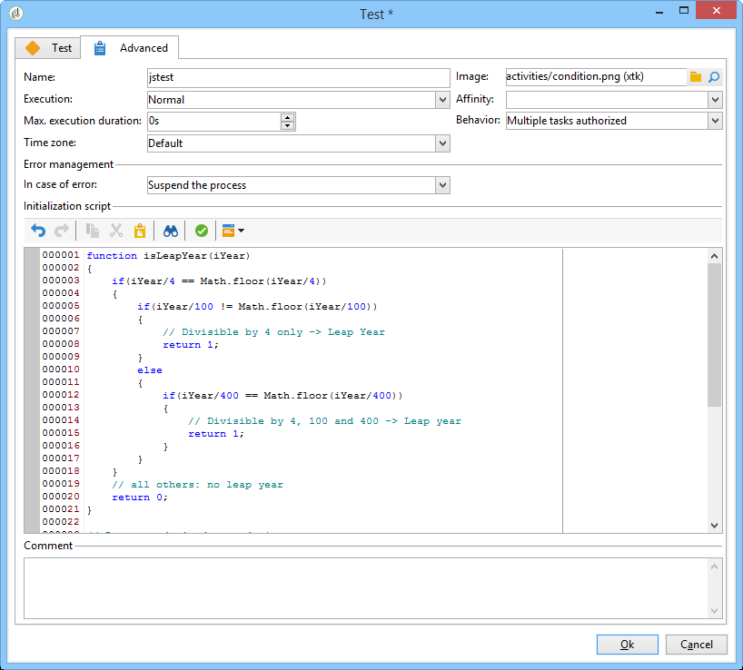
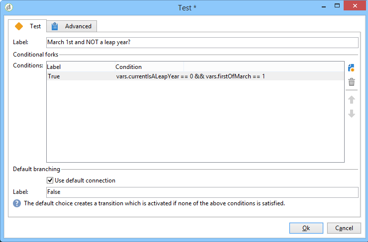

# 傳送生日電子郵件{#sending-a-birthday-email}


## 簡介 {#introduction}

此使用案例說明如何規劃在收件者生日當天傳送循環電子郵件至其清單。

為了設定此使用案例，我們建立了下列目標工作流程：


此（每日執行）工作流程會選取在目前日期具有其生日的所有收件者。

 您也可以以影片的形式找到此使用案例。有關詳細資訊，請參閱[建立工作流程](https://experienceleague.adobe.com/docs/campaign-classic-learn/tutorials/automating-with-workflows/creating-a-workflow.html)影片。

若要這麼做，請建立促銷活動，然後按一下&#x200B;**[!UICONTROL Targeting and workflows]**&#x200B;標籤。 有關詳細資訊，請參閱[在工作流](../../campaign/using/marketing-campaign-deliveries.md#building-the-main-target-in-a-workflow)區段中建立主要目標。

然後，請依照下列步驟操作：

## 排程傳送 {#configuring-the-scheduler}

1. 首先，新增&#x200B;**排程器**&#x200B;以觸發每天傳送傳送。 在以下範例中，傳送會每天早上6:00建立。

   


## 識別生日為誰的收件者 {#identifying-recipients-whose-birthday-it-is}

設定&#x200B;**[!UICONTROL Scheduler]**&#x200B;活動以便工作流程每天開始後，請識別其出生日期等於目前日期的所有收件者。

若要這麼做，請套用下列步驟：

1. 將&#x200B;**[!UICONTROL Query]**&#x200B;活動拖放至工作流程中，並連按兩下它。
1. 按一下&#x200B;**編輯查詢**&#x200B;連結並選取&#x200B;**[!UICONTROL Filtering conditions]**。

   

1. 按一下&#x200B;**[!UICONTROL Expression]**&#x200B;欄的第一個儲存格，然後按一下&#x200B;**[!UICONTROL Edit expression]**&#x200B;以開啟運算式編輯器。

   

1. 按一下&#x200B;**[!UICONTROL Advanced selection]**&#x200B;以選取篩選模式。

   

1. 選擇&#x200B;**[!UICONTROL Edit the formula using an expression]**&#x200B;並按一下&#x200B;**[!UICONTROL Next]**&#x200B;以顯示運算式編輯器。
1. 在函式清單中，按兩下可透過&#x200B;**[!UICONTROL Date]**&#x200B;節點存取的&#x200B;**[!UICONTROL Day]**。 此函式會傳回數字，代表與以參數傳遞之日期相對應的日期。

   

1. 在可用欄位清單中，按兩下&#x200B;**[!UICONTROL Birth date]**。 然後編輯器的上方區段顯示下列公式：

   ```
   Day(@birthDate)
   ```

   按一下&#x200B;**[!UICONTROL Finish]**&#x200B;以確認。

1. 在查詢編輯器中，在&#x200B;**[!UICONTROL Operator]**&#x200B;欄的第一個儲存格中，選取&#x200B;**[!UICONTROL equal to]**。

   

1. 接下來，按一下第二列的第一個儲存格(**[!UICONTROL Value]**)，然後按一下&#x200B;**[!UICONTROL Edit expression]**&#x200B;以開啟運算式編輯器。
1. 在函式清單中，按兩下可透過&#x200B;**[!UICONTROL Date]**&#x200B;節點存取的&#x200B;**[!UICONTROL Day]**。
1. 按兩下&#x200B;**[!UICONTROL GetDate]**&#x200B;函式以擷取目前日期。

   

   編輯器的上方區段顯示下列公式：

   ```
   Day(GetDate())
   ```

   按一下&#x200B;**[!UICONTROL Finish]**&#x200B;以確認。

1. 重複此過程以檢索與當前月份對應的出生月份。 要執行此操作，請按一下&#x200B;**[!UICONTROL Add]**&#x200B;按鈕並重複步驟3到10，將&#x200B;**[!UICONTROL Day]**&#x200B;替換為&#x200B;**[!UICONTROL Month]**。

   完整查詢如下：

   

將&#x200B;**[!UICONTROL Query]**&#x200B;活動的結果連結到&#x200B;**[!UICONTROL Email delivery]**&#x200B;活動，以將電子郵件發送到生日時所有收件人的清單。

## 包括2月29日出生的收件者（可選） {#including-recipients-born-on-february-29th--optional-}

如果您想納入2月29日出生的所有收件者，此使用案例會說明如何計畫傳送循環電子郵件給生日的收件者清單，無論是否為閏年。

此使用案例的主要實作步驟為：

* 選取收件者
* 選擇是否是閏年
* 選擇2月29日出生的任何收件人

為了設定此使用案例，我們建立了下列目標工作流程：


如果當前年份&#x200B;**不是閏年**，而工作流程在3月1日運行，則我們需要選擇所有原本在昨天（2月29日）生日的收件者，並將他們添加到收件者清單中。 在任何其他情況下，均無需採取其他動作。

### 步驟1:選取收件者 {#step-1--selecting-the-recipients}

設定&#x200B;**[!UICONTROL Scheduler]**&#x200B;活動以讓工作流程每天開始後，請識別週年為當天的所有收件者。

>[!NOTE]
>
>如果今年是閏年，則所有出生於2月29日的收件者都會自動包含在內。


在[「識別生日為](#identifying-recipients-whose-birthday-it-is)的收件者」區段中會顯示選取生日對應至目前日期的收件者。

### 步驟2:選擇是否是閏年 {#step-2--select-whether-or-not-it-is-a-leap-year}

**[!UICONTROL Test]**&#x200B;活動可讓您檢查這是否為閏年，以及目前日期是否為3月1日。

如果測試經過驗證（年份不是閏年 — 沒有2月29日 — 而目前日期確實是3月1日）,**[!UICONTROL True]**&#x200B;轉變即會啟用，而2月29日出生的收件者將會新增至3月1日的傳送。 否則，將啟用&#x200B;**[!UICONTROL False]**&#x200B;轉變，只有在目前日期出生的收件者才會收到傳遞。

將下方的程式碼複製並貼到&#x200B;**[!UICONTROL Advanced]**&#x200B;標籤的&#x200B;**[!UICONTROL Initialization script]**&#x200B;區段中。

```
function isLeapYear(iYear)
{
    if(iYear/4 == Math.floor(iYear/4))
    {
        if(iYear/100 != Math.floor(iYear/100))
        {
            // Divisible by 4 only -> Leap Year
            return 1;
        }
        else
        {
            if(iYear/400 == Math.floor(iYear/400))
            {
                // Divisible by 4, 100 and 400 -> Leap year
                return 1;
            }
        }
    }
    // all others: no leap year
    return 0;
}

// Return today's date and time
var currentTime = new Date()
// returns the month (from 0 to 11)
var month = currentTime.getMonth() + 1
// returns the day of the month (from 1 to 31)
var day = currentTime.getDate()
// returns the year (four digits)
var year = currentTime.getFullYear()

// is current year a leap year?
vars.currentIsALeapYear = isLeapYear(year);

// is current date the first of march?
if(month == 3 && day == 1) {
  // today is 1st of march
vars.firstOfMarch = 1;
}
```



在&#x200B;**[!UICONTROL Conditional forks]**&#x200B;區段中新增下列條件：

```
vars.currentIsALeapYear == 0 && vars.firstOfMarch == 1
```



### 步驟3:選擇2月29日出生的任何收件人 {#step-3--select-any-recipients-born-on-february-29th}

建立&#x200B;**[!UICONTROL Fork]**&#x200B;活動，並將其中一個出站轉變連結至&#x200B;**[!UICONTROL Query]**&#x200B;活動。

在此查詢中，選擇出生日期為2月29日的所有收件人。


將結果與&#x200B;**[!UICONTROL Union]**&#x200B;活動結合。

將兩個&#x200B;**[!UICONTROL Test]**&#x200B;活動分支的結果連結到&#x200B;**[!UICONTROL Email delivery]**&#x200B;活動，以在生日當天向所有收件者的清單發送電子郵件，即使是在非閏年期間出生的收件者。

## 建立循環傳送 {#creating-a-recurring-delivery-in-a-targeting-workflow}

根據您要傳送的生日電子郵件範本，新增&#x200B;**循環傳送**&#x200B;活動。

>[!CAUTION]
>
>若要執行工作流程，必須啟動與Campaign套件相關的技術工作流程。 有關詳細資訊，請參閱[技術工作流程清單](about-technical-workflows.md)區段。
>
>如果為促銷活動啟用核准步驟，則只有確認這些步驟後，才會傳送傳遞。 有關詳細資訊，請參閱[選擇要批准的進程](../../campaign/using/marketing-campaign-approval.md#choosing-the-processes-to-be-approved)部分。


