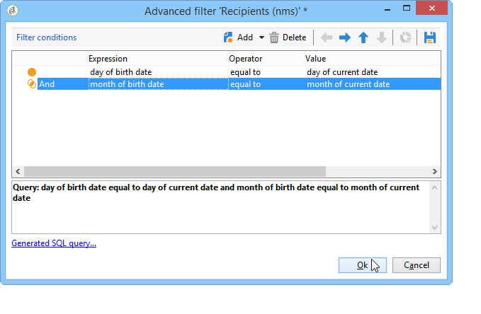

# 傳送生日電子郵件{#sending-a-birthday-email}

## 簡介 {#introduction}

此使用案例說明如何規劃在收件者生日當天，將循環電子郵件傳送至其清單。

若要設定此使用案例，我們建立了下列定位工作流程：


此（每日執行）工作流程會選取目前日期有生日的所有收件者。

 此使用案例也可以以視訊的形式找到。有關詳細資訊，請參閱[建立工作流](https://docs.adobe.com/content/help/en/campaign-classic-learn/tutorials/automating-with-workflows/creating-a-workflow.html)視頻。

若要這麼做，請建立促銷活動，然後按一下&#x200B;**[!UICONTROL Targeting and workflows]**&#x200B;標籤。 有關詳細資訊，請參閱[在工作流](../../campaign/using/marketing-campaign-deliveries.md#building-the-main-target-in-a-workflow)中構建主目標部分。

然後，請遵循下列步驟：

## 排程傳送的{#configuring-the-scheduler}

1. 首先，新增&#x200B;**排程器**&#x200B;以觸發每天傳送傳送。 在以下範例中，每天早上6點建立傳送。

   


## 識別生日{#identifying-recipients-whose-birthday-it-is}的收件者

在設定&#x200B;**[!UICONTROL Scheduler]**&#x200B;活動以便工作流程每天開始後，請識別出生日期等於目前日期的所有收件者。

若要這麼做，請套用下列步驟：

1. 將&#x200B;**[!UICONTROL Query]**&#x200B;活動拖放至工作流程中，然後按兩下。
1. 按一下&#x200B;**編輯查詢**&#x200B;連結並選擇&#x200B;**[!UICONTROL Filtering conditions]**。

   

1. 按一下&#x200B;**[!UICONTROL Expression]**&#x200B;列的第一個單元格，然後按一下&#x200B;**[!UICONTROL Edit expression]**&#x200B;開啟表達式編輯器。

   

1. 按一下&#x200B;**[!UICONTROL Advanced selection]**&#x200B;選擇過濾模式。

   

1. 選擇&#x200B;**[!UICONTROL Edit the formula using an expression]**&#x200B;並按一下&#x200B;**[!UICONTROL Next]**&#x200B;以顯示表達式編輯器。
1. 在函式清單中，按兩下&#x200B;**[!UICONTROL Day]** ，該&#x200B;**[!UICONTROL Date]**&#x200B;節點可以訪問。 此函式會傳回代表與作為參數傳遞之日期相對應的日期的數字。

   

1. 在可用欄位清單中，按兩下&#x200B;**[!UICONTROL Birth date]**。 然後編輯器的上部區域會顯示下列公式：

   ```
   Day(@birthDate)
   ```

   按一下&#x200B;**[!UICONTROL Finish]**&#x200B;進行確認。

1. 在查詢編輯器中，在&#x200B;**[!UICONTROL Operator]**&#x200B;列的第一個單元格中，選擇&#x200B;**[!UICONTROL equal to]**。

   

1. 接著，按一下第二欄的第一個儲存格(**[!UICONTROL Value]**)，然後按一下&#x200B;**[!UICONTROL Edit expression]**&#x200B;以開啟運算式編輯器。
1. 在函式清單中，按兩下&#x200B;**[!UICONTROL Day]** ，該&#x200B;**[!UICONTROL Date]**&#x200B;節點可以訪問。
1. 連按兩下&#x200B;**[!UICONTROL GetDate]**&#x200B;函式以擷取目前的日期。

   

   編輯器的上部區域顯示以下公式：

   ```
   Day(GetDate())
   ```

   按一下&#x200B;**[!UICONTROL Finish]**&#x200B;進行確認。

1. 重複此過程以檢索與當月對應的出生月份。 要執行此操作，請按一下&#x200B;**[!UICONTROL Add]**&#x200B;按鈕並重複步驟3到10，將&#x200B;**[!UICONTROL Day]**&#x200B;替換為&#x200B;**[!UICONTROL Month]**。

   完整查詢如下：

   

將&#x200B;**[!UICONTROL Query]**&#x200B;活動的結果連結至&#x200B;**[!UICONTROL Email delivery]**&#x200B;活動，以寄送電子郵件至所有收件者的生日清單。

## 包含2月29日出生的收件者（可選）{#including-recipients-born-on-february-29th--optional-}

如果您想要包含2月29日出生的所有收件者，此使用案例會說明如何計畫傳送循環電子郵件給其生日的收件者清單——不論是否是閏年。

此使用案例的主要實施步驟為：

* 選取收件者
* 選擇是否是閏年
* 選擇2月29日出生的收件者

若要設定此使用案例，我們建立了下列定位工作流程：


如果當前年份&#x200B;**不是閏年**，而工作流程在3月1日運行，我們需要選擇所有昨天（2月29日）生日的收件者，並將其添加到收件者清單中。 在任何其他情況下，都不需要採取其他行動。

### 步驟1:選擇收件人{#step-1--selecting-the-recipients}

在設定&#x200B;**[!UICONTROL Scheduler]**&#x200B;活動以開始工作流程後，請識別週年日為當天的所有收件者。

>[!NOTE]
>
>如果今年是閏年，那麼所有在2月29日出生的收件者都會自動納入。


在[「識別生日為](#identifying-recipients-whose-birthday-it-is)的收件者」區段中，選擇生日與目前日期對應的收件者。

### 步驟2:選擇是否為閏年{#step-2--select-whether-or-not-it-is-a-leap-year}

**[!UICONTROL Test]**&#x200B;活動可讓您檢查它是否為閏年，以及目前日期是否為3月1日。

如果測試通過驗證（年份不是閏年——沒有2月29日——而目前日期確實是3月1日），則&#x200B;**[!UICONTROL True]**&#x200B;轉換將啟用，而2月29日出生的收件者將被添加到3月1日的交貨中。 否則，**[!UICONTROL False]**&#x200B;轉換會啟用，只有在目前日期出生的收件者才會收到傳送。

將下面的代碼複製並貼上到&#x200B;**[!UICONTROL Advanced]**&#x200B;頁籤的&#x200B;**[!UICONTROL Initialization script]**&#x200B;部分。

```
function isLeapYear(iYear)
{
    if(iYear/4 == Math.floor(iYear/4))
    {
        if(iYear/100 != Math.floor(iYear/100))
        {
            // Divisible by 4 only -> Leap Year
            return 1;
        }
        else
        {
            if(iYear/400 == Math.floor(iYear/400))
            {
                // Divisible by 4, 100 and 400 -> Leap year
                return 1;
            }
        }
    }
    // all others: no leap year
    return 0;
}

// Return today's date and time
var currentTime = new Date()
// returns the month (from 0 to 11)
var month = currentTime.getMonth() + 1
// returns the day of the month (from 1 to 31)
var day = currentTime.getDate()
// returns the year (four digits)
var year = currentTime.getFullYear()

// is current year a leap year?
vars.currentIsALeapYear = isLeapYear(year);

// is current date the first of march?
if(month == 3 && day == 1) {
  // today is 1st of march
vars.firstOfMarch = 1;
}
```


在&#x200B;**[!UICONTROL Conditional forks]**&#x200B;節中添加以下條件：

```
vars.currentIsALeapYear == 0 && vars.firstOfMarch == 1
```


### 步驟3:選擇2月29日出生的任何收件者{#step-3--select-any-recipients-born-on-february-29th}

建立&#x200B;**[!UICONTROL Fork]**&#x200B;活動，並將其中一個傳出轉場連結至&#x200B;**[!UICONTROL Query]**&#x200B;活動。

在此查詢中，選擇出生日期為2月29日的所有收件者。


結合結果與&#x200B;**[!UICONTROL Union]**&#x200B;活動。

將兩個&#x200B;**[!UICONTROL Test]**&#x200B;活動分支的結果連結至&#x200B;**[!UICONTROL Email delivery]**&#x200B;活動，以便在所有收件者的生日當天（即使是在非閏年的2月29日出生的人）寄送電子郵件至其清單。

## 建立循環傳送{#creating-a-recurring-delivery-in-a-targeting-workflow}

根據您要傳送的生日電子郵件範本，新增&#x200B;**循環傳送**&#x200B;活動。

>[!CAUTION]
>
>若要執行工作流程，必須啟動與Campaign套件相關的技術工作流程。 有關詳細資訊，請參閱[技術工作流清單](../../workflow/using/about-technical-workflows.md)部分。
>
>如果促銷活動的核准步驟已啟用，則只有在確認這些步驟後，才會傳送傳送。 有關詳細資訊，請參閱[選擇要批准的進程](../../campaign/using/marketing-campaign-approval.md#choosing-the-processes-to-be-approved)部分。


