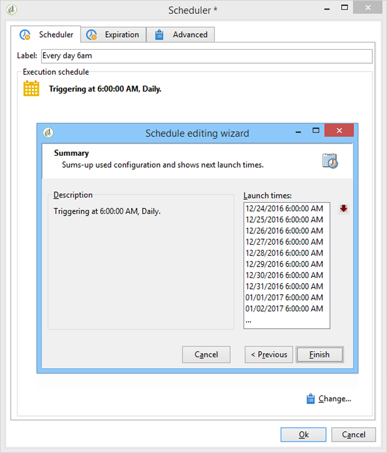

# 傳送生日電子郵件{#sending-a-birthday-email}

## 簡介 {#introduction}

此使用案例說明如何規劃在收件者生日當天，將循環電子郵件傳送至其清單。

若要設定此使用案例，我們建立了下列定位工作流程：


此（每日執行）工作流程會選取目前日期有生日的所有收件者。

此使用案例也可以以視訊的形式找到。 如需詳細資訊，請參閱「建立工 [作流程」影片](https://docs.campaign.adobe.com/doc/AC/en/Videos/Videos.html) 。

若要這麼做，請建立促銷活動，然後按一下標 **[!UICONTROL Targeting and workflows]** 簽。 有關詳細資訊，請參閱「在工 [作流中構建主目標](../../campaign/using/marketing-campaign-deliveries.md#building-the-main-target-in-a-workflow) 」部分。

然後，請遵循下列步驟：

## 排程傳送 {#configuring-the-scheduler}

1. 首先，新增排程 **器** ，以觸發每天傳送的傳送。 在以下範例中，每天早上6點建立傳送。

   


## 識別生日是誰的收件者 {#identifying-recipients-whose-birthday-it-is}

在設定活 **[!UICONTROL Scheduler]** 動以讓工作流程每天開始後，請識別出生日期等於目前日期的所有收件者。

若要這麼做，請套用下列步驟：

1. 將活動拖放 **[!UICONTROL Query]** 到工作流程中，然後按兩下。
1. 按一下「編 **輯查詢** 」連結並選擇 **[!UICONTROL Filtering conditions]**。

   

1. 按一下列的第一個單元格， **[!UICONTROL Expression]** 然後按一下 **[!UICONTROL Edit expression]** 開啟表達式編輯器。

   

1. 按一 **[!UICONTROL Advanced selection]** 下以選取篩選模式。

   

1. 選擇 **[!UICONTROL Edit the formula using an expression]** 並按一下 **[!UICONTROL Next]** 以顯示表達式編輯器。
1. 在函式清單中，按兩下可 **[!UICONTROL Day]**&#x200B;通過節點訪問的 **[!UICONTROL Date]** 函式。 此函式會傳回代表與作為參數傳遞之日期相對應的日期的數字。

   

1. 在可用欄位清單中，按兩下 **[!UICONTROL Birth date]**。 然後編輯器的上部區域會顯示下列公式：

   ```
   Day(@birthDate)
   ```

   Click **[!UICONTROL Finish]** to confirm.

1. 在查詢編輯器中，在列的第一個單元格中 **[!UICONTROL Operator]** 選擇 **[!UICONTROL equal to]**。

   

1. 接著，按一下第二欄(**[!UICONTROL Value]**)的第一個儲存格，然後按一 **[!UICONTROL Edit expression]** 下以開啟運算式編輯器。
1. 在函式清單中，按兩下可 **[!UICONTROL Day]**&#x200B;通過節點訪問的 **[!UICONTROL Date]** 函式。
1. 連按兩下函 **[!UICONTROL GetDate]** 數以擷取目前日期。

   

   編輯器的上部區域顯示以下公式：

   ```
   Day(GetDate())
   ```

   Click **[!UICONTROL Finish]** to confirm.

1. 重複此過程以檢索與當月對應的出生月份。 要執行此操作，請按一下按 **[!UICONTROL Add]** 鈕並重複步驟3到10，替換 **[!UICONTROL Day]** 為 **[!UICONTROL Month]**。

   完整查詢如下：

   

將活動結果連 **[!UICONTROL Query]** 結至活 **[!UICONTROL Email delivery]** 動，以寄送電子郵件至您所有收件者的生日清單。

## 包含2月29日出生的收件者（可選） {#including-recipients-born-on-february-29th--optional-}

如果您想要包含2月29日出生的所有收件者，此使用案例會說明如何計畫傳送循環電子郵件給其生日的收件者清單——不論是否是閏年。

此使用案例的主要實施步驟為：

* 選取收件者
* 選擇是否是閏年
* 選擇2月29日出生的收件者

若要設定此使用案例，我們建立了下列定位工作流程：


如果目前的年 **份不是閏年** ，而工作流程在3月1日執行，我們需要選取所有昨天（2月29日）過生日的收件者，並將他們新增至收件者清單。 在任何其他情況下，都不需要採取其他行動。

### 步驟1:選擇收件者 {#step-1--selecting-the-recipients}

在設定活 **[!UICONTROL Scheduler]** 動以便工作流程每天開始後，請識別週年日為當天的所有收件者。

>[!NOTE]
>
>如果今年是閏年，那麼所有在2月29日出生的收件者都會自動納入。


在「識別生日的收件者」區段中，會顯示選擇其生日與目前日 [期對應的收件者](#identifying-recipients-whose-birthday-it-is) 。

### 步驟2:選擇是否是閏年 {#step-2--select-whether-or-not-it-is-a-leap-year}

此活 **[!UICONTROL Test]** 動可讓您檢查它是否為閏年，以及目前日期是否為3月1日。

如果測試通過驗證（年份不是閏年——沒有2月29日——而目前日期確實是3月1日），則會啟用轉換，而2月29日出生的收件者將被添加到3月1日的交貨中。 **[!UICONTROL True]** 否則，會 **[!UICONTROL False]** 啟用轉場，只有在目前日期出生的收件者才會收到傳送。

將下方的程式碼複製並貼 **[!UICONTROL Initialization script]** 入標籤的區 **[!UICONTROL Advanced]** 段。

```
function isLeapYear(iYear)
{
    if(iYear/4 == Math.floor(iYear/4))
    {
        if(iYear/100 != Math.floor(iYear/100))
        {
            // Divisible by 4 only -> Leap Year
            return 1;
        }
        else
        {
            if(iYear/400 == Math.floor(iYear/400))
            {
                // Divisible by 4, 100 and 400 -> Leap year
                return 1;
            }
        }
    }
    // all others: no leap year
    return 0;
}

// Return today's date and time
var currentTime = new Date()
// returns the month (from 0 to 11)
var month = currentTime.getMonth() + 1
// returns the day of the month (from 1 to 31)
var day = currentTime.getDate()
// returns the year (four digits)
var year = currentTime.getFullYear()

// is current year a leap year?
vars.currentIsALeapYear = isLeapYear(year);

// is current date the first of march?
if(month == 3 && day == 1) {
  // today is 1st of march
vars.firstOfMarch = 1;
}
```


在區段中新增下列條 **[!UICONTROL Conditional forks]** 件：

```
vars.currentIsALeapYear == 0 && vars.firstOfMarch == 1
```


### 步驟3:選擇2月29日出生的任何收件者 {#step-3--select-any-recipients-born-on-february-29th}

建立活 **[!UICONTROL Fork]** 動，並將其中一個傳出轉場連結至活 **[!UICONTROL Query]** 動。

在此查詢中，選擇出生日期為2月29日的所有收件者。


將結果與活動結 **[!UICONTROL Union]** 合。

將兩個活動分支的結 **[!UICONTROL Test]** 果連結至活動， **[!UICONTROL Email delivery]** 即使是在非閏年的2月29日出生的收件者，在生日當天也會寄電子郵件給所有收件人的名單。

## 建立循環傳送 {#creating-a-recurring-delivery-in-a-targeting-workflow}

根據您 **要傳送的生日電子郵件範本** ，新增「循環傳送」活動。

>[!CAUTION]
>
>若要執行工作流程，必須啟動與促銷活動程式相關的技術工作流程。 如需詳細資訊，請參閱促銷活動 [程式工作流程清單](../../workflow/using/campaign.md) 。
>
>如果促銷活動的核准步驟已啟用，則只有在確認這些步驟後，才會傳送傳送。 有關詳細資訊，請參 [閱選擇要批准的流程](../../campaign/using/marketing-campaign-approval.md#choosing-the-processes-to-be-approved) 。


