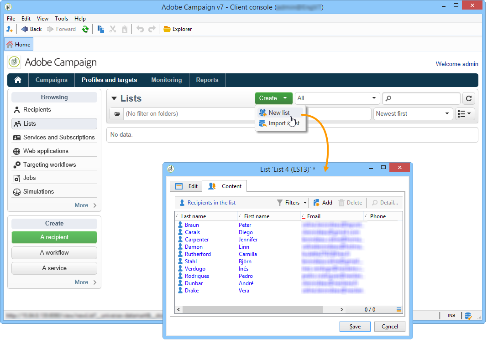

# 傳送報表至清單{#sending-a-report-to-a-list}

此使用案例詳細說明如何以PDF格式產生每月現成可用的&#x200B;**[!UICONTROL Tracking indicators]**&#x200B;報表，以及如何將它傳送至收件者清單。


此使用案例的主要實施步驟為：

* 建立接收遞送的收件者清單(請參閱：[步驟1:建立收件者清單](#step-1--creating-the-recipient-list))。
* 建立傳送範本，讓您在每次執行工作流程時產生新的傳送(請參閱：[步驟2:建立傳送範本](#step-2--creating-the-delivery-template))。
* 建立工作流程，讓您以PDF格式產生報表並傳送至收件者清單(請參閱：[步驟3:建立工作流](#step-3--creating-the-workflow))。

## 步驟1:建立收件人清單{#step-1--creating-the-recipient-list}

前往&#x200B;**[!UICONTROL Profiles and targets]**&#x200B;標籤，按一下&#x200B;**[!UICONTROL Lists]**&#x200B;連結，然後按一下&#x200B;**[!UICONTROL Create]**&#x200B;按鈕。 選擇&#x200B;**[!UICONTROL New list]**&#x200B;並為要發送到的報告建立新的收件人清單。



有關建立清單的詳細資訊，請參閱此[部分](../../platform/using/creating-and-managing-lists.md)。

## 步驟2:建立傳送範本{#step-2--creating-the-delivery-template}

1. 轉至Adobe Campaign瀏覽器的&#x200B;**[!UICONTROL Resources > Templates > Delivery templates]**&#x200B;節點，並複製&#x200B;**[!UICONTROL Email delivery]**&#x200B;現成可用模板。

   

   如需建立傳送範本的詳細資訊，請參閱此[章節](../../delivery/using/about-templates.md)。

1. 輸入各種模板參數：標籤、目標（先前建立的收件者清單）、主旨和內容。

   

1. 每次執行工作流程時，都會更新&#x200B;**[!UICONTROL Tracking indicators]**&#x200B;報表(請參閱[步驟3:建立工作流程](#step-3--creating-the-workflow))。 若要在傳送中加入報表的最新版本，您必須新增&#x200B;**[!UICONTROL Calculated attachment]**:

   有關建立計算附件的詳細資訊，請參閱此[部分](../../delivery/using/attaching-files.md#creating-a-calculated-attachment)。

   * 按一下&#x200B;**[!UICONTROL Attachments]**&#x200B;連結，然後按一下&#x200B;**[!UICONTROL Add]** ，然後選擇&#x200B;**[!UICONTROL Calculated attachment]**。

      

   * 前往&#x200B;**[!UICONTROL Type]**&#x200B;欄位並選取第四個選項：**[!UICONTROL File name is computed during delivery of each message (it may then depend on the recipient profile)]**。

      

      在&#x200B;**[!UICONTROL Label]**&#x200B;欄位中輸入的值不會出現在最終傳送中。

   * 轉到編輯區域並輸入檔案的訪問路徑和名稱。

      

      >[!CAUTION]
      >
      >該檔案必須存在於伺服器上。 其路徑和名稱必須與工作流&#x200B;**[!UICONTROL JavaScript code]**&#x200B;類型活動中輸入的路徑和名稱相同(請參閱：[步驟3:建立工作流程](#step-3--creating-the-workflow))。

   * 選擇&#x200B;**[!UICONTROL Advanced]**&#x200B;頁籤並選中&#x200B;**[!UICONTROL Script the name of the file name displayed in the mails sent]**。 前往編輯區域，然後輸入您要在最終傳送中提供附件的名稱。

      

## 步驟3:建立工作流{#step-3--creating-the-workflow}

為此使用案例建立了下列工作流程。 它有三項活動：

* 一個&#x200B;**[!UICONTROL Scheduler]**&#x200B;類型活動，可讓您每月執行一次工作流程，
* 一個&#x200B;**[!UICONTROL JavaScript code]**&#x200B;類型活動，可讓您產生PDF格式的報表，
* 一個&#x200B;**[!UICONTROL Delivery]**&#x200B;類型活動，使用先前建立的傳送範本。


1. 現在，請前往&#x200B;**[!UICONTROL Administration > Production > Technical workflows]**&#x200B;節點並建立新的工作流程。

   

1. 首先，新增&#x200B;**[!UICONTROL Scheduler]**&#x200B;類型活動，並加以設定，讓工作流程在當月的第一個星期一執行。

   

   有關配置調度程式的詳細資訊，請參閱[調度程式](../../workflow/using/scheduler.md)。

1. 然後新增&#x200B;**[!UICONTROL JavaScript code]**&#x200B;類型活動。

   

   在編輯區域中輸入以下代碼：

   ```
   var reportName = "deliveryFeedback";
   var path = "/tmp/deliveryFeedback.pdf";
   var exportFormat = "PDF";
   var reportURL = "<PUT THE URL OF THE REPORT HERE>";
   var _ctx = <ctx _context="global" _reportContext="deliveryFeedback" />
   var isAdhoc = 0;
   
   xtk.report.export(reportName, _ctx, exportFormat, path, isAdhoc);
   ```

   使用下列變數：

   * **var reportName**:以雙引號輸入報表的內部名稱。在此例中，**追蹤指標**&#x200B;報表的內部名稱為&quot;deliveryFeedback&quot;。
   * **var路徑**:輸入檔案的儲存路徑(&quot;tmp/files/&quot;)、您要指定檔案的名稱(&quot;deliveryFeedback&quot;)和副檔名(&quot;。pdf&quot;)。在本例中，我們使用內部名稱作為檔案名。 值必須在雙引號之間，並以&quot;+&quot;字元分隔。

      >[!CAUTION]
      >
      >檔案必須儲存在伺服器上。 必須在編輯窗口的&#x200B;**[!UICONTROL General]**&#x200B;頁籤中為計算附件輸入相同的路徑和相同的名稱(請參閱：[步驟2:建立傳送範本](#step-2--creating-the-delivery-template))。

   * **var exportFormat**:輸入檔案的匯出格式(「PDF」)。
   * **var _ctx** (context):在此案例中，我們會在其全 **[!UICONTROL Tracking indicators]** 域內使用報表。

1. 通過添加&#x200B;**[!UICONTROL Delivery]**&#x200B;類型活動和以下選項完成：

   * **[!UICONTROL Delivery]**:選擇 **[!UICONTROL New, created from a template]**，然後選擇先前建立的傳送模板。
   * 對於&#x200B;**[!UICONTROL Recipients]**&#x200B;和&#x200B;**[!UICONTROL Content]**&#x200B;欄位，請選擇&#x200B;**[!UICONTROL Specified in the delivery]**。
   * **[!UICONTROL Action to execute]**:選擇「 **[!UICONTROL Prepare and start]** Select（選擇）」。
   * 取消檢查&#x200B;**[!UICONTROL Generate an outbound transition]**&#x200B;和&#x200B;**[!UICONTROL Process errors]**。

   

