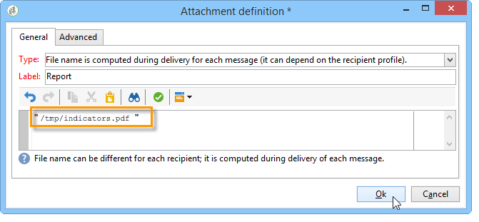

# 傳送報吿至清單{#sending-a-report-to-a-list}


此使用案例詳細說明如何以PDF格式產生每月立即可用的&#x200B;**[!UICONTROL Tracking indicators]**&#x200B;報告，以及如何將其傳送給收件者清單。


此使用案例的主要實施步驟為：

* 建立將接收傳遞的收件者清單（請參閱： [步驟1：建立收件者清單](#step-1--creating-the-recipient-list)）。
* 建立傳遞範本，可讓您每次執行工作流程時都產生新的傳遞（請參閱： [步驟2：建立傳遞範本](#step-2--creating-the-delivery-template)）。
* 建立工作流程，讓您以PDF格式產生報表，並將報表傳送至收件者清單（請參閱： [步驟3：建立工作流程](#step-3--creating-the-workflow)）。

## 步驟1：建立收件者清單 {#step-1--creating-the-recipient-list}

前往&#x200B;**[!UICONTROL Profiles and targets]**&#x200B;標籤，按一下&#x200B;**[!UICONTROL Lists]**&#x200B;連結，然後按一下&#x200B;**[!UICONTROL Create]**&#x200B;按鈕。 選取&#x200B;**[!UICONTROL New list]**&#x200B;並為要傳送的報告建立新的收件者清單。


如需建立清單的詳細資訊，請參閱此[區段](../../platform/using/creating-and-managing-lists.md)。

## 步驟2：建立傳遞範本 {#step-2--creating-the-delivery-template}

1. 前往Adobe Campaign Explorer的&#x200B;**[!UICONTROL Resources > Templates > Delivery templates]**&#x200B;節點並複製&#x200B;**[!UICONTROL Email delivery]**&#x200B;現成可用的範本。

   

   如需建立傳遞範本的詳細資訊，請參閱此[區段](../../delivery/using/about-templates.md)。

1. 輸入各種範本引數：標籤、目標（先前建立的收件者清單）、主旨與內容。

   

1. 每次執行工作流程時，**[!UICONTROL Tracking indicators]**&#x200B;報告都會更新（請參閱[步驟3：建立工作流程](#step-3--creating-the-workflow)）。 若要在傳遞中包含最新版本的報告，您必須新增&#x200B;**[!UICONTROL Calculated attachment]**：

   如需建立計算附件的詳細資訊，請參閱此[區段](../../delivery/using/attaching-files.md#creating-a-calculated-attachment)。

   * 按一下&#x200B;**[!UICONTROL Attachments]**&#x200B;連結並按一下&#x200B;**[!UICONTROL Add]**，然後選取&#x200B;**[!UICONTROL Calculated attachment]**。

     

   * 移至&#x200B;**[!UICONTROL Type]**&#x200B;欄位並選取第四個選項： **[!UICONTROL File name is computed during delivery of each message (it may then depend on the recipient profile)]**。

     

     在&#x200B;**[!UICONTROL Label]**&#x200B;欄位中輸入的值將不會出現在最終傳遞中。

   * 移至編輯區域，並輸入檔案的存取路徑和名稱。

     

     >[!CAUTION]
     >
     >伺服器上必須有檔案。 其路徑和名稱必須與在工作流程的&#x200B;**[!UICONTROL JavaScript code]**&#x200B;型別活動中輸入的相同（請參閱： [步驟3：建立工作流程](#step-3--creating-the-workflow)）。

   * 選取&#x200B;**[!UICONTROL Advanced]**&#x200B;索引標籤並核取&#x200B;**[!UICONTROL Script the name of the file name displayed in the mails sent]**。 前往編輯區域，並輸入要在最終傳遞中指定附件的名稱。

     

## 步驟3：建立工作流程 {#step-3--creating-the-workflow}

已針對此使用案例建立下列工作流程。 它有三個活動：

* 一個&#x200B;**[!UICONTROL Scheduler]**&#x200B;型別活動，可讓您每月執行工作流程一次，
* 一個&#x200B;**[!UICONTROL JavaScript code]**&#x200B;型別活動，可讓您以PDF格式產生報告，
* 一個&#x200B;**[!UICONTROL Delivery]**&#x200B;型別活動，使用先前建立的傳遞範本。


1. 現在移至&#x200B;**[!UICONTROL Administration > Production > Technical workflows]**&#x200B;節點並建立新的工作流程。

   

1. 從新增&#x200B;**[!UICONTROL Scheduler]**&#x200B;型別活動並加以設定開始，讓工作流程在當月第一個星期一執行。

   

   如需設定排程器的詳細資訊，請參閱[排程器](scheduler.md)。

1. 然後新增&#x200B;**[!UICONTROL JavaScript code]**&#x200B;型別活動。

   

   在編輯區域中輸入下列程式碼：

   ```
   var reportName = "deliveryFeedback";
   var path = "/tmp/deliveryFeedback.pdf";
   var exportFormat = "PDF";
   var reportURL = "<PUT THE URL OF THE REPORT HERE>";
   var _ctx = <ctx _context="global" _reportContext="deliveryFeedback" />
   var isAdhoc = 0;
   
   xtk.report.export(reportName, _ctx, exportFormat, path, isAdhoc);
   ```

   以下是使用的變數：

   * **var reportName**：以雙引號輸入報告的內部名稱。 在這種情況下，**追蹤指標**&#x200B;報告的內部名稱為「deliveryFeedback」。
   * **var路徑**：輸入檔案的儲存路徑(&quot;tmp/files/&quot;)、您要提供檔案的名稱(&quot;deliveryFeedback&quot;)和副檔名(&quot;。pdf&quot;)。 在此案例中，我們使用內部名稱作為檔案名稱。 值必須位於雙引號之間，並以「+」字元分隔。

     >[!CAUTION]
     >
     >檔案必須儲存在伺服器上。 您必須在已計算附件的編輯視窗的&#x200B;**[!UICONTROL General]**&#x200B;索引標籤中輸入相同的路徑和名稱（請參閱： [步驟2：建立傳遞範本](#step-2--creating-the-delivery-template)）。

   * **var exportFormat**：輸入檔案的匯出格式(「PDF」)。
   * **var _ctx** （內容）：在此案例中，我們在其全域內容中使用&#x200B;**[!UICONTROL Tracking indicators]**&#x200B;報告。

1. 使用下列選項新增&#x200B;**[!UICONTROL Delivery]**&#x200B;型別活動以完成：

   * **[!UICONTROL Delivery]**：選取&#x200B;**[!UICONTROL New, created from a template]**，然後選取先前建立的傳遞範本。
   * 針對&#x200B;**[!UICONTROL Recipients]**&#x200B;和&#x200B;**[!UICONTROL Content]**&#x200B;欄位，選取&#x200B;**[!UICONTROL Specified in the delivery]**。
   * **[!UICONTROL Action to execute]**：選取&#x200B;**[!UICONTROL Prepare and start]**。
   * 取消核取&#x200B;**[!UICONTROL Generate an outbound transition]**&#x200B;和&#x200B;**[!UICONTROL Process errors]**。

   
