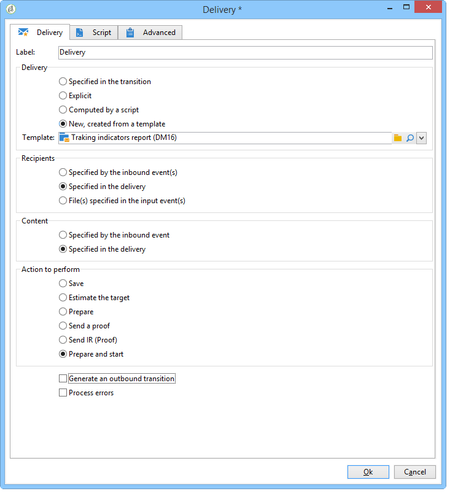

# 傳送報表至清單{#sending-a-report-to-a-list}


此使用案例詳細說明如何產生每月現成可用 **[!UICONTROL Tracking indicators]** 以PDF格式報表，以及如何將其傳送至收件者清單。


此使用案例的主要實作步驟為：

* 建立將接收傳遞的收件者清單(請參閱： [步驟1:建立收件者清單](#step-1--creating-the-recipient-list))。
* 建立傳送範本，可讓您在每次執行工作流程時產生新的傳送(請參閱： [步驟2:建立傳遞範本](#step-2--creating-the-delivery-template))。
* 建立工作流程，讓您以PDF格式產生報表，並將其傳送至收件者清單(請參閱： [步驟3:建立工作流程](#step-3--creating-the-workflow))。

## 步驟1:建立收件者清單 {#step-1--creating-the-recipient-list}

前往 **[!UICONTROL Profiles and targets]** ，按一下 **[!UICONTROL Lists]** 連結，然後 **[!UICONTROL Create]** 按鈕。 選擇 **[!UICONTROL New list]** 並為要發送到的報告建立新的收件人清單。


有關建立清單的詳細資訊，請參閱 [節](../../platform/using/creating-and-managing-lists.md).

## 步驟2:建立傳遞範本 {#step-2--creating-the-delivery-template}

1. 前往 **[!UICONTROL Resources > Templates > Delivery templates]** 節點，並複製 **[!UICONTROL Email delivery]** 現成可用的範本。

   

   如需建立傳送範本的詳細資訊，請參閱 [節](../../delivery/using/about-templates.md).

1. 輸入各種範本參數：標籤、目標（先前建立的收件者清單）、主旨和內容。

   

1. 每次執行工作流程時， **[!UICONTROL Tracking indicators]** 報表已更新(請參閱 [步驟3:建立工作流程](#step-3--creating-the-workflow))。 若要在傳送中納入最新版本的報表，您必須新增 **[!UICONTROL Calculated attachment]**:

   如需建立計算附件的詳細資訊，請參閱 [節](../../delivery/using/attaching-files.md#creating-a-calculated-attachment).

   * 按一下 **[!UICONTROL Attachments]** 連結，按一下 **[!UICONTROL Add]**，然後選取 **[!UICONTROL Calculated attachment]**.

      

   * 前往 **[!UICONTROL Type]** 欄位，然後選取第四個選項： **[!UICONTROL File name is computed during delivery of each message (it may then depend on the recipient profile)]**.

      

      在 **[!UICONTROL Label]** 欄位不會顯示在最終傳送中。

   * 前往編輯區域，輸入檔案的存取路徑和名稱。

      

      >[!CAUTION]
      >
      >檔案必須存在於伺服器上。 其路徑和名稱必須與 **[!UICONTROL JavaScript code]** 工作流程的活動類型(請參閱： [步驟3:建立工作流程](#step-3--creating-the-workflow))。

   * 選取 **[!UICONTROL Advanced]** 標籤和檢查 **[!UICONTROL Script the name of the file name displayed in the mails sent]**. 前往編輯區域，並輸入您要在最終傳送中提供附件的名稱。

      

## 步驟3:建立工作流程 {#step-3--creating-the-workflow}

為此使用案例建立了以下工作流。 它有三個活動：

* 一 **[!UICONTROL Scheduler]** 輸入可讓您每月執行一次工作流程的活動，
* 一 **[!UICONTROL JavaScript code]** 輸入可讓您以PDF格式產生報表的活動，
* one **[!UICONTROL Delivery]** 輸入使用先前建立之傳送範本的活動。


1. 現在，請前往 **[!UICONTROL Administration > Production > Technical workflows]** 節點，並建立新的工作流程。

   

1. 首先，新增 **[!UICONTROL Scheduler]** 輸入活動並加以設定，以便工作流程在當月的第一個星期一執行。

   

   有關配置調度程式的詳細資訊，請參閱 [排程器](scheduler.md).

1. 然後新增 **[!UICONTROL JavaScript code]** 類型活動。

   

   在編輯區域中輸入下列程式碼：

   ```
   var reportName = "deliveryFeedback";
   var path = "/tmp/deliveryFeedback.pdf";
   var exportFormat = "PDF";
   var reportURL = "<PUT THE URL OF THE REPORT HERE>";
   var _ctx = <ctx _context="global" _reportContext="deliveryFeedback" />
   var isAdhoc = 0;
   
   xtk.report.export(reportName, _ctx, exportFormat, path, isAdhoc);
   ```

   會使用下列變數：

   * **var reportName**:以雙引號輸入報表的內部名稱。 在此案例中， **追蹤指標** 報表為「deliveryFeedback」。
   * **var路徑**:輸入檔案的保存路徑(&quot;tmp/files/&quot;)、要提供檔案的名稱(&quot;deliveryFeedback&quot;)和副檔名(&quot;。pdf&quot;)。 在此情況下，我們已使用內部名稱作為檔案名稱。 值必須在雙引號之間，並以&quot;+&quot;字元分隔。

      >[!CAUTION]
      >
      >檔案必須儲存在伺服器上。 您必須在 **[!UICONTROL General]** 頁簽(請參閱： [步驟2:建立傳遞範本](#step-2--creating-the-delivery-template))。

   * **var exportFormat**:輸入檔案的匯出格式(「PDF」)。
   * **var_ctx** （內容）:在本例中，我們使用 **[!UICONTROL Tracking indicators]** 報告。

1. 完成，請新增 **[!UICONTROL Delivery]** 使用下列選項輸入活動：

   * **[!UICONTROL Delivery]**:選取 **[!UICONTROL New, created from a template]**，並選取先前建立的傳送範本。
   * 若 **[!UICONTROL Recipients]** 和 **[!UICONTROL Content]** 欄位，選擇 **[!UICONTROL Specified in the delivery]**.
   * **[!UICONTROL Action to execute]**:選取 **[!UICONTROL Prepare and start]**.
   * 取消檢查 **[!UICONTROL Generate an outbound transition]** 和 **[!UICONTROL Process errors]**.
   
