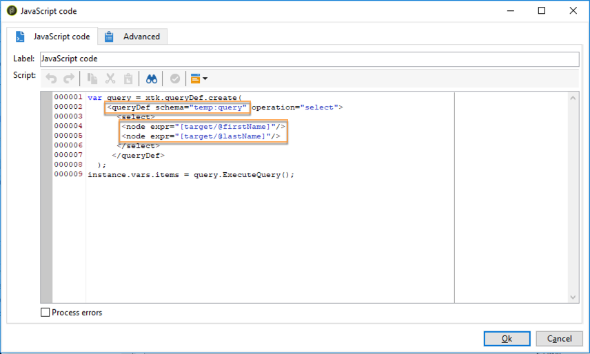

# 傳送個人化警報給營運商{#sending-personalized-alerts-to-operators}


在此範例中，我們想傳送警報給運算子，運算子將包含開啟電子報但未點按其所包含連結之設定檔的名稱。

設定檔的名字和姓氏欄位會連結至&#x200B;**[!UICONTROL Recipients]**&#x200B;目標維度，而&#x200B;**[!UICONTROL Alert]**&#x200B;活動會連結至&#x200B;**[!UICONTROL Operator]**&#x200B;目標維度。 因此，兩個目標維度之間沒有可用的欄位，無法執行調解和擷取名字和姓氏欄位，以及在「警報」活動中顯示。

程式是建立工作流程，如下所示：

1. 使用&#x200B;**[!UICONTROL Query]**&#x200B;活動來定位資料。
1. 將&#x200B;**[!UICONTROL JavaScript code]**&#x200B;活動新增至工作流程，以從查詢儲存母體至執行個體變數。
1. 使用&#x200B;**[!UICONTROL Test]**&#x200B;活動來檢查母體計數。
1. 根據&#x200B;**[!UICONTROL Test]**&#x200B;活動結果，使用&#x200B;**[!UICONTROL Alert]**&#x200B;活動將警報發送到運算子。


## 將母體儲存至執行個體變數 {#saving-the-population-to-the-instance-variable}

將以下代碼新增至&#x200B;**[!UICONTROL JavaScript code]**&#x200B;活動。

```
var query = xtk.queryDef.create(  
    <queryDef schema="temp:query" operation="select">  
      <select>  
       <node expr="[target/recipient.@firstName]"/>  
       <node expr="[target/recipient.@lastName]"/>  
      </select>  
     </queryDef>  
  );  
  var items = query.ExecuteQuery();
```

請確定Javascript程式碼與您的工作流程資訊對應：

* **[!UICONTROL queryDef schema]**&#x200B;標籤應與查詢活動中使用之目標維度的名稱相對應。
* **[!UICONTROL node expr]**&#x200B;標籤應對應至您要擷取之欄位的名稱。



若要擷取這些資訊，請遵循下列步驟：

1. 從&#x200B;**[!UICONTROL Query]**&#x200B;活動按一下右鍵出站轉變，然後選擇&#x200B;**[!UICONTROL Display the target]**。

   

1. 按一下右鍵該清單，然後選擇&#x200B;**[!UICONTROL Configure list]**。

   

1. 查詢目標維度和欄位名稱會顯示在清單中。

   

## 測試人口計數 {#testing-the-population-count}

將下列程式碼新增至&#x200B;**[!UICONTROL Test]**&#x200B;活動，以檢查目標母體是否至少包含1個設定檔。

```
var.recCount>0
```


## 設定警報 {#setting-up-the-alert}

現在，填入內容已新增至包含所需欄位的執行個體變數中，您可以將這些資訊新增至&#x200B;**[!UICONTROL Alert]**&#x200B;活動。

若要這麼做，請將下列程式碼新增至&#x200B;**[!UICONTROL Source]**&#x200B;標籤中：

```
<ul>
<%
var items = new XML(instance.vars.items)
for each (var item in items){
%>
<li><%= item.target.@firstName %> <%= item.target.@lastName %></li>
<%
} %></ul>
```

>[!NOTE]
>
>**[!UICONTROL <%= item.target.recipient.@fieldName %>]**&#x200B;命令可讓您新增其中一個已透過&#x200B;**[!UICONTROL JavaScript code]**&#x200B;活動儲存至執行個體變數的欄位。\
>只要欄位已插入JavaScript程式碼中，您就可以視需要新增欄位。


