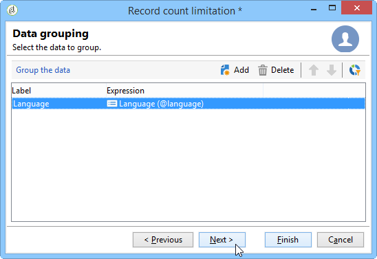
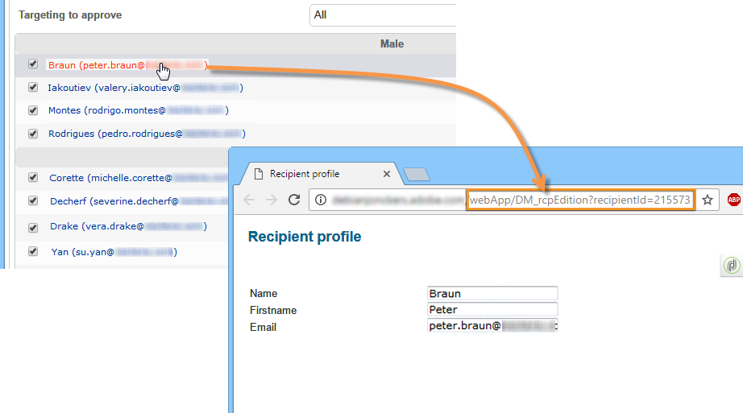

# 分割{#split}

**Split**-type活動可讓您將目標分割為數個子集。 目標是用所有接收結果構建的：因此，所有先前的活動必須已完成，才能執行此活動。

此活動不會觸發入站母體的聯合。 如果數個轉變落在一個分割活動中，建議在該活動前面插入&#x200B;**[!UICONTROL Union]**&#x200B;活動。

有關所使用的拆分活動的示例，請參閱[使用拆分活動建立子集](targeting-data.md#creating-subsets-using-the-split-activity)。

[此區段](cross-channel-delivery-workflow.md)中有一個範例，說明如何使用分割活動來使用篩選條件將目標細分為不同母體。

[此區段](javascript-scripts-and-templates.md)提供如何在分割活動中使用例項變數的範例。

要配置此活動，請在&#x200B;**[!UICONTROL Subsets]**&#x200B;頁簽中定義子集內容和標籤，然後在&#x200B;**[!UICONTROL General]**&#x200B;頁簽中選擇目標維。

## 建立子集 {#creating-subsets}

要建立子集：

1. 在相符欄位中按一下標籤，然後選取要套用的篩選。
1. 若要篩選入站母體，請選取&#x200B;**[!UICONTROL Add a filtering condition]**&#x200B;選項，然後按一下&#x200B;**[!UICONTROL Edit...]**&#x200B;連結。

   選取要套用至資料的篩選器類型，以將其納入此集。

   此程式與&#x200B;**Query**-type活動的相同。

   >[!NOTE]
   >
   >您最多可以篩選兩個外部資料庫(FDA)中的資料。

1. 您可以指定要從目標中提取以建立子集的最大記錄數。 要執行此操作，請核取&#x200B;**[!UICONTROL Limit the selected records]**&#x200B;選項，然後按一下&#x200B;**[!UICONTROL Edit...]**&#x200B;連結。

   嚮導允許您選擇此子集的記錄的選擇模式。 可在[限制子集記錄數](#limiting-the-number-of-subset-records)中找到這些步驟。

   

1. 如果您希望，可以使用&#x200B;**[!UICONTROL Add]**&#x200B;按鈕&#x200B;**添加其他子集**。

   

   >[!NOTE]
   >
   >如果未檢查&#x200B;**[!UICONTROL Enable overlapping of output populations]**&#x200B;選項，則按頁簽的順序建立子集。 使用此窗口右上角的箭頭來移動它們。 例如，如果第一個子集恢復了初始母體的70%，則下一個子集將只將其選擇標準應用於剩餘的30%，以此類推。

   對於已建立的每個子集，將向拆分活動添加出站轉變。

   

   您可以選擇產生單一出站轉變（例如，並使用區段代碼來識別集）:要執行此操作，請在&#x200B;**[!UICONTROL General]**&#x200B;標籤中選取&#x200B;**[!UICONTROL Generate subsets in the same table]**&#x200B;選項。

   如果完成，則每個子集的區段代碼會自動儲存在另一欄中。 您可以在傳送層級的個人化欄位中存取此欄。

## 限制子集記錄數 {#limiting-the-number-of-subset-records}

如果您不想使用子集中包含的整個母體，則可以限制其將包含的記錄數。

1. 在「子集編輯」窗口中，選中&#x200B;**[!UICONTROL Limit the selected records]**&#x200B;選項，然後按一下&#x200B;**[!UICONTROL Edit...]**&#x200B;連結。
1. 選取您選擇的限制類型：

   * **[!UICONTROL Activate random sampling]**:此選項會取用隨機的記錄範例。套用的隨機取樣類型取決於資料庫引擎。
   * **[!UICONTROL Keep only the first records after sorting]**:此選項可讓您根據一或多個排序順序定義限制。如果您選取&#x200B;**[!UICONTROL Age]**&#x200B;欄位作為排序標準，並選取100作為限制，則只會保留最年輕的100個收件者。
   * **[!UICONTROL Keep the first ones after sorting (criteria, random)]**:此選項會結合前兩個選項。它可讓您根據一或多個排序順序定義限制，如果某些記錄的值與定義的准則相同，則對第一個記錄套用隨機選取。

      例如，如果您選取&#x200B;**[!UICONTROL Age]**&#x200B;欄位作為排序標準，然後定義100的限制，但資料庫中2000個最年輕的收件者都是18個，則從2000個收件者中隨機選取100個收件者。
   

1. 如果您想要定義排序標準，可使用其他步驟來定義欄和排序順序。

   

1. 然後選擇資料限制方法。

   

   執行此作業有數種方式：

   * **[!UICONTROL Size (in %)]**:記錄的百分比。例如，下方的設定會擷取總母體的10%。

      百分比適用於初始母體，而非活動的結果。

   * **[!UICONTROL Size (as a % of the segment)]**:僅與子集而不是與初始母體相關的記錄百分比。
   * **[!UICONTROL Maximum size]**:記錄數上限。
   * **[!UICONTROL By data grouping]**:您可以根據入站母體之指定欄位中的值，設定記錄數限制。有關此主題的詳細資訊，請參閱[按資料分組限制子集記錄的數量](#limiting-the-number-of-subset-records-by-data-grouping)。
   * **[!UICONTROL By data grouping (in %)]**:您可以根據入站母體的指定欄位中的值，使用百分比來設定記錄數限制。有關此主題的詳細資訊，請參閱[按資料分組限制子集記錄的數量](#limiting-the-number-of-subset-records-by-data-grouping)。
   * **[!UICONTROL By data distribution]**:如果您的分組欄位有太多值，或您不想針對每個新分割活動再次輸入值，Adobe Campaign可讓您設定限制( **[!UICONTROL By data distribution]** 選用的Distributed Marketing模組)。有關詳細資訊，請參閱[限制每個資料分發的子集記錄數](#limiting-the-number-of-subset-records-per-data-distribution)。

1. 按一下&#x200B;**[!UICONTROL Finish]**&#x200B;以批准記錄選擇標準。 定義的設定隨後會顯示在編輯器的中間視窗中。

## 按資料分組限制子集記錄數 {#limiting-the-number-of-subset-records-by-data-grouping}

您可以依資料分組來限制記錄數。 此限制可使用固定值或百分比執行。

例如，如果選擇&#x200B;**[!UICONTROL Language]**&#x200B;欄位作為組欄位，則可以定義每種語言的記錄清單。

1. 選擇資料限制值後，選擇&#x200B;**[!UICONTROL By data grouping]**&#x200B;或&#x200B;**[!UICONTROL By data grouping (as a %)]**，然後按一下&#x200B;**[!UICONTROL Next]**。

   

1. 然後選取分組欄位（例項的&#x200B;**[!UICONTROL Language]**&#x200B;欄位），然後按一下&#x200B;**[!UICONTROL Next]**。

   

1. 最後，指定資料分組臨界值（使用固定值或百分比，視先前選取的分組方法而定）。 若要為每個值設定相同的臨界值，例如，如果要將每種語言的記錄數設定為10，請選取&#x200B;**[!UICONTROL All data groupings are the same size]**&#x200B;選項。 若要為每個值設定不同的限制，請選取&#x200B;**[!UICONTROL Limitations by grouping value]**&#x200B;選項。 這可讓您選擇不同的英文、法文等限制。

   

1. 按一下&#x200B;**[!UICONTROL Finish]**&#x200B;以核准限制並返回編輯分割活動。

## 限制每個資料分發的子集記錄數 {#limiting-the-number-of-subset-records-per-data-distribution}

如果您的分組欄位包含的值過多，或您不想重設每個新分割活動的值，Adobe Campaign可讓您針對資料分送建立限制。 選擇資料限制值時（有關此主題的詳細資訊，請參閱[建立子集](#creating-subsets)部分），選擇&#x200B;**[!UICONTROL By data distribution]**&#x200B;選項，然後從下拉菜單中選擇模板。 以下示範如何建立資料分送範本。

如需具有發佈範本的&#x200B;**[!UICONTROL Local approval]**&#x200B;活動範例，請參閱[使用本機核准活動](using-the-local-approval-activity.md)。

>[!IMPORTANT]
>
>若要使用此功能，您需要購買Distributed Marketing模組（此為促銷活動選項）。 請檢查您的授權合約。

資料分送範本可讓您使用分組值清單來限制記錄數。 若要建立資料分送範本，請套用下列步驟：

1. 要建立資料分發模板，請轉至&#x200B;**[!UICONTROL Resources > Campaign management > Data distribution]**&#x200B;節點，然後按一下&#x200B;**[!UICONTROL New]**。

   

1. **[!UICONTROL General]**&#x200B;標籤可讓您輸入分送的標籤和執行內容（目標維度、分送欄位）。

   

   需要輸入下列欄位：

   * **[!UICONTROL Label]**:分送範本的標籤。
   * **[!UICONTROL Targeting dimension]**:輸入要套用資料分送的目標維度， **[!UICONTROL Recipient]** 例如。此結構必須始終與目標工作流程中使用的資料相容。
   * **[!UICONTROL Distribution field]**:透過目標維度選取欄位。例如，如果您選取&#x200B;**[!UICONTROL Email domain]**&#x200B;欄位，收件者清單將依網域劃分。
   * **[!UICONTROL Distribution type]**:在索引標籤中選取目標限制值劃分的方 **[!UICONTROL Distribution]** 式： **[!UICONTROL Percentage]** 或 **[!UICONTROL Set]**。
   * **[!UICONTROL Assignment type]**:選擇資料分發分配類型。您可以按組或運算子或按本地實體分配來選擇分配。 在&#x200B;**Distributed Marketing**&#x200B;中使用由本地實體分配。 如需詳細資訊，請參閱此[區段](../../distributed/using/about-distributed-marketing.md)。
   * **[!UICONTROL Approval storage]**:如果您在目 **[!UICONTROL Local approval]** 標定位工作流程中使用活動(請參 [閱本機核准](local-approval.md))，請輸入要儲存核准結果的結構。必須為每個目標架構指定一個儲存架構。 如果使用&#x200B;**[!UICONTROL Recipients]**&#x200B;目標定位架構，請輸入預設的&#x200B;**[!UICONTROL Local approval of recipients]**&#x200B;儲存架構。

      如果資料分組不經本地批准而簡單限制，則無需輸入&#x200B;**[!UICONTROL Approvals storage]**&#x200B;欄位。

1. 如果您使用&#x200B;**[!UICONTROL Local approval]**&#x200B;活動（請參閱[本地批准](local-approval.md)），請為分發模板輸入&#x200B;**[!UICONTROL Advanced settings]**:

   

   需要輸入下列欄位：

   * **[!UICONTROL Approve targeted messages]**:如果您希望從要核准的收件者清單中預先選取所有收件者，請核取此選項。如果取消勾選此選項，則不會預先選取任何收件者。

      >[!NOTE]
      >
      >預設會勾選此選項。

      

   * **[!UICONTROL Delivery label]**:可讓您定義運算式，以在傳回通知中顯示傳送標籤。預設運算式提供傳送（計算字串）之標準標籤的相關資訊。 您可以修改此運算式。

      

   * **[!UICONTROL Grouping field]**:此欄位可讓您定義用來在核准和傳回通知中顯示收件者的分組。

      

   * **[!UICONTROL Web Interface]**:可讓您將Web應用程式連結至收件者清單。在核准和傳回通知中，每個收件者都可點按，並連結至選取的Web應用程式。 **[!UICONTROL Parameters]**&#x200B;欄位（例如&#x200B;**[!UICONTROL recipientId]**）可讓您設定要在URL和Web應用程式中使用的其他參數。

      

1. **[!UICONTROL Breakdown]**&#x200B;標籤可讓您定義分送值清單。

   

   * **[!UICONTROL Value]**:輸入分配值。
   * **[!UICONTROL Percentage / Set]**:輸入連結到每個值的記錄限制（固定或百分比）。

      此列由&#x200B;**[!UICONTROL General]**&#x200B;標籤內的&#x200B;**[!UICONTROL Distribution type]**&#x200B;欄位定義。

   * **[!UICONTROL Label]**:輸入連結到每個值的標籤。
   * **[!UICONTROL Group or operator]**:如果您使用活 **[!UICONTROL Local approval]** 動(請參閱本 [機核准](local-approval.md))，請選取指派給每個分配值的運算子或運算子群組。

      如果資料分組不經本地批准而簡單限制，則無需輸入&#x200B;**[!UICONTROL Group or operator]**&#x200B;欄位。

      >[!IMPORTANT]
      >
      >請確定已為運算子指派適當的權限。

   * **[!UICONTROL Local entity]**:選擇分配給每個分配值的本地實體。本機實體用於&#x200B;**Distributed Marketing**。 如需詳細資訊，請參閱此[區段](../../distributed/using/about-distributed-marketing.md)。

## 篩選參數 {#filtering-parameters}

按一下&#x200B;**[!UICONTROL General]**&#x200B;標籤以輸入活動標籤。 為此分割選取目標維度並篩選維度。 如有必要，您可以為指定子集更改這些維。

如果要利用剩餘母體，請核取&#x200B;**[!UICONTROL Generate complement]**&#x200B;選項。 補充是傳入目標減去子集的聯合。 接著，會新增其他出站轉變至活動，如下所示：

若要讓此選項正常運作，入站資料必須具有主索引鍵。

例如，如果通過&#x200B;**[!UICONTROL Data loading (RDBMS)]**&#x200B;活動直接從外部資料庫(如Netezza)讀取資料（不支援索引概念），則&#x200B;**[!UICONTROL Split]**&#x200B;活動生成的補充將不正確。

若要避免此情況，您可以將&#x200B;**[!UICONTROL Enrichment]**&#x200B;活動拖放在&#x200B;**[!UICONTROL Split]**&#x200B;活動之前。 在&#x200B;**[!UICONTROL Enrichment]**&#x200B;活動中，檢查&#x200B;**[!UICONTROL Keep all additional data from the main set]**&#x200B;並在其他資料中指定要用於配置&#x200B;**[!UICONTROL Split]**&#x200B;活動篩選器的列。 然後，**[!UICONTROL Split]**&#x200B;活動入站轉變中的資料會儲存在Adobe Campaign伺服器上的臨時表中，並且可正確產生補充。

**[!UICONTROL Enable overlapping of output populations]**&#x200B;選項可讓您管理屬於數個子集的母體：

* 未核取方塊時，分割活動會確保收件者無法出現在數個輸出轉變中，即使符合數個子集的准則亦然。 它們會位於第一個索引標籤的目標中，且具有相符的條件。
* 核取方塊後，如果收件者符合其篩選准則，即可在數個子集中找到收件者。 Adobe Campaign建議使用獨家條件。

## 輸入參數 {#input-parameters}

* tableName
* 綱要

每個入站事件都必須指定由這些參數定義的目標。

## 輸出參數 {#output-parameters}

* tableName
* 綱要
* recCount

這組三個值可識別排除後產生的目標。 **[!UICONTROL tableName]** 是記錄目標標識符的表的名稱， **[!UICONTROL schema]** 是母體（通常為nms:recipient）的模式， **[!UICONTROL recCount]** 是表中的元素數。

與補體相關聯的轉變具有相同的參數。
