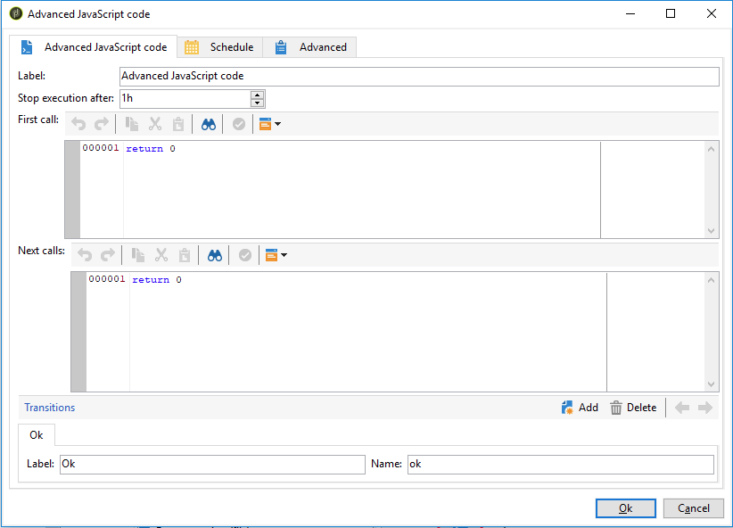

# SQL 程式碼和 JavaScript 程式碼{#sql-code-and-javascript-code}

## SQL代碼 {#sql-code}

活動 **[!UICONTROL SQL code]** 執行SQL指令碼。 該指令碼是JST模板。

* **[!UICONTROL Script]**

   編輯器的中心區域包含要執行的指令碼。 此指令碼是JST模板，因此可以根據工作流上下文進行配置。

* **[!UICONTROL Processing errors]**

   請參閱「 [處理錯誤](../../workflow/using/monitoring-workflow-execution.md#processing-errors)」。

## JavaScript程式碼與進階JavaScript程式碼 {#javascript-code}

**[!UICONTROL JavaScript code]** 和活 **[!UICONTROL Advanced JavaScript code]** 動在工作流的上下文中執行JavaScript指令碼。 如需指令碼的詳細資訊，請參閱 [JavaScript指令碼和範本一節](../../workflow/using/javascript-scripts-and-templates.md) 。

>[!NOTE]
>
>預設情況下，活動和活動的執 **[!UICONTROL JavaScript code]** 行階 **[!UICONTROL Advanced JavaScript code]** 段不能超過1小時。 在此延遲後，進程將中止，並顯示錯誤消息，活動執行將失敗。
>
>您可以在活動屬性中可 **[!UICONTROL Stop execution after]** 用的欄位中更改此延遲。

* **[!UICONTROL JavaScript code]**

   

   * **[!UICONTROL Script]**:編輯器的中心區域包含要執行的指令碼。
   * **[!UICONTROL Processing errors]**:請參閱「 [處理錯誤](../../workflow/using/monitoring-workflow-execution.md#processing-errors)」。

* **[!UICONTROL Advanced JavaScript code]**

   

   * **[!UICONTROL First call]**:編輯器的第一個區域包含要在第一次調用期間執行的指令碼。
   * **[!UICONTROL Next calls]**:編輯器的第二個區域包含在下次調用期間執行的指令碼。
   * **[!UICONTROL Transitions]**:您可以定義數個活動輸出轉場。
   * **[!UICONTROL Schedule]**:此標 **[!UICONTROL Schedule]** 簽可讓您排程何時觸發活動。
