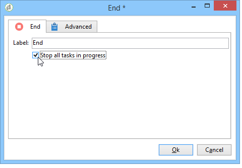
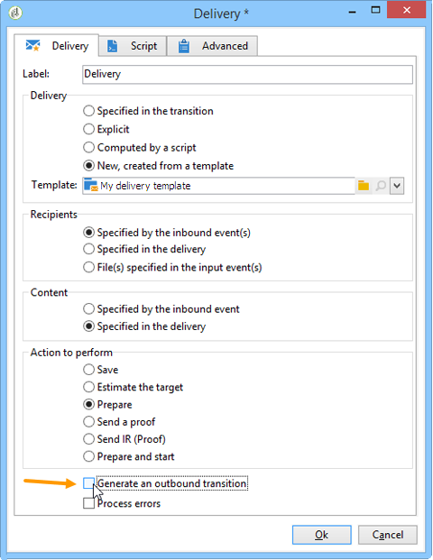

# 開始和結束{#start-and-end}

**[!UICONTROL Start]**&#x200B;和&#x200B;**[!UICONTROL End]**&#x200B;活動可讓您以圖形方式標示工作流程的開始和結束。 這些活動沒有功能影響，因此是可選活動。

* **[!UICONTROL Start]**

   執行工作流程會從沒有入站轉變的活動和開始類型活動開始。

   

* **[!UICONTROL End]**

   您可以配置&#x200B;**[!UICONTROL End]**&#x200B;活動以中斷正在執行的所有任務。 若要這麼做，請連按兩下活動以顯示其屬性，然後核取適當的選項。

   

   啟用結束活動時，工作表中的資料會自動刪除。 如果不需要，並且為了避免不必要的載入，您可以選取在最後一個活動輸出時停用轉變。 例如，在傳送輸出中，如果未排程任何程式，請取消勾選下列相關選項：

   
