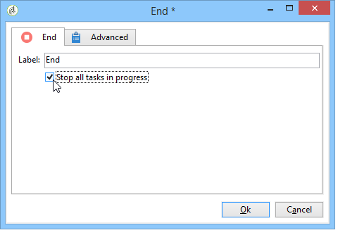
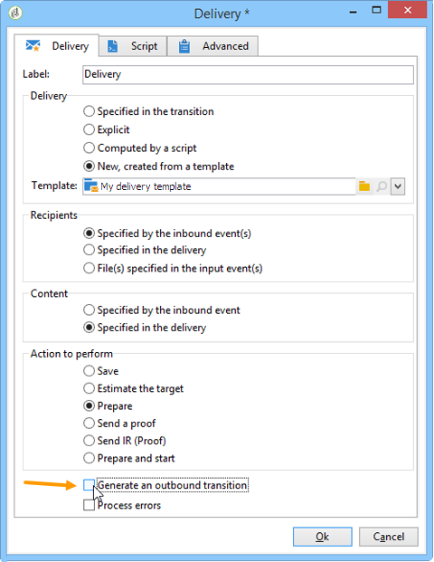

# 開始和結束{#start-and-end}

**[!UICONTROL Start]**&#x200B;和&#x200B;**[!UICONTROL End]**&#x200B;活動可讓您以圖形方式標示工作流程的開始和結束。 這些活動沒有功能影響，因此是選用的。

* **[!UICONTROL Start]**

  執行工作流程會從沒有入站轉變的活動和開始型別活動開始。

  

* **[!UICONTROL End]**

  您可以設定&#x200B;**[!UICONTROL End]**&#x200B;活動以中斷所有進行中的工作。 若要這麼做，請連按兩下活動以顯示其屬性，並核取適當的選項。

  

  啟用結束活動時，工作表中的資料會自動刪除。 如果不需要這樣做，且為了避免不必要的載入，您可以選擇在最後一個活動輸出時停用轉變。 例如，在傳送輸出中，如果未排程任何程式，請取消核取相關選項，如下所示：

  

