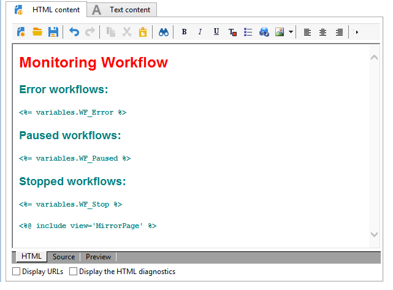
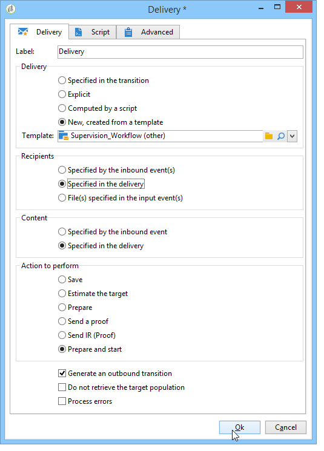

# 使用案例：監督工作流{#supervising-workflows}

此使用案例詳細說明如何建立工作流程，讓您監視「暫停」、「停止」或「有錯誤」之工作流程集的狀態。

其目的是：

* 使用工作流程來監控一組商業工作流程。
* 透過「傳送」活動傳送訊息給主管。

若要監控一組工作流程的狀態，您必須遵循下列步驟：

1. 建立監控工作流程。
1. 撰寫JavaScript以判斷工作流程是暫停、停止或有錯誤。
1. 建立&#x200B;**[!UICONTROL Test]**&#x200B;活動。
1. 準備傳送範本。

>[!NOTE]
>
>除了工作流程外，Campaign **Workflow Heatmap**&#x200B;還可讓您詳細分析目前執行的工作流程。 有關詳細資訊，請參閱[專用部分](../../workflow/using/heatmap.md)。
>
>有關如何&#x200B;**監控工作流的執行**&#x200B;的詳細資訊，請參閱[本節](../../workflow/using/monitoring-workflow-execution.md)。

## 步驟1:建立監視工作流{#step-1--creating-the-monitoring-workflow}

我們要監視的工作流資料夾是儲存在&#x200B;**管理>生產>技術工作流**&#x200B;節點中的&#x200B;**&quot;CustomWorkflows&quot;**&#x200B;資料夾。 此資料夾包含一組商業工作流程。

**監控工作流**&#x200B;儲存在「技術工作流」資料夾的根目錄中。 使用的標籤為&#x200B;**「監控」**。

下列結構模式顯示活動的序列：


此工作流由以下幾部分組成：

* a **「開始」**&#x200B;活動。
* a **&quot;JavaScript code&quot;**&#x200B;活動，負責分析業務工作流資料夾。
* a **&quot;Test&quot;**&#x200B;活動，以傳送傳送給主管或重新啟動工作流。
* a **「傳送」**&#x200B;活動，負責訊息配置。
* a **&quot;Wait&quot;**&#x200B;活動，用於控制工作流迭代之間的提前期。

## 步驟2:編寫JavaScript {#step-2--writing-the-javascript}

JavaScript程式碼的第一部分與&#x200B;**查詢(queryDef)**&#x200B;一致，可讓您以&quot;pause&quot;(@state == 13)、&quot;error&quot;(@failed == 1)或&quot;stopped&quot;(@state == 20)狀態來識別工作流程。

要監視的工作流資料夾的&#x200B;**內部名稱**&#x200B;在以下情況下提供：

```
<condition boolOperator="AND" expr="[folder/@name] = 'Folder20'" internalId="1"/>
```

```
var strError = "";
var strPaused = "";
var strStop = "";

var queryWkfError = xtk.queryDef.create(
  <queryDef schema="xtk:workflow" operation="select">
    <select>
      <node expr="@internalName"/>
      <node expr="@state"/>
      <node expr="@label"/>
      <node expr="@failed"/>
      <node expr="@state"/>   
    </select>
    <where id="12837805386">
      <condition boolOperator="AND" expr="[folder/@name] = 'Folder20'" internalId="1"/>
        <condition boolOperator="AND" internalId="2">
          <condition boolOperator="OR" expr="@state = 20" internalId="3"/>
          <condition expr="@state = 13" internalId="4"/>
        </condition>  
    </where>
  </queryDef>
);
var ndWkfError = queryWkfError.ExecuteQuery(); 
```

JavaScript程式碼的第二部分可讓您根據查詢期間復原的狀態，顯示每個工作流程的訊息&#x200B;**。**

>[!NOTE]
>
>所建立的字串必須載入至工作流程的事件變數中。

```
for each ( var wkf in ndWkfError.workflow ) 
{
  if ( wkf.@state == 13 )  // Status 13 = paused
  {
    if ( wkf.@failed == 1 )
      strError += "<li>Workflow '" + wkf.@internalName + "' with the label '" + wkf.@label + "'</li>";
    else
      strPaused += "<li>Workflow '" + wkf.@internalName + "' with the label '" + wkf.@label + "'</li>";
  }
  
  if ( wkf.@state == 20 )  // Status 20 = stop
    strStop += "<li>Workflow '" + wkf.@internalName + "' with the label '" + wkf.@label + "'</li>";
}

vars.strWorkflowError = strError;
vars.strWorkflowPaused = strPaused;
vars.strWorkflowStop = strStop;
```

## 步驟3:建立「測試」活動{#step-3--creating-the--test--activity}

「測試」活動可讓您根據「等待」活動判斷是否需要傳送傳送，或監控工作流程是否需要執行另一個週期。

如果三個事件變數&quot;vars.strWorkflowError&quot;、&quot;vars.strWorkflowPaused&quot;或&quot;vars.strWorkflowStop&quot;中至少有一個是無效的，則傳送給主管&#x200B;**。**


「等待」活動可配置為以定期間隔重新啟動監視工作流。 對於此使用案例，**等待時間設為1小時**。


## 步驟4:準備傳送{#step-4--preparing-the-delivery}

「傳送」活動基於儲存在&#x200B;**資源>模板>傳送模板**&#x200B;節點中的&#x200B;**傳送模板**。

此範本必須包含：

* **主管的電子郵件地址**。
* **HTML內** 容，以插入個人化文字。

   

   聲明的三個變數(WF_Stop、WF_Paused、WF_Error)與三個工作流事件變數匹配。

   這些變數必須在傳送範本屬性的&#x200B;**Variables**&#x200B;標籤中宣告。

   若要復原工作流程事件變數&#x200B;**的內容**，您必須聲明特定於傳送的變數，這些變數將會以JavaScript程式碼傳回的值進行初始化。

   傳送範本包含下列內容：

   

在建立並核准範本後，您必須將&#x200B;**Delivery**&#x200B;活動設定為：

* 將「傳送」活動連結至先前建立的傳送範本。
* 將工作流程的事件變數連結至特定於傳送範本的事件變數。

連按兩下&#x200B;**Delivery**&#x200B;活動，並選取下列選項：

* 傳送：選擇&#x200B;**新建，從模板**&#x200B;建立，並選擇以前建立的交付模板。
* 對於&#x200B;**收件者和內容**&#x200B;欄位，選擇&#x200B;**在交貨**&#x200B;中指定。
* 要執行的動作：選擇&#x200B;**準備並啟動**。
* 取消選中&#x200B;**處理錯誤**&#x200B;選項。

   

* 前往&#x200B;**Delivery**&#x200B;活動的&#x200B;**Script**&#x200B;標籤，透過個人化欄位選單新增三個&#x200B;**字元字串**&#x200B;類型變數。

   

   

   宣告的三個變數為：

   ```
   delivery.variables._var[0].stringValue = vars.strWorkflowError;
   delivery.variables._var[1].stringValue = vars.strWorkflowPaused;
   delivery.variables._var[2].stringValue = vars.strWorkflowStop; 
   ```

啟動此監控工作流程後，會傳送下列摘要給收件者：


