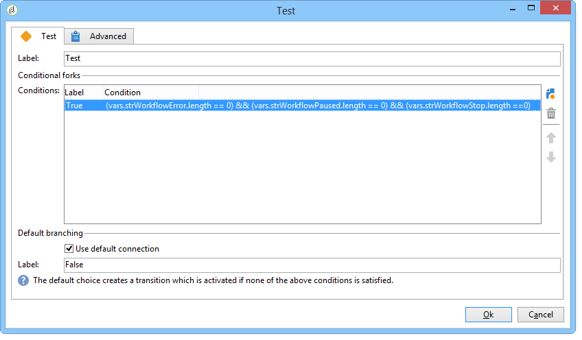
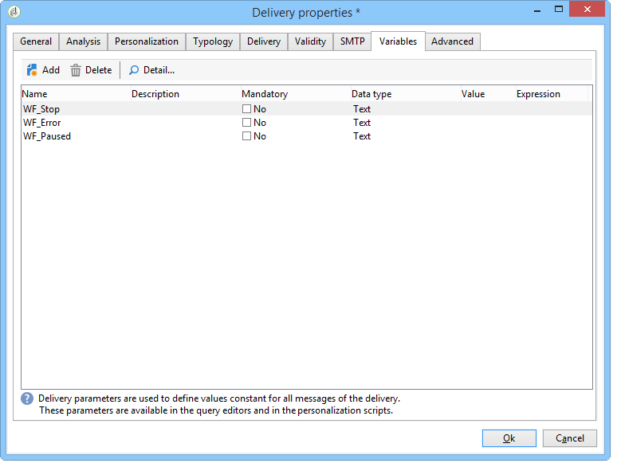

# 使用案例：監督工作流{#supervising-workflows}

此使用案例詳細說明了如何建立工作流程，讓您監控「暫停」、「停止」或「有錯誤」之工作流程集的狀態。

其目的為：

* 使用工作流程來監視一組業務工作流程。
* 透過「傳送」活動傳送訊息給主管。

若要監控一組工作流程的狀態，您需要遵循下列步驟：

1. 建立監控工作流程。
1. 撰寫JavaScript以判斷工作流程是否暫停、停止或有錯誤。
1. 建立&#x200B;**[!UICONTROL Test]**&#x200B;活動。
1. 準備傳遞範本。

>[!NOTE]
>
>除了工作流程外，Campaign **Workflow Heatmap**&#x200B;還可讓您詳細分析目前執行的工作流程。 有關詳細資訊，請參閱[專用區段](../../workflow/using/heatmap.md)。
>
>有關如何&#x200B;**監視工作流程的執行**&#x200B;的詳細資訊，請參閱[此區段](../../workflow/using/monitoring-workflow-execution.md)。

## 步驟1:建立監視工作流{#step-1--creating-the-monitoring-workflow}

我們要監控的工作流程資料夾是儲存在&#x200B;**管理>生產>技術工作流程**&#x200B;節點中的&#x200B;**&quot;CustomWorkflows&quot;**&#x200B;資料夾。 此資料夾包含一組業務工作流程。

**監控工作流**&#x200B;儲存在「技術工作流」資料夾的根目錄中。 使用的標籤為&#x200B;**&quot;Monitoring&quot;**。

下列結構會顯示活動的順序：


此工作流程由下列部分組成：

* a **&quot;開始&quot;**&#x200B;活動。
* **&quot;JavaScript代碼&quot;**&#x200B;活動，負責分析業務工作流資料夾。
* a **&quot;Test&quot;**&#x200B;活動，用於向主管發送傳遞或重新啟動工作流。
* a **&quot;傳遞&quot;**&#x200B;活動，負責訊息配置。
* a **&quot;wait&quot;**&#x200B;活動，控制工作流迭代之間的提前期。

## 步驟2:編寫JavaScript {#step-2--writing-the-javascript}

JavaScript程式碼的第一部分與&#x200B;**查詢(queryDef)**&#x200B;一致，可讓您識別具有「pause」(@state == 13)、「error」(@failed == 1)或「stopped」(@state == 20)狀態的工作流程。

要監視的工作流資料夾的&#x200B;**內部名稱**&#x200B;在以下條件中提供：

```
<condition boolOperator="AND" expr="[folder/@name] = 'Folder20'" internalId="1"/>
```

```
var strError = "";
var strPaused = "";
var strStop = "";

var queryWkfError = xtk.queryDef.create(
  <queryDef schema="xtk:workflow" operation="select">
    <select>
      <node expr="@internalName"/>
      <node expr="@state"/>
      <node expr="@label"/>
      <node expr="@failed"/>
      <node expr="@state"/>   
    </select>
    <where id="12837805386">
      <condition boolOperator="AND" expr="[folder/@name] = 'Folder20'" internalId="1"/>
        <condition boolOperator="AND" internalId="2">
          <condition boolOperator="OR" expr="@state = 20" internalId="3"/>
          <condition expr="@state = 13" internalId="4"/>
        </condition>  
    </where>
  </queryDef>
);
var ndWkfError = queryWkfError.ExecuteQuery(); 
```

JavaScript程式碼的第二部分可讓您根據查詢期間復原的狀態，**顯示每個工作流程的訊息**。

>[!NOTE]
>
>建立的字串必須載入工作流程的事件變數中。

```
for each ( var wkf in ndWkfError.workflow ) 
{
  if ( wkf.@state == 13 )  // Status 13 = paused
  {
    if ( wkf.@failed == 1 )
      strError += "<li>Workflow '" + wkf.@internalName + "' with the label '" + wkf.@label + "'</li>";
    else
      strPaused += "<li>Workflow '" + wkf.@internalName + "' with the label '" + wkf.@label + "'</li>";
  }
  
  if ( wkf.@state == 20 )  // Status 20 = stop
    strStop += "<li>Workflow '" + wkf.@internalName + "' with the label '" + wkf.@label + "'</li>";
}

vars.strWorkflowError = strError;
vars.strWorkflowPaused = strPaused;
vars.strWorkflowStop = strStop;
```

## 步驟3:建立「測試」活動{#step-3--creating-the--test--activity}

「測試」活動可讓您判斷是否需要傳送傳送，或監控工作流程是否需要根據「等待」活動執行其他週期。

如果三個事件變數「vars.strWorkflowError」、「vars.strWorkflowPaused」或「vars.strWorkflowStop」中的至少一個為非void，則會將傳送給主管&#x200B;**。**



「等待」活動可設定為定期重新啟動監控工作流程。 對於此使用案例， **等待時間設為1小時**。


## 步驟4:準備傳送{#step-4--preparing-the-delivery}

「傳送」活動以儲存在&#x200B;**資源>範本>傳送範本**&#x200B;節點中的&#x200B;**傳送範本**&#x200B;為基礎。

此範本必須包括：

* **主管的電子郵件地址**。
* **用於** 插入個人化文字的HTML內容。

   

   聲明的三個變數(WF_Stop、WF_Paused、WF_Error)與三個工作流事件變數匹配。

   這些變數必須在傳送範本屬性的&#x200B;**Variables**&#x200B;標籤中宣告。

   若要復原&#x200B;**工作流程事件變數**&#x200B;的內容，您需要宣告傳送專屬的變數，這些變數將會以JavaScript程式碼傳回的值初始化。

   傳遞範本包含下列內容：

   

建立並核准範本後，您需要將&#x200B;**Delivery**&#x200B;活動設定為：

* 將「傳送」活動連結至先前建立的傳送範本。
* 將工作流程的事件變數連結至傳送範本專屬的事件變數。

連按兩下&#x200B;**傳送**&#x200B;活動並選取下列選項：

* 傳送：選取&#x200B;**新建，從範本**&#x200B;建立，並選取先前建立的傳送範本。
* 對於&#x200B;**收件者和內容**&#x200B;欄位，選擇&#x200B;**在傳送**&#x200B;中指定。
* 要執行的動作：選擇&#x200B;**準備並啟動**。
* 取消選中&#x200B;**Process errors**&#x200B;選項。

   

* 前往&#x200B;**Delivery**&#x200B;活動的&#x200B;**Script**&#x200B;標籤，透過個人化欄位功能表新增三個&#x200B;**字元字串**&#x200B;類型變數。

   

   

   宣告的三個變數為：

   ```
   delivery.variables._var[0].stringValue = vars.strWorkflowError;
   delivery.variables._var[1].stringValue = vars.strWorkflowPaused;
   delivery.variables._var[2].stringValue = vars.strWorkflowStop; 
   ```

此監控工作流程啟動後，會傳送下列摘要給收件者：


