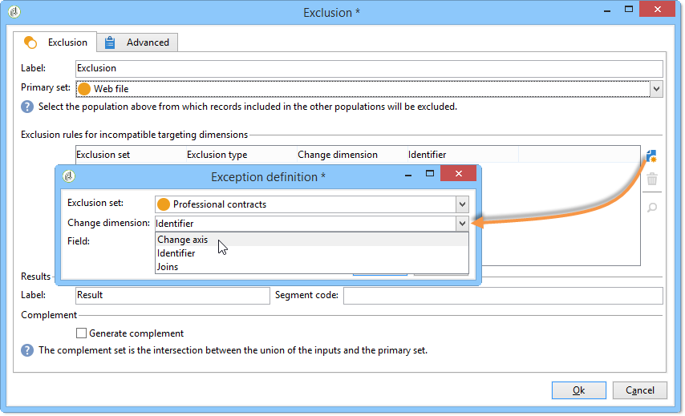
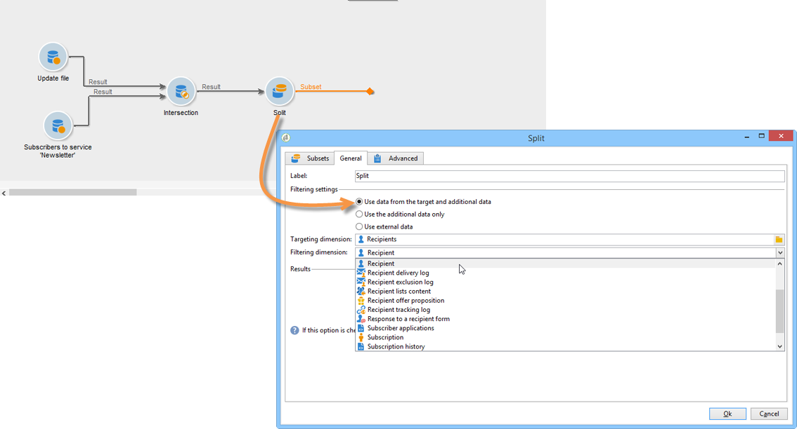

# 目標資料{#targeting-data}

## 建立查詢 {#creating-queries}

### 選取資料 {#selecting-data}

A **[!UICONTROL Query]** 活動可讓您選取基本資料以建置目標母體。 有關詳細資訊，請參閱 [建立查詢](query.md#creating-a-query).

您也可以使用下列活動來查詢及調整資料庫中的資料： [增量查詢](incremental-query.md)， [讀取清單](read-list.md).

可在整個工作流程生命週期中收集要轉送及處理的其他資料。 有關詳細資訊，請參閱 [新增資料](query.md#adding-data) 和 [編輯其他資料](#editing-additional-data).

### 編輯其他資料 {#editing-additional-data}

新增其他資料後，您可以編輯資料或使用這些資料來調整查詢活動中定義的目標。

此 **[!UICONTROL Edit additional data...]** 連結可讓您檢視新增的資料、修改或新增至其中。

若要將資料新增至先前定義的輸出欄，請在可用欄位清單中選取該資料。 若要建立新的輸出欄，請按一下 **[!UICONTROL Add]** 圖示，然後選取欄位並按一下 **[!UICONTROL Edit expression]**.

為要新增的欄位定義計算模式，例如彙總。

此 **[!UICONTROL Add a sub-item]** 選項可讓您將計算資料附加至集合。 這可讓您從收集中選取其他資料，或定義收集要素的彙總計算。

子元素會顯示在它們所對應之集合的子樹狀結構中。

集合顯示在 **[!UICONTROL Collections]** 子標籤。 您可以按一下 **[!UICONTROL Detail]** 圖示中選取的集合。 篩選精靈可讓您選取收集的資料，並指定要套用至集合中資料的篩選條件。

### 使用其他資料調整目標 {#refining-the-target-using-additional-data}

收集的其他資料可讓您調整資料庫中的資料篩選。 若要這麼做，請按一下 **[!UICONTROL Refine the target using additional data...]** 連結：這可讓您對新增的資料進行過度篩選。

### 均勻化資料 {#homogenizing-data}

在 **[!UICONTROL Union]** 或 **[!UICONTROL Intersection]** 輸入活動，您可以選擇僅保留共用的其他資料，以保持資料的一致性。 在這種情況下，此活動的暫時輸出工作表將僅包含在所有入站集中找到的其他資料。

### 與其他資料協調 {#reconciliation-with-additional-data}

在資料調解階段期間(**[!UICONTROL Union]**， **[!UICONTROL Intersection]**&#x200B;等 活動)，則可從其他欄中選取要用於資料協調的欄。 要執行此操作，請在選取的欄上設定調解，並指定主集。 然後選取視窗下方欄中的欄，如下列範例所示：

### 建立子集 {#creating-subsets}

此 **[!UICONTROL Split]** 活動可讓您根據透過擷取查詢定義的條件建立子集。 對於每個子集，當您編輯母體的篩選條件時，將存取可讓您定義目標細分條件的標準查詢活動。

您僅可使用其他資料作為篩選條件或目標資料將目標分割成數個子集。 如果您已購買 **同盟資料存取** 選項。

有關詳細資訊，請參閱 [使用分割活動建立子集](#creating-subsets-using-the-split-activity).

## 區段資料 {#segmenting-data}

### 結合數個目標（聯集） {#combining-several-targets--union-}

聯合活動可讓您在一個轉變中結合數個活動的結果。 集合不一定要是同質的。

下列資料調解選項可供使用：

* **[!UICONTROL Keys only]**

  如果輸入母體是同質的，則可以使用此選項。

* **[!UICONTROL All columns in common]**

  此選項可讓您根據目標各種母體所共有的所有欄來調解資料。

  Adobe Campaign會根據欄的名稱來識別欄。 接受容許度臨界值：例如，「電子郵件」欄可識別為與「@email」欄相同。

* **[!UICONTROL A selection of columns]**

  選取此選項可定義將套用資料協調的欄清單。

  首先，選取主集（包含來源資料的主集），然後選取要用於聯結的欄。

  

  >[!CAUTION]
  >
  >在資料協調期間，母體不會進行重複資料刪除。

  您可以將母體大小限製為指定的記錄數。 若要這麼做，請按一下適當的選項，並指定要保留的記錄數。

  此外，指定入站母體的優先順序：視窗下方會列出聯合活動的入站轉變，並讓您使用視窗右側的藍色箭頭來排序它們。

  記錄會先從清單中第一個入站轉變的母體取得，如果未達到最大值，則會從第二個入站轉變的母體取得，以此類推。

  

### 擷取連線點資料（交集） {#extracting-joint-data--intersection-}

交集可讓您僅復原入站轉變母體所共用的線。 此活動的設定方式應類似聯合活動。

此外，可能只保留選定的欄，或只保留入站母體共用的欄。

交集活動的詳細資訊請參閱 [交集](intersection.md) 區段。

### 排除人口（排除） {#excluding-a-population--exclusion-}

排除活動可讓您從不同的目標母體中排除目標的元素。 此活動的輸出目標維度將是主要集的輸出目標維度。

必要時，可以操控傳入表格。 事實上，若要從另一個維度排除目標，必須將此目標傳回主要目標的同一目標定位維度。若要這麼做，請按一下 **[!UICONTROL Add]** 按鈕並指定維度變更條件。

資料調解可透過識別碼、變更軸或連線來執行。 以下提供範例： [使用清單中的資料：讀取清單](../../platform/using/import-export-workflows.md#using-data-from-a-list--read-list).

### 使用分割活動建立子集 {#creating-subsets-using-the-split-activity}

此 **[!UICONTROL Split]** 活動是標準活動，可讓您透過一或多個篩選維度建立所需數量的集合，並為每個子集產生一個輸出轉變或產生唯一轉變。

入站轉變所傳達的其他資料可用於篩選條件中。

若要進行設定，您必須先選取條件：

1. 在工作流程中，拖放 **[!UICONTROL Split]** 活動。
1. 在 **[!UICONTROL General]** 索引標籤中，選取所要的選項： **[!UICONTROL Use data from the target and additional data]**， **[!UICONTROL Use the additional data only]** 或 **[!UICONTROL Use external data]**.
1. 如果 **[!UICONTROL Use data from the target and additional data]** 如果選取選項，則目標維度可讓您使用入站轉變所傳達的所有資料。

   

   建立子集時，會使用上述篩選引數。

   若要定義篩選條件，請選擇 **[!UICONTROL Add a filtering condition on the inbound population]** 選項，然後按一下 **[!UICONTROL Edit...]** 連結。 然後指定建立此子集的篩選條件。

   

   此範例說明如何在中使用篩選條件 **[!UICONTROL Split]** 將目標區隔為不同母體的活動說明，請參閱 [本節](cross-channel-delivery-workflow.md).

   此 **[!UICONTROL Label]** 欄位可讓您為新建立的子集命名，以符合出站轉變。

   您也可以將區段代碼指派給子集，以識別該子集並使用它來定位其母體。

   如有必要，您可以針對要建立的每個子集個別變更目標定位和篩選維度。 若要這麼做，請編輯子集的篩選條件，並檢查 **[!UICONTROL Use a specific filtering dimension]** 選項。

   

1. 如果 **[!UICONTROL Use the additional data only]** 選項，則僅會提供其他資料用於子集篩選。

   

1. 如果 **同盟資料存取** 選項已啟用， **[!UICONTROL Use external data]** 可讓您在已設定的外部資料庫中處理資料，或建立與資料庫的新連線。

   

   如需詳細資訊，請參閱Campaign版本的相關章節：

   [Campaign v7檔案](../../installation/using/about-fda.md)

   [Campaign v8檔案](https://experienceleague.adobe.com/docs/campaign/campaign-v8/connect/fda.html)

然後，我們需要新增子集：

1. 按一下 **[!UICONTROL Add]** 按鈕並定義篩選條件。

   

1. 在中定義篩選維度 **[!UICONTROL General]** 標籤（請參閱上文）。依預設，其適用於所有子集。

   

1. 如有必要，您可以個別變更每個子集的篩選維度。 這可讓您為所有金卡持有者建立一組檔案，一個檔案適用於在最新電子報中點按的所有收件者，第三個檔案適用於過去30天內於店內購買的18至25歲人士，所有檔案皆使用相同的分割活動。 若要這麼做，請選取 **[!UICONTROL Use a specific filtering dimension]** 選項並選取資料篩選內容。

   

   >[!NOTE]
   >
   >如果您已取得 **同盟資料存取** 選項，您可以根據外部基底中的資訊來建立子集。 若要這麼做，請在以下位置選取外部表格的綱要： **[!UICONTROL Targeting dimension]** 欄位。 有關詳細資訊，請參閱 [存取外部資料庫(FDA)](accessing-an-external-database-fda.md).

建立子集後，分割活動預設會顯示與子集相同數量的輸出轉變：

您可以將所有這些子集群組為一個輸出轉變。 在此情況下，個別子集的連結將顯示在區段代碼中，例如。 若要這麼做，請選取 **[!UICONTROL Generate all subsets in the same table]** 選項。

例如，您可以放置單一傳遞活動，並根據每個收件者集的區段代碼來個人化傳遞內容：

您也可以使用下列專案建立子集： **[!UICONTROL Cells]** 活動。 有關詳細資訊，請參閱 [儲存格](cells.md) 區段。

### 使用目標資料 {#using-targeted-data}

識別並準備資料後，便可用於下列內容：

* 您可以在各種工作流程階段中進行資料操作後，更新資料庫中的資料。

  有關詳細資訊， [更新資料](update-data.md).

* 您也可以重新整理現有清單的內容。

  有關詳細資訊，請參閱 [清單更新](list-update.md).

* 您可以直接在工作流程中準備或開始傳送。

  有關詳細資訊，請參閱 [傳遞](delivery.md)， [傳遞控制](delivery-control.md) 和 [持續傳遞](continuous-delivery.md).

## 資料管理 {#data-management}

在Adobe Campaign中，資料管理結合了一系列活動，提供更有效率、更靈活的工具以解決複雜的鎖定問題。 這可讓您使用合約、訂閱、傳遞再活動等的相關資訊，對與聯絡人的所有通訊進行一致的管理。 「資料管理」可讓您在細分作業期間追蹤資料生命週期，特別是：

* 透過包含未在資料超市中模型化的資料，來簡化及最佳化鎖定過程（建立新的資料表：根據配置，對目標工作流程進行本地擴展）。
* 保持和傳達緩衝區計算，尤其是在目標建構階段或進行資料庫管理時。
* 存取外部資料庫（選用）：在鎖定過程中考慮異質資料庫。

為了實作這些作業，Adobe Campaign提供：

* 資料收集活動： [檔案傳輸](file-transfer.md)， [資料載入（檔案）](data-loading-file.md)， [資料載入(RDBMS)](data-loading-rdbms.md)， [更新資料](update-data.md). 收集資料的第一個步驟是準備資料，以便在其他活動中處理。 為了確保工作流程正確執行並提供預期的結果，需要監控數個引數。 例如，當您匯入資料時，此資料的主索引鍵(Pkey)對於每個記錄必須是唯一的。
* 目標定位活動已新增資料管理選項： [查詢](query.md)， [聯集](union.md)， [交集](intersection.md)， [Split](split.md). 這可讓您在數個不同目標維度的資料之間設定聯合或交集，前提是資料協調可行。
* 資料轉換活動： [擴充](enrichment.md)， [變更維度](change-dimension.md).

>[!CAUTION]
>
>連結兩個工作流程時，刪除來源表格元素並不表示刪除連結至該元素的所有資料。
>  
>例如，透過工作流程刪除收件者將不會導致所有收件者的傳遞歷史記錄被刪除。 不過，直接在「收件者」資料夾中刪除收件者，實際上會導致所有連結至此收件者的資料遭到刪除。

### 豐富及修改資料 {#enriching-and-modifying-data}

除了目標維度之外，篩選維度還可讓您指定收集資料的性質。 請參閱 [目標定位和篩選維度](building-a-workflow.md#targeting-and-filtering-dimensions).

已識別和收集的資料可以擴充、彙總和操作，以最佳化目標建構。 為此，除了詳述的資料操作活動外，另需在 [將資料分段](#segmenting-data) 區段，使用下列專案：

* 此 **[!UICONTROL Enrichment]** 活動可讓您暫時新增欄到結構描述，以及新增資訊到特定元素。 詳細資訊請參見 [擴充](enrichment.md) 活動存放庫中的區段。
* 此 **[!UICONTROL Edit schema]** 活動可讓您修改綱要的結構。 詳細資訊請參見 [編輯結構描述](edit-schema.md) 活動存放庫中的區段。
* 此 **[!UICONTROL Change dimension]** 活動可讓您在目標建構週期中變更目標維度。 詳細資訊請參見 [變更維度](change-dimension.md) 區段。
