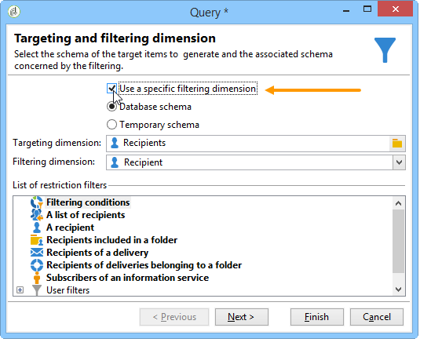

# 目標定位資料{#targeting-data}

## 建立查詢 {#creating-queries}

### 選取資料 {#selecting-data}

**[!UICONTROL Query]**&#x200B;活動可讓您選取基本資料以建立目標母體。 有關詳細資訊，請參閱[建立查詢](query.md#creating-a-query)。

您也可以使用下列活動來查詢和調整資料庫中的資料：[增量查詢](incremental-query.md), [讀取清單](read-list.md)。

可以收集要在整個工作流生命週期中轉發和處理的其他資料。 有關詳細資訊，請參閱[新增資料](query.md#adding-data)和[編輯其他資料](#editing-additional-data)。

### 編輯其他資料 {#editing-additional-data}

新增其他資料後，您可以編輯該資料，或使用該資料來調整查詢活動中定義的目標。

**[!UICONTROL Edit additional data...]**&#x200B;連結可讓您檢視新增的資料，並加以修改或新增至該資料。

若要將資料新增至先前定義的輸出欄，請在可用欄位清單中選取資料。 要建立新的輸出列，請按一下&#x200B;**[!UICONTROL Add]**&#x200B;表徵圖，然後選擇欄位並按一下&#x200B;**[!UICONTROL Edit expression]**。

為要添加的欄位定義計算模式，例如聚合。

**[!UICONTROL Add a sub-item]**&#x200B;選項可讓您將計算資料附加至集合。 這可讓您從集合中選取其他資料，或定義集合元素的匯總計算。

子元素將在它們映射的集合的子樹中表示。

集合顯示在&#x200B;**[!UICONTROL Collections]**&#x200B;子索引標籤中。 您可以按一下所選集合的&#x200B;**[!UICONTROL Detail]**&#x200B;圖示，以篩選所收集的元素。 篩選精靈可讓您選取收集的資料，並指定要套用至集合中資料的篩選條件。

### 使用其他資料縮小目標範圍 {#refining-the-target-using-additional-data}

收集的其他資料可讓您調整資料庫中的資料篩選。 要執行此操作，請按一下&#x200B;**[!UICONTROL Refine the target using additional data...]**&#x200B;連結：這可讓您對新增的資料進行過度篩選。

### 均質化資料 {#homogenizing-data}

在&#x200B;**[!UICONTROL Union]**&#x200B;或&#x200B;**[!UICONTROL Intersection]**&#x200B;類型活動中，您可以選擇僅保留共用的其他資料以保持資料的一致性。 在這種情況下，此活動的臨時輸出工作表將僅包含所有入站集中找到的其他資料。

### 與其他資料調解 {#reconciliation-with-additional-data}

在資料協調階段（**[!UICONTROL Union]**、**[!UICONTROL Intersection]**&#x200B;等）期間。 活動)，則可以從其他欄選取要用於資料協調的欄。 要執行此操作，請對選定的列配置協調並指定主集。 然後選取視窗下方欄中的欄，如下列範例所示：

### 建立子集 {#creating-subsets}

**[!UICONTROL Split]**&#x200B;活動可讓您根據透過擷取查詢定義的條件建立子集。 對於每個子集，當您編輯母體上的篩選條件時，將會存取標準查詢活動，該活動可讓您定義目標分段條件。

您只能使用附加資料作為篩選條件，或除了目標資料之外，將目標分割為多個子集。 如果您已購買&#x200B;**同盟資料存取**&#x200B;選項，也可以使用外部資料。

有關詳細資訊，請參閱[使用分割活動建立子集](#creating-subsets-using-the-split-activity)。

## 將資料分段 {#segmenting-data}

### 合併多個目標（聯合） {#combining-several-targets--union-}

聯合活動可讓您在一個轉變中結合數個活動的結果。 集不一定必須是同質的。

可使用下列資料協調選項：

* **[!UICONTROL Keys only]**

   如果輸入母體是同質的，則可使用此選項。

* **[!UICONTROL All columns in common]**

   此選項可讓您根據目標各種母體的所有共同欄來調解資料。

   Adobe Campaign會根據欄的名稱來識別欄。 接受允差閾值：例如，「電子郵件」欄可辨識為與「@email」欄相同。

* **[!UICONTROL A selection of columns]**

   選擇此選項可定義將應用資料協調的列清單。

   首先，選擇主集（包含源資料的集），然後選擇要用於聯接的列。

   

   >[!CAUTION]
   >
   >在資料協調期間，不會刪除重複的母體。

   您可以將母體大小限制為指定數量的記錄。 要執行此操作，請按一下適當的選項，並指定要保留的記錄數。

   此外，指定入站母體的優先順序：視窗的下部會列出聯合活動的入站轉變，並可讓您使用視窗右側的藍色箭頭來排序。

   記錄會先從清單中第一個入站轉變的母體中擷取，然後，如果尚未達到最大值，則會從第二個入站轉變的母體中擷取，以此類推。

   

### 提取聯合資料（交集） {#extracting-joint-data--intersection-}

交集可讓您僅復原入站轉變母體共用的線條。 此活動的設定應與聯合活動相同。

此外，您也可以僅保留一系列欄，或僅保留入站母體共用的欄。

交集活動在[交集](intersection.md)部分中詳細說明。

### 排除母體（排除） {#excluding-a-population--exclusion-}

排除活動可讓您從不同的目標母體中排除目標的元素。 此活動的輸出目標維度將是主要集的目標維度。

如有必要，可操控入站表。 事實上，若要從其他維度排除目標，必須將此目標傳回與主要目標相同的目標維度。 要執行此操作，請按一下&#x200B;**[!UICONTROL Add]**&#x200B;按鈕並指定維更改條件。

資料協調是透過識別碼、變更軸或連接執行。 [使用清單中的資料中提供了示例：讀取清單](../../platform/using/import-export-workflows.md#using-data-from-a-list--read-list)。

### 使用分割活動建立子集 {#creating-subsets-using-the-split-activity}

**[!UICONTROL Split]**&#x200B;活動是標準活動，可讓您透過一或多個篩選維度，視需要建立任意數量的集，以及為每個子集產生一個輸出轉變或一個唯一轉變。

入站轉變所傳送的其他資料可用於篩選條件。

若要設定，您必須先選取條件：

1. 在工作流程中，拖放&#x200B;**[!UICONTROL Split]**&#x200B;活動。
1. 在&#x200B;**[!UICONTROL General]**&#x200B;標籤中，選取所需的選項：**[!UICONTROL Use data from the target and additional data]**、**[!UICONTROL Use the additional data only]**&#x200B;或&#x200B;**[!UICONTROL Use external data]**。
1. 如果選取&#x200B;**[!UICONTROL Use data from the target and additional data]**&#x200B;選項，定位維度可讓您使用入站轉變所傳送的所有資料。

   

   建立子集時，使用上述過濾參數。

   要定義篩選條件，請選擇&#x200B;**[!UICONTROL Add a filtering condition on the inbound population]**&#x200B;選項，然後按一下&#x200B;**[!UICONTROL Edit...]**&#x200B;連結。 然後指定建立此子集的篩選條件。

   

   [此區段](cross-channel-delivery-workflow.md)說明如何使用&#x200B;**[!UICONTROL Split]**&#x200B;活動中的篩選條件將目標細分為不同母體的範例。

   **[!UICONTROL Label]**&#x200B;欄位可讓您為新建立的子集指定名稱，該名稱將與出站轉變相符。

   您也可以指派區段代碼給子集以加以識別，並使用它來定位母體。

   如有需要，您可以針對要建立的每個子集分別變更目標定位和篩選維度。 要執行此操作，請編輯子集的篩選條件並核取&#x200B;**[!UICONTROL Use a specific filtering dimension]**&#x200B;選項。

   

1. 如果選取&#x200B;**[!UICONTROL Use the additional data only]**&#x200B;選項，則僅為子集篩選提供其他資料。

   

1. 如果啟用了&#x200B;**聯合資料訪問**&#x200B;選項， **[!UICONTROL Use external data]**&#x200B;允許您處理已配置的外部資料庫中的資料，或建立到資料庫的新連接。

   

   如需詳細資訊，請視您的Campaign版本而定，參閱下列區段：

   [  Campaign v7 文件](../../installation/using/about-fda.md)

   [  Campaign v8 文件](https://experienceleague.adobe.com/docs/campaign/campaign-v8/connect/fda.html?lang=en)

然後，我們需要添加新的子集：

1. 按一下&#x200B;**[!UICONTROL Add]**&#x200B;按鈕並定義篩選條件。

   

1. 在活動的&#x200B;**[!UICONTROL General]**&#x200B;標籤中定義篩選維（請參閱上文）。預設情況下，它應用於所有子集。

   

1. 如有必要，您可以個別變更每個子集的篩選維度。 這可讓您為所有金卡持卡者建立一組資料，其中一個是所有點按最新電子報的收件者，另一個是18至25歲的人，在過去30天內購買過金卡，而所有這些都使用相同的分割活動。 要執行此操作，請選取&#x200B;**[!UICONTROL Use a specific filtering dimension]**&#x200B;選項並選取資料篩選內容。

   

   >[!NOTE]
   >
   >如果已獲得&#x200B;**聯合資料訪問**&#x200B;選項，則可以根據外部基中的資訊建立子集。 要執行此操作，請在&#x200B;**[!UICONTROL Targeting dimension]**&#x200B;欄位中選取外部表的架構。 有關詳細資訊，請參閱[存取外部資料庫(FDA)](accessing-an-external-database--fda-.md)。

建立子集後，預設情況下，拆分活動顯示的輸出轉變數與有子集數相同：

您可以將所有這些子集分組到單個輸出轉變中。 在這種情況下，例如，到各個子集的連結將在段代碼中可見。 要執行此操作，請選取&#x200B;**[!UICONTROL Generate all subsets in the same table]**&#x200B;選項。

例如，您可以放置單一傳送活動，並根據每個收件者集的區段代碼個人化傳送內容：

也可以使用&#x200B;**[!UICONTROL Cells]**&#x200B;活動建立子集。 有關詳細資訊，請參閱[儲存格](cells.md)區段。

### 使用目標資料 {#using-targeted-data}

識別並準備資料後，即可在下列內容中使用：

* 在各種工作流程階段中進行資料操作之後，您可以更新資料庫中的資料。

   有關詳細資訊，請[更新資料](update-data.md)。

* 您也可以重新整理現有清單的內容。

   有關詳細資訊，請參閱[清單更新](list-update.md)。

* 您可以直接在工作流程中準備或開始傳送。

   如需詳細資訊，請參閱[傳送](delivery.md)、[傳送控制項](delivery-control.md)和[連續傳送](continuous-delivery.md)。

## 資料管理 {#data-management}

在Adobe Campaign中，資料管理結合了一組活動，透過提供更有效率、更靈活的工具來解決複雜的鎖定問題。 這可讓您使用與合約、訂閱、傳送再活動等相關的資訊，對與聯絡人的所有通訊進行一致的管理。 「資料管理」可讓您在細分操作期間追蹤資料生命週期，尤其是：

* 透過包含未在資料超市中模型化的資料，來簡化及最佳化鎖定過程（建立新的資料表：根據配置，對目標工作流程進行本地擴展）。
* 保持和傳達緩衝區計算，尤其是在目標建構階段或進行資料庫管理時。
* 存取外部資料庫（選用）：在鎖定過程中考慮異質資料庫。

為了實作這些操作，Adobe Campaign提供：

* 資料收集活動：[檔案傳輸](file-transfer.md)、[資料載入（檔案）](data-loading--file-.md)、[資料載入(RDBMS)](data-loading--rdbms-.md)、[更新資料](update-data.md)。 收集資料的第一步會準備資料，以便在其他活動中處理資料。 需要監控數個參數，以確保工作流程正確執行並提供預期的結果。 例如，匯入資料時，此資料的主索引鍵(Pkey)對於每個記錄都必須是唯一的。
* 已使用「資料管理」選項擴充目標定位活動：[Query](query.md)、[Union](union.md)、[Intersection](intersection.md)、[Split](split.md)。 這可讓您設定來自數個不同目標維度之資料之間的聯合或交集，只要可進行資料協調即可。
* 資料轉換活動：[擴充](enrichment.md), [變更維度](change-dimension.md)。

>[!CAUTION]
>
>連結兩個工作流程時，刪除來源表格元素並不表示會刪除連結至該工作流程的所有資料。
>  
>例如，透過工作流程刪除收件者不會導致刪除所有收件者的傳送歷史記錄。 不過，直接在「收件者」資料夾中刪除收件者，確實會導致刪除與此收件者連結的所有資料。

### 擴充和修改資料 {#enriching-and-modifying-data}

除了目標維度，篩選維度還可讓您指定收集資料的性質。 請參閱[目標定位和篩選維度](building-a-workflow.md#targeting-and-filtering-dimensions)。

識別和收集的資料可以被豐富、聚合和操作以優化目標構造。 若要這麼做，除了[劃分資料](#segmenting-data)區段中詳述的資料操作活動外，請使用下列項目：

* **[!UICONTROL Enrichment]**&#x200B;活動可讓您暫時將欄新增至架構，以及新增資訊至特定元素。 在活動存放庫的[ Excrent](enrichment.md)區段中會詳細說明。
* **[!UICONTROL Edit schema]**&#x200B;活動可讓您修改架構的結構。 在活動存放庫的[編輯結構](edit-schema.md)區段中會詳細說明。
* **[!UICONTROL Change dimension]**&#x200B;活動可讓您在目標建構週期期間變更目標維度。 在[Change dimension](change-dimension.md)區段中會詳細說明。
