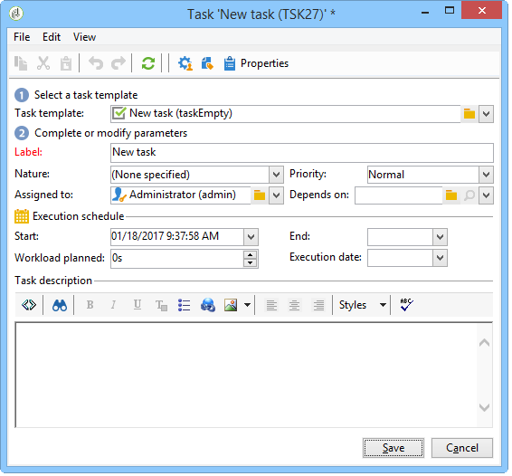

# 任務{#task}

在促銷活動工作流程中，活 **[!UICONTROL Task]** 動可讓您指定兩個藍本：第一個是任務完成時，第二個是任務未完成時（如果手動標籤為未完成或任務過期）。

如何配置和操作任務將在本節中詳 [細說明](../../campaign/using/creating-and-managing-tasks.md)。

此選 **[!UICONTROL Resources]** 項可讓您定義數個運算子以及任務的核准排程。 如果核准者拒絕，這不會導致任務本身遭到拒絕。
