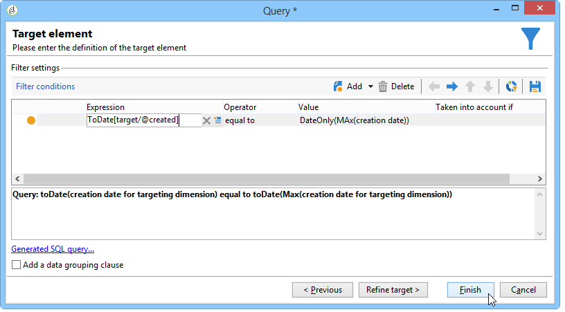

# 使用聚合{#using-aggregates}

此使用案例詳細資訊如何自動識別最後新增至資料庫的收件者。

使用以下流程，將資料庫中收件人的建立日期與上次使用匯總建立收件人的已知日期進行比較。 也會選取在同一天建立的所有收件者。

若要對收件者執 **行「建立日期=最大（建立日期）** 」類型篩選，您必須執行工作流程以遵循下列步驟：

1. 使用基本查詢檢索資料庫收件人。 有關此步驟的詳細資訊，請參閱 [建立查詢](../../workflow/using/query.md#creating-a-query)。
1. 使用最大（建立日期）聚合函式生成的結果計算收件人建立的 **最後已知日期** 。
1. 將每個收件者連結至匯總函式，會產生相同的架構。
1. 透過編輯的結構，使用匯整篩選收件者。

## 步驟1:計算匯總結果 {#step-1--calculating-the-aggregate-result}

1. 建立查詢。 在此，目標是計算資料庫中所有收件人的最後一個已知建立日期。 因此，查詢不包含篩選器。
1. Select **[!UICONTROL Add data]**.
1. 在開啟的視窗中，選取 **[!UICONTROL Data linked to the filtering dimension]** 然後 **[!UICONTROL Filtering dimension data]**。
1. 在窗 **[!UICONTROL Data to add]** 口中，添加一列，該列計算收件人表中「創 **建日期** 」欄位的最大值。 您可以使用運算式編輯器，或 **直接在欄的欄位中輸入max(@created)****[!UICONTROL Expression]** 。 然後按一下 **[!UICONTROL Finish]** 按鈕。

   

1. 按一 **[!UICONTROL Edit additional data]** 下 **[!UICONTROL Advanced parameters...]**。 勾選 **[!UICONTROL Disable automatic adding of the primary keys of the targeting dimension]** 選項。

   此選項可確保不會因此顯示所有收件者，而且不會保留明確新增的資料。 在此例中，它是指收件者最後建立的日期。

   保留選 **[!UICONTROL Remove duplicate rows (DISTINCT)]** 項為選中狀態。

## 步驟2:連結收件人和聚合函式結果 {#step-2--linking-the-recipients-and-the-aggregation-function-result}

要將處理收件人的查詢連結到執行聚合函式計算的查詢，必須使用方案編輯活動。

1. 將收件者查詢定義為主集。
1. 在標籤 **[!UICONTROL Links]** 中，添加新連結並在窗口中輸入以下開啟的資訊：

   * 選擇與聚合相關的臨時方案。 此架構的資料將添加到主集的成員中。
   * 選擇 **[!UICONTROL Use a simple join]** 將聚合結果連結到主集的每個收件人。
   * 最後，指定連結為 **[!UICONTROL Type 11 simple link]**。
   

因此，聚合結果與每個接收者連結。

## 步驟3:使用匯總篩選收件者。 {#step-3--filtering-recipients-using-the-aggregate-}

建立連結後，匯整結果和收件者會組成相同的暫時架構。 因此，可以在方案上建立篩選器，以比較收件人的建立日期和由聚集函式表示的最後已知建立日期。 此篩選器是使用分割活動來執行。

1. 在標籤中 **[!UICONTROL General]** ，選擇「收件者 **** 」作為定位維度，選擇「編輯方案 **** 」作為篩選維度（以篩選傳入的轉換方案活動）。
1. 在標籤中 **[!UICONTROL subsets]** ，選擇，然 **[!UICONTROL Add a filtering condition on the inbound population]** 後按一下 **[!UICONTROL Edit...]**。
1. 使用運算式編輯器，在收件者的建立日期與由匯總計算的建立日期之間新增等式標準。

   資料庫中的日期類型欄位通常保存為毫秒。 因此，您必須將這些內容延長整天，以避免擷取僅在毫秒內建立的收件者。

   若要這麼做，請使用運算式 **編輯器中提供的ToDate** 函式，可將日期和小時數轉換為簡單日期。

   因此，要用於條件的表達式為：

   * **[!UICONTROL Expression]**: `toDate([target/@created])`.
   * **[!UICONTROL Value]**: `toDate([datemax/expr####])`，其中expr####與聚合函式查詢中指定的聚合相關。
   

因此，分割活動的結果與與上次已知建立日期建立的同一天建立的收件人有關。

然後，您可以新增其他活動，例如清單更新或傳送，以豐富您的工作流程。
