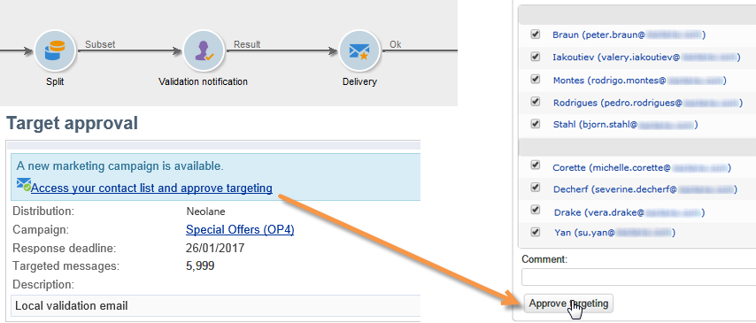
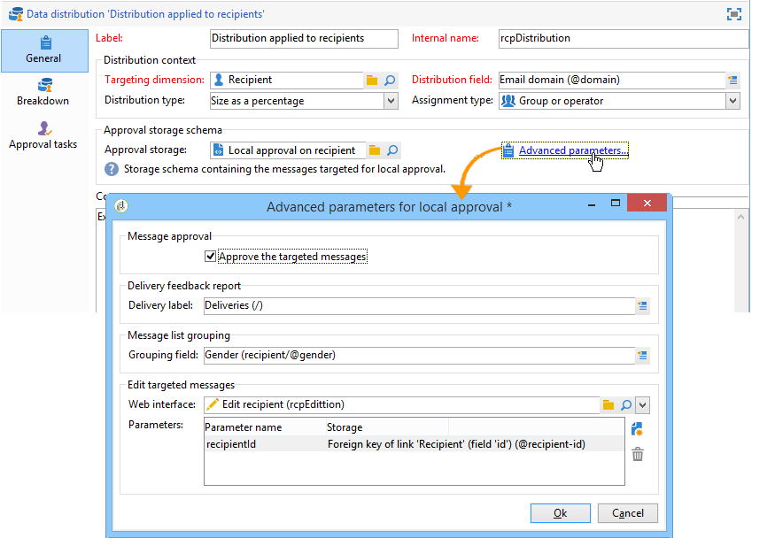
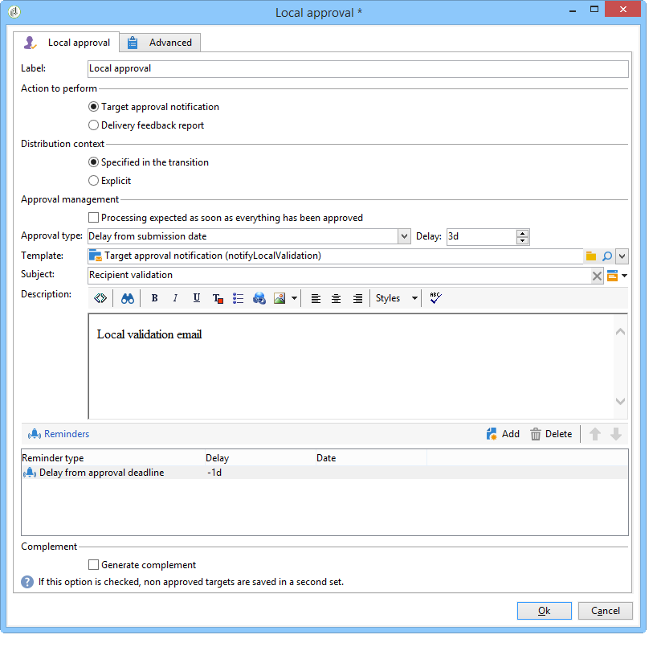
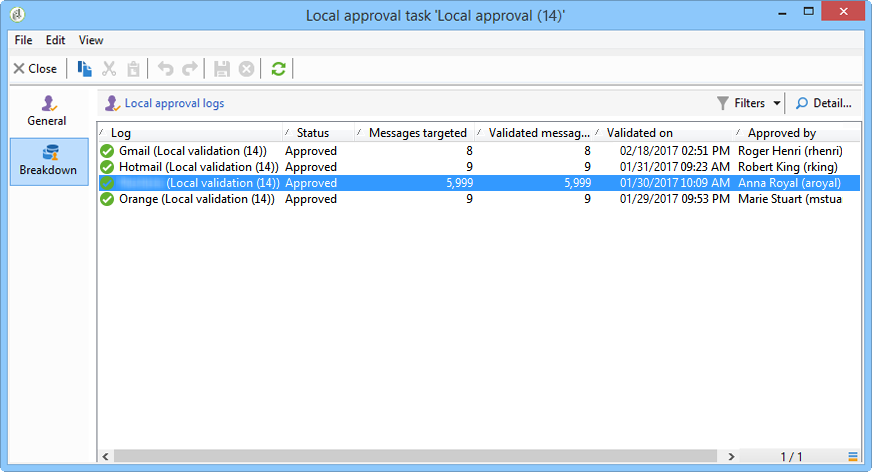

# 使用本機核准活動{#using-the-local-approval-activity}

整合 **[!UICONTROL Local approval]** 至定位工作流程的活動可讓您在傳送傳送之前設定收件者核准程式。

>[!CAUTION]
>
>若要使用此函式，您必須購買Distributed Marketing模組，此為促銷活動選項。 請檢查您的授權合約。

若要設定此使用案例，我們建立了下列定位工作流程：

本端核准程式的主要步驟為：

1. 由於使用資料分發模型的類型活動，因定位而 **[!UICONTROL Split]** 產生的人口數量可能有限。

   

1. 然後， **[!UICONTROL Local approval]** 活動將接管並向每個本地主管發送通知電子郵件。 活動將暫停，直到每個本地主管批准分配給它們的收件人。

   

1. 一旦到達核准截止日期，工作流程就會重新開始。 在此範例中，活動 **[!UICONTROL Delivery]** 會開始，傳送內容會傳送至已核准的目標。

   >[!NOTE]
   >
   >到達期限後，尚未核准的收件者就會被排除在定位之外。

   

1. 幾天後，第二類活動 **[!UICONTROL Local approval]** 會傳送通知電子郵件給每個本地主管，並附上其聯絡人（點按、開啟等）所執行動作的摘要。

   

## 步驟1:建立資料分發範本 {#step-1--creating-the-data-distribution-template-}

資料分發範本可讓您根據資料分組限制定位所產生的人口族群，同時讓您將每個值指派給本機主管。 在此示例中，我們將該欄位定 **[!UICONTROL Email address domain]** 義為分佈欄位，並為每個本地主管分配了域

有關建立資料分發模板的詳細資訊，請參 [閱限制每個資料分發的子集記錄數](../../workflow/using/split.md#limiting-the-number-of-subset-records-per-data-distribution)。

1. 若要建立資料分發範本，請移至節 **[!UICONTROL Resources > Campaign management > Data distribution]** 點並按一下 **[!UICONTROL New]**。

   

1. 選擇選 **[!UICONTROL General]** 項卡。

   

1. 輸入 **[!UICONTROL Label]** 和 **[!UICONTROL Distribution context]**。 在此範例中，我們已選取定 **[!UICONTROL Recipient]** 位架構和欄位 **[!UICONTROL Email domain]** 做為分發欄位。 收件者清單將依網域劃分。
1. 在欄位 **[!UICONTROL Distribution type]** 中，選取目標限制值在索引標籤中的表達 **[!UICONTROL Distribution]** 方式。 我們已經選好了 **[!UICONTROL Percentage]**。
1. 在欄位 **[!UICONTROL Approval storage]** 中，輸入與正在使用的目標方案匹配的批准的儲存方案。 下面我們將使用預設儲存模式： **[!UICONTROL Local approval of recipients]**。
1. 然後按一下 **[!UICONTROL Advanced parameters]** 連結。

   

1. 將選 **[!UICONTROL Approve the targeted messages]** 項保持為勾選狀態，以便從要核准的收件者清單中預先選取所有收件者。
1. 在欄位 **[!UICONTROL Delivery label]** 中，我們保留了預設運算式（傳送的計算字串）。 傳送的標準標籤將用於回饋通知。
1. 在此區 **[!UICONTROL Grouping field]** 段中，我們選取欄位 **[!UICONTROL Gender]** 做為群組欄位，以在核准和意見通知中顯示收件者。
1. 在此 **[!UICONTROL Edit targeted messages]** 節中，我們選取了Web應 **[!UICONTROL Edit recipients]** 用程式和參 **[!UICONTROL recipientId]** 數。 在核准和意見通知中，收件者可點按，並指向網頁應用程式的URL。 其他URL參數將為 **[!UICONTROL recipientId]**。
1. 然後按一下 **[!UICONTROL Distribution]** 標籤。 針對每個網域，輸入下列欄位：

   

   * **[!UICONTROL Value]**:輸入域名的值。
   * **[!UICONTROL Percentage / Fixed]**:對於每個域，輸入最大值。 要傳送傳送給的收件者數。 在此範例中，我們希望將傳送限制為每個網域10%。
   * **[!UICONTROL Label]**:輸入要在批准和反饋通知中顯示的域標籤。
   * **[!UICONTROL Group or operator]**:選擇分配給域的運算子或運算子組。

      >[!CAUTION]
      >
      >請確定已為運算子指派適當的權限。

## 步驟2:建立定位工作流程 {#step-2--creating-the-targeting-workflow}

若要設定此使用案例，我們建立了下列定位工作流程：

新增下列活動：

* 兩次 **[!UICONTROL Query]** 活動，
* 一項 **[!UICONTROL Intersection]** 活動，
* 一項 **[!UICONTROL Split]** 活動，
* 一項 **[!UICONTROL Local approval]** 活動，
* 一項 **[!UICONTROL Delivery]** 活動，
* 一項 **[!UICONTROL Wait]** 活動，
* 第二次 **[!UICONTROL Local approval]** 活動，
* 一項 **[!UICONTROL End]** 活動。

### 查詢、交叉點和分割 {#queries--intersection-and-split}

上游定位由兩個查詢組成，一個交叉點和一個分割。 使用資料分發範本的活動，可以限制由定 **[!UICONTROL Split]** 位產生的人口數量。

有關配置拆分活動的詳細資訊，請參 [閱Split](../../workflow/using/split.md)。 「限制每個資料分發的子集記錄數 [」中詳述了資料分發模板的建立](../../workflow/using/split.md#limiting-the-number-of-subset-records-per-data-distribution)。

如果您不想限制查詢的人口，則不必使用、 **[!UICONTROL Query]**&#x200B;和 **[!UICONTROL Intersection]**&#x200B;活 **[!UICONTROL Split]** 動。 在這種情況下，請完成第一個活動中的資料分發 **[!UICONTROL Local approval]** 範本。

1. 在區段 **[!UICONTROL Record count limitation]** 中，選取選 **[!UICONTROL Limit the selected records]** 項並按一下 **[!UICONTROL Edit]** 連結。

   

1. 選取選 **[!UICONTROL Keep only the first records after sorting]** 項並按一下 **[!UICONTROL Next]**。

   

1. 在節 **[!UICONTROL Sort columns]** 中，添加要應用排序的欄位。 這裡，我們選了這 **[!UICONTROL Email]** 個。 按一下 **[!UICONTROL Next]**.

   

1. 選擇選 **[!UICONTROL By data distribution]** 項，選擇以前建立的分發模板(請參 [閱步驟1:建立資料分發範本](#step-1--creating-the-data-distribution-template-))，然後按一下 **[!UICONTROL Finish]**。

   

在分配模板中，我們選擇將人口限制為每個分組值10%，這與工作流中顯示的值一致（340作為輸入，34作為輸出）。

### 核准通知 {#approval-notification}

此活 **[!UICONTROL Local approval]** 動可讓您傳送通知給每個本機主管。

如需設定活動的詳 **[!UICONTROL Local approval]** 細資訊，請參 [閱本機核准](../../workflow/using/local-approval.md)。

需要輸入下列欄位：

1. 在節 **[!UICONTROL Action to execute]** 中，選擇選 **[!UICONTROL Target approval notification]** 項。
1. 在節 **[!UICONTROL Distribution context]** 中，選擇選 **[!UICONTROL Specified in the transition]** 項。

   如果您不想限制目標人口，請在此處選擇選 **[!UICONTROL Explicit]** 項，然後輸入先前在欄位中建立的分配范 **[!UICONTROL Data distribution]** 本。

1. 在區 **[!UICONTROL Notification]** 段中，選取傳送範本和用於通知電子郵件的主題。 在此，我們選擇了預設模板： **[!UICONTROL Local approval notification]**。
1. 在此 **[!UICONTROL Approval schedule]** 節中，我們保留了預設核准期限（3天）並新增提醒。 交貨將於批准開始後3天內結束。 在核准期限到達後，尚未核准的收件者就不會透過定位來考量。

活動向本地主管發送 **[!UICONTROL Local approval]** 的通知電子郵件如下：

### 等待 {#wait}

等待活動可讓您延遲第二個本機核准活動的開始，該活動將傳送傳送意見回應通知。 在欄位 **[!UICONTROL Duration]** 中，我們已輸入 **[!UICONTROL 5d]** 值（5天）。 收件者在傳送傳送後5天所執行的動作，會納入回饋通知中。

### 回饋通知 {#feedback-notification}

第二個活 **[!UICONTROL Local approval]** 動可讓您傳送傳送意見回饋通知給每個本機主管。

需要輸入下列欄位。

1. 在節 **[!UICONTROL Action to execute]** 中，選擇 **[!UICONTROL Delivery feedback report]**。
1. 在節 **[!UICONTROL Delivery]** 中，選擇 **[!UICONTROL Specified in the transition]**。
1. 在區 **[!UICONTROL Notification]** 段中，選取傳送範本和用於通知電子郵件的主題。

在等待活動中配置的截止日期到來後，第二類活動 **[!UICONTROL Local approval]** 會向每個本地主管發送以下通知電子郵件：

### 管理員的核准追蹤 {#approval-tracking-by-the-administrator}

每次啟動本地批准活動時，都會建立一個批准任務。 管理員可以控制這些核准工作。

前往促銷活動的定位工作流程，然後按一下標 **[!UICONTROL Local approval tasks]** 簽。

您也可以透過資料分發範本的標籤，存取本 **[!UICONTROL Approval tasks]** 機核准工作清單。

選擇要監視的任務，然後按一下該 **[!UICONTROL Detail]** 按鈕。 本地 **[!UICONTROL General]** 批准任務的頁籤允許您查看有關該任務的資訊。 如有必要，您可以變更核准和提醒日期。

此頁籤顯示以下資訊：

* 任務的標籤及其ID
* 使用的散發範本
* 目標訊息數
* 連結的工作流程和促銷活動
* 任務計畫

任務 **[!UICONTROL Distribution]** 的頁籤可讓您查看批准日誌、其狀態、目標消息數、批准日期以及批准傳送的操作員。

選取核准記錄，然後按一下 **[!UICONTROL Detail]** 按鈕以顯示詳細資訊。 本機 **[!UICONTROL General]** 批准記錄檔的標籤可讓您檢視一般記錄檔資訊。 您也可以變更核准狀態。

此頁籤顯示以下資訊：

* 連結的核准工作
* 核准狀態(**[!UICONTROL Approved]** 或 **[!UICONTROL Pending]**)
* 使用的散發範本
* 批准和批准日期的當地主管
* 已定位和批准的消息數

核准 **[!UICONTROL Targeted]** 記錄的標籤會顯示目標收件者的清單及其核准狀態。 您可以視需要變更此狀態。

