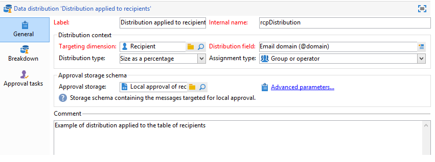

# 使用本機核准活動{#using-the-local-approval-activity}

整合至目標工作流程的&#x200B;**[!UICONTROL Local approval]**&#x200B;活動可讓您在傳送傳遞之前設定收件者核准程式。

>[!CAUTION]
>
>若要使用此功能，您需要購買Distributed Marketing模組（此為促銷活動選項）。 請檢查您的授權合約。

為了設定此使用案例，我們建立了下列目標工作流程：

本機核准程式的主要步驟為：

1. 由於&#x200B;**[!UICONTROL Split]**&#x200B;類型活動使用資料分送模型，因此鎖定目標產生的母體數量可能有限。

   

1. 然後，**[!UICONTROL Local approval]**&#x200B;活動接管並向每個本地主管發送通知電子郵件。 在每個本地主管批准分配給它們的收件者之前，活動將被暫停。

   

1. 一旦達到核准截止日期，工作流程就會重新開始。 在此範例中，**[!UICONTROL Delivery]**&#x200B;活動會開始，並傳送至已核准的目標。

   >[!NOTE]
   >
   >到達期限後，尚未核准的收件者將排除在鎖定目標之外。

   

1. 幾天後，第二個&#x200B;**[!UICONTROL Local approval]**&#x200B;類型活動向每個本地主管發送通知電子郵件，其中包含其聯繫人（點擊、開啟等）執行的操作的摘要。

   

## 步驟1:建立資料分送範本 {#step-1--creating-the-data-distribution-template-}

通過資料分發模板，您可以限制根據資料分組進行目標定位而生成的母體，同時允許您將每個值分配給本地主管。 在本示例中，我們將&#x200B;**[!UICONTROL Email address domain]**&#x200B;欄位定義為分發欄位，並為每個本地主管分配了一個域

有關建立資料分發模板的詳細資訊，請參閱[限制每個資料分發的子集記錄數](split.md#limiting-the-number-of-subset-records-per-data-distribution)。

1. 要建立資料分發模板，請轉至&#x200B;**[!UICONTROL Resources > Campaign management > Data distribution]**&#x200B;節點，然後按一下&#x200B;**[!UICONTROL New]**。

   

1. 選取 **[!UICONTROL General]** 索引標籤。

   

1. 輸入&#x200B;**[!UICONTROL Label]**&#x200B;和&#x200B;**[!UICONTROL Distribution context]**。 在此範例中，我們已選取&#x200B;**[!UICONTROL Recipient]**&#x200B;目標結構和&#x200B;**[!UICONTROL Email domain]**&#x200B;欄位作為分發欄位。 收件者清單將依網域劃分。
1. 在&#x200B;**[!UICONTROL Distribution type]**&#x200B;欄位中，選取目標限制值在&#x200B;**[!UICONTROL Distribution]**&#x200B;標籤中的表達方式。 在此，我們選擇了&#x200B;**[!UICONTROL Percentage]**。
1. 在&#x200B;**[!UICONTROL Approval storage]**&#x200B;欄位中，輸入與使用中目標架構相符之核准的儲存架構。 以下是使用預設儲存架構：**[!UICONTROL Local approval of recipients]**。
1. 然後按一下&#x200B;**[!UICONTROL Advanced parameters]**&#x200B;連結。

   

1. 保持勾選&#x200B;**[!UICONTROL Approve the targeted messages]**&#x200B;選項，以便從要核准的收件者清單中預先選取所有收件者。
1. 在&#x200B;**[!UICONTROL Delivery label]**&#x200B;欄位中，我們保留了預設運算式（傳送的計算字串）。 傳送的標準標籤將用於意見通知中。
1. 在&#x200B;**[!UICONTROL Grouping field]**&#x200B;區段中，我們已選取&#x200B;**[!UICONTROL Gender]**&#x200B;欄位作為分組欄位，以在核准和意見通知中顯示收件者。
1. 在&#x200B;**[!UICONTROL Edit targeted messages]**&#x200B;部分，我們已選擇&#x200B;**[!UICONTROL Edit recipients]** Web應用程式和&#x200B;**[!UICONTROL recipientId]**&#x200B;參數。 在核准和意見通知中，收件者將可點按，並指向Web應用程式的URL。 其他URL參數將為&#x200B;**[!UICONTROL recipientId]**。
1. 然後按一下&#x200B;**[!UICONTROL Distribution]**&#x200B;標籤。 對於每個網域，輸入下列欄位：

   

   * **[!UICONTROL Value]**:輸入域名的值。
   * **[!UICONTROL Percentage / Fixed]**:對於每個網域，輸入最大值。您要傳送傳遞給的收件者人數。 在此範例中，我們想將傳送限制為每個網域10%。
   * **[!UICONTROL Label]**:輸入要在批准和反饋通知中顯示的域的標籤。
   * **[!UICONTROL Group or operator]**:選擇分配給域的運算子或運算子組。

      >[!CAUTION]
      >
      >請確定已為運算子指派適當的權限。

## 步驟2:建立目標工作流程 {#step-2--creating-the-targeting-workflow}

為了設定此使用案例，我們建立了下列目標工作流程：

已新增下列活動：

* 兩個&#x200B;**[!UICONTROL Query]**&#x200B;活動，
* 一個&#x200B;**[!UICONTROL Intersection]**&#x200B;活動，
* 一個&#x200B;**[!UICONTROL Split]**&#x200B;活動，
* 一個&#x200B;**[!UICONTROL Local approval]**&#x200B;活動，
* 一個&#x200B;**[!UICONTROL Delivery]**&#x200B;活動，
* 一個&#x200B;**[!UICONTROL Wait]**&#x200B;活動，
* 第二個&#x200B;**[!UICONTROL Local approval]**&#x200B;活動，
* 一個&#x200B;**[!UICONTROL End]**&#x200B;活動。

### 查詢、交集和拆分 {#queries--intersection-and-split}

上游定位由兩個查詢組成，一個交集和一個分割。 目標定位產生的母體可使用資料分發範本的&#x200B;**[!UICONTROL Split]**&#x200B;活動來限制。

有關配置拆分活動的詳細資訊，請參閱[Split](split.md)。 [限制每個資料分發的子集記錄數](split.md#limiting-the-number-of-subset-records-per-data-distribution)中詳細說明了資料分發模板的建立。

如果您不想限制查詢中的母體，則不必使用&#x200B;**[!UICONTROL Query]**、**[!UICONTROL Intersection]**&#x200B;和&#x200B;**[!UICONTROL Split]**&#x200B;活動。 在此情況下，請完成第一個&#x200B;**[!UICONTROL Local approval]**&#x200B;活動中的資料分發範本。

1. 在&#x200B;**[!UICONTROL Record count limitation]**&#x200B;區段中，選取&#x200B;**[!UICONTROL Limit the selected records]**&#x200B;選項，然後按一下&#x200B;**[!UICONTROL Edit]**&#x200B;連結。

   

1. 選擇&#x200B;**[!UICONTROL Keep only the first records after sorting]**&#x200B;選項，然後按一下&#x200B;**[!UICONTROL Next]**。

   

1. 在&#x200B;**[!UICONTROL Sort columns]**&#x200B;區段中，新增套用排序的欄位。 在此，我們已選擇&#x200B;**[!UICONTROL Email]**&#x200B;欄位。 按一下&#x200B;**[!UICONTROL Next]**。

   

1. 選取&#x200B;**[!UICONTROL By data distribution]**&#x200B;選項，選取先前建立的發佈範本(請參閱[步驟1:建立資料分發模板](#step-1--creating-the-data-distribution-template-))，然後按一下&#x200B;**[!UICONTROL Finish]**。

   

在分配模板中，我們選擇將母體限制為每分組值10%，這與工作流中顯示的值一致（340作為輸入，34作為輸出）。

### 核准通知 {#approval-notification}

**[!UICONTROL Local approval]**&#x200B;活動可讓您向每個本地主管發送通知。

有關配置&#x200B;**[!UICONTROL Local approval]**&#x200B;活動的詳細資訊，請參閱[本地批准](local-approval.md)。

需要輸入下列欄位：

1. 在 **[!UICONTROL Action to execute]** 區段中，選取 **[!UICONTROL Target approval notification]** 選項。
1. 在 **[!UICONTROL Distribution context]** 區段中，選取 **[!UICONTROL Specified in the transition]** 選項。

   如果您不想限制目標母體，請在此選取&#x200B;**[!UICONTROL Explicit]**&#x200B;選項，然後輸入先前在&#x200B;**[!UICONTROL Data distribution]**&#x200B;欄位中建立的分送範本。

1. 在&#x200B;**[!UICONTROL Notification]**&#x200B;區段中，選取傳送範本以及用於通知電子郵件的主旨。 在此，我們選取了預設範本：**[!UICONTROL Local approval notification]**。
1. 在&#x200B;**[!UICONTROL Approval schedule]**&#x200B;區段中，我們保留了預設的核准截止時間（3天），並新增了提醒。 交貨將在核准後3天結束。 一旦達到核准截止日期，目標就不會將尚未核准的收件者納入考量。

**[!UICONTROL Local approval]**&#x200B;活動傳送給本機主管的通知電子郵件如下：

### 等待 {#wait}

等待活動可讓您延遲第二個本機核准活動的開始，該活動會傳送傳送意見通知。 在&#x200B;**[!UICONTROL Duration]**&#x200B;欄位中，我們已輸入&#x200B;**[!UICONTROL 5d]**&#x200B;值（5天）。 在傳送傳遞後，收件者執行5天的動作將包含在意見通知中。

### 意見通知 {#feedback-notification}

第二個&#x200B;**[!UICONTROL Local approval]**&#x200B;活動可讓您向每個本地主管發送傳遞反饋通知。

需要輸入下列欄位。

1. 在&#x200B;**[!UICONTROL Action to execute]**&#x200B;部分中，選擇&#x200B;**[!UICONTROL Delivery feedback report]**。
1. 在&#x200B;**[!UICONTROL Delivery]**&#x200B;部分中，選擇&#x200B;**[!UICONTROL Specified in the transition]**。
1. 在&#x200B;**[!UICONTROL Notification]**&#x200B;區段中，選取傳送範本以及用於通知電子郵件的主旨。

達到等待活動中配置的截止時間後，第二個&#x200B;**[!UICONTROL Local approval]**&#x200B;類型活動將向每個本地主管發送以下通知電子郵件：

### 管理員的核准追蹤 {#approval-tracking-by-the-administrator}

每次本機核准活動開始時，都會建立核准任務。 管理員可以控制這些核准任務中的每個。

前往促銷活動的目標定位工作流程，然後按一下&#x200B;**[!UICONTROL Local approval tasks]**&#x200B;標籤。

您也可以透過資料發佈範本的&#x200B;**[!UICONTROL Approval tasks]**&#x200B;標籤來存取本機核准任務清單。

選擇要監視的任務，然後按一下&#x200B;**[!UICONTROL Detail]**&#x200B;按鈕。 本地批准任務的&#x200B;**[!UICONTROL General]**&#x200B;頁簽允許您查看有關該任務的資訊。 如有必要，您可以更改批准和提醒日期。

此索引標籤會顯示下列資訊：

* 任務的標籤及其ID
* 使用的發佈範本
* 目標訊息的數量
* 連結的工作流程和行銷活動
* 任務計畫

任務的&#x200B;**[!UICONTROL Distribution]**&#x200B;標籤可讓您檢視核准記錄、其狀態、目標訊息數量、核准日期，以及核准傳送的運算子。

選擇批准日誌，然後按一下&#x200B;**[!UICONTROL Detail]**&#x200B;按鈕以顯示更多資訊。 本地批准日誌的&#x200B;**[!UICONTROL General]**&#x200B;頁簽允許您查看常規日誌資訊。 您也可以變更核准狀態。

此索引標籤會顯示下列資訊：

* 連結的批准任務
* 批准狀態（**[!UICONTROL Approved]**&#x200B;或&#x200B;**[!UICONTROL Pending]**）
* 使用的發佈範本
* 批准的地方主管和批准日期
* 已定位和已核准的訊息數

核准記錄的&#x200B;**[!UICONTROL Targeted]**&#x200B;標籤會顯示目標收件者的清單及其核准狀態。 您可以視需要變更此狀態。

